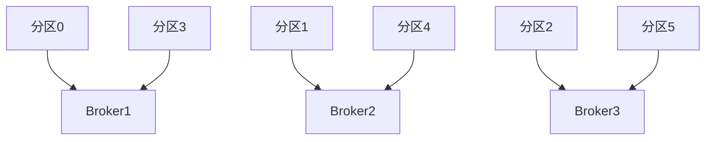
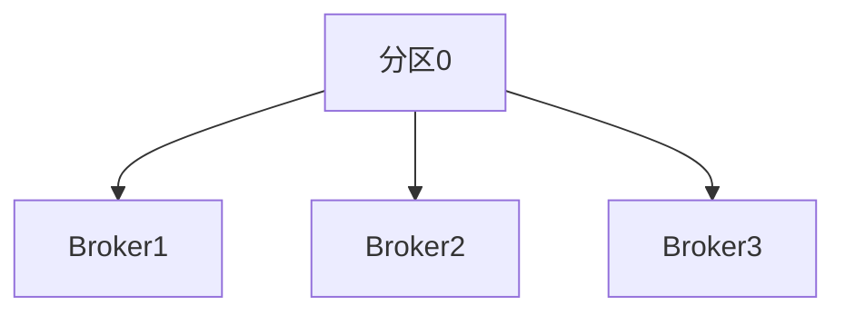

# Kafka 负载均衡策略

Kafka是一个分布式流处理平台，广泛用于构建实时数据管道和流应用。为了确保Kafka集群的高性能和可靠性，负载均衡是一个关键的设计考虑。本文将详细介绍Kafka的负载均衡策略，帮助初学者理解如何通过分区和副本分配来优化Kafka集群的性能。

## 什么是负载均衡？

负载均衡是指在分布式系统中，将工作负载均匀地分配到多个节点上，以避免单个节点过载，从而提高系统的整体性能和可靠性。在Kafka中，负载均衡主要通过分区（Partition）和副本（Replica）的分配来实现。

## Kafka 分区与副本

Kafka中的每个主题（Topic）可以被分成多个分区（Partition），每个分区可以有一个或多个副本（Replica）。分区是Kafka并行处理的基本单位，而副本则用于提供数据冗余和高可用性。

### 分区分配

Kafka的分区分配策略决定了如何将分区分配到不同的Broker上。默认情况下，Kafka使用**轮询（Round Robin）**策略来分配分区。这意味着分区会依次分配到集群中的每个Broker上，以确保负载的均匀分布。

例如，假设我们有一个包含3个Broker的Kafka集群，并且我们创建了一个有6个分区的主题。Kafka会将分区0分配到Broker1，分区1分配到Broker2，分区2分配到Broker3，分区3再次分配到Broker1，依此类推。



### 副本分配

副本分配策略决定了如何将分区的副本分配到不同的Broker上。Kafka的默认策略是确保每个分区的副本分布在不同的Broker上，以提高数据的可靠性和容错能力。

例如，假设我们有一个包含3个Broker的Kafka集群，并且我们创建了一个有3个副本的主题。Kafka会将分区的第一个副本分配到Broker1，第二个副本分配到Broker2，第三个副本分配到Broker3。



## 自定义负载均衡策略

在某些情况下，默认的负载均衡策略可能无法满足特定的需求。Kafka允许用户通过自定义分区分配器（Partition Assignor）来实现更复杂的负载均衡策略。

### 实现自定义分区分配器

要实现自定义分区分配器，需要继承`org.apache.kafka.clients.consumer.internals.PartitionAssignor`类，并实现`assign`方法。以下是一个简单的自定义分区分配器示例：

```java
import org.apache.kafka.clients.consumer.internals.AbstractPartitionAssignor;
import org.apache.kafka.common.TopicPartition;

import java.util.*;

public class CustomPartitionAssignor extends AbstractPartitionAssignor {
    @Override
    public Map<String, List<TopicPartition>> assign(Map<String, Integer> partitionsPerTopic,
                                                    Map<String, Subscription> subscriptions) {
        Map<String, List<TopicPartition>> assignment = new HashMap<>();
        for (String memberId : subscriptions.keySet()) {
            assignment.put(memberId, new ArrayList<>());
        }

        // 自定义分区分配逻辑
        for (Map.Entry<String, Integer> entry : partitionsPerTopic.entrySet()) {
            String topic = entry.getKey();
            int numPartitions = entry.getValue();
            for (int i = 0; i < numPartitions; i++) {
                TopicPartition partition = new TopicPartition(topic, i);
                String memberId = selectMember(subscriptions, partition);
                assignment.get(memberId).add(partition);
            }
        }

        return assignment;
    }

    private String selectMember(Map<String, Subscription> subscriptions, TopicPartition partition) {
        // 自定义选择逻辑
        return subscriptions.keySet().iterator().next();
    }

    @Override
    public String name() {
        return "custom";
    }
}
```

:::note
在实际应用中，自定义分区分配器需要根据具体的业务需求来设计。例如，可以根据消费者的处理能力、网络拓扑结构等因素来优化分区分配。
:::

## 实际案例

假设我们有一个Kafka集群，用于处理来自多个传感器的实时数据流。每个传感器生成的数据量不同，有些传感器的数据量非常大，而有些则相对较小。为了确保集群的负载均衡，我们可以根据传感器的数据量来调整分区的分配策略。

例如，我们可以将高数据量的传感器的分区分配到更多的Broker上，而将低数据量的传感器的分区分配到较少的Broker上。这样可以避免某些Broker过载，从而提高集群的整体性能。

## 总结

Kafka的负载均衡策略是确保集群高性能和可靠性的关键。通过合理分配分区和副本，可以有效地平衡集群中的负载，避免单个节点过载。在某些情况下，自定义分区分配器可以帮助我们实现更复杂的负载均衡策略，以满足特定的业务需求。

## 附加资源与练习

- **练习1**：尝试在本地搭建一个Kafka集群，并创建一个包含多个分区的主题。观察分区和副本的分配情况。
- **练习2**：实现一个自定义分区分配器，并根据消费者的处理能力来优化分区分配。
- **资源**：阅读Kafka官方文档中关于分区和副本分配的章节，深入了解Kafka的负载均衡机制。

通过本文的学习，你应该对Kafka的负载均衡策略有了初步的了解。希望你能在实际应用中灵活运用这些知识，优化你的Kafka集群性能。