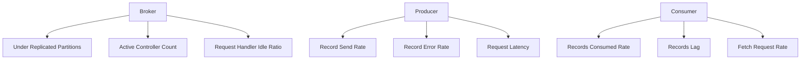

# Kafka 监控指标分析

Kafka是一个分布式流处理平台，广泛应用于实时数据管道和大规模数据处理场景。为了确保Kafka集群的高效运行，监控和分析其关键性能指标至关重要。本文将详细介绍Kafka监控的核心指标，并通过实际案例展示如何利用这些指标进行性能优化。

## 1. 介绍

Kafka的监控指标可以帮助我们了解集群的健康状态、性能瓶颈以及潜在问题。通过监控这些指标，我们可以及时发现并解决问题，确保系统的稳定性和高效性。

## 2. 关键监控指标

### 2.1 Broker指标

Broker是Kafka集群中的核心组件，负责消息的存储和转发。以下是Broker的关键监控指标：

- **Under Replicated Partitions (URP)**: 表示未完全复制的分区数量。高URP值可能表明网络问题或Broker故障。
- **Active Controller Count**: 表示当前活动的控制器数量。正常情况下应为1，若为0或大于1，则可能存在问题。
- **Request Handler Idle Ratio**: 表示请求处理器的空闲比例。低空闲比例可能表明Broker负载过高。

### 2.2 Producer指标

Producer负责将消息发送到Kafka集群。以下是Producer的关键监控指标：

- **Record Send Rate**: 表示每秒发送的记录数。高发送率可能表明系统负载较高。
- **Record Error Rate**: 表示每秒发送失败的记录数。高错误率可能表明网络问题或Broker故障。
- **Request Latency**: 表示请求的延迟时间。高延迟可能表明网络或Broker性能问题。

### 2.3 Consumer指标

Consumer负责从Kafka集群中消费消息。以下是Consumer的关键监控指标：

- **Records Consumed Rate**: 表示每秒消费的记录数。低消费率可能表明Consumer性能问题。
- **Records Lag**: 表示Consumer落后于Producer的记录数。高延迟可能表明Consumer处理速度过慢。
- **Fetch Request Rate**: 表示每秒的Fetch请求数。高请求率可能表明Consumer负载较高。

## 3. 实际案例

### 3.1 案例1：高URP值问题

假设我们在监控中发现某个Broker的URP值持续较高。通过进一步分析，我们发现该Broker的网络带宽利用率接近100%。这表明网络带宽不足可能是导致URP值高的原因。为了解决这个问题，我们可以增加网络带宽或优化网络配置。

### 3.2 案例2：高Record Error Rate问题

假设我们在监控中发现某个Producer的Record Error Rate较高。通过进一步分析，我们发现Broker的磁盘I/O利用率接近100%。这表明磁盘I/O瓶颈可能是导致Record Error Rate高的原因。为了解决这个问题，我们可以增加磁盘I/O性能或优化磁盘配置。

## 4. 总结

Kafka的监控指标是确保系统高效运行的关键。通过监控和分析这些指标，我们可以及时发现并解决问题，确保系统的稳定性和高效性。希望本文能帮助你更好地理解和应用Kafka的监控指标。

## 5. 附加资源

- [Kafka官方文档](https://kafka.apache.org/documentation/)
- [Kafka监控工具推荐](https://www.confluent.io/blog/monitoring-kafka-performance-metrics/)
- [Kafka性能优化指南](https://www.confluent.io/blog/optimizing-kafka-performance/)

## 6. 练习

1. 在你的Kafka集群中，监控Broker的URP值，并分析其变化趋势。
2. 尝试调整Producer的配置，观察Record Error Rate的变化。
3. 使用Kafka监控工具，分析Consumer的Records Lag，并尝试优化Consumer的性能。

:::tip
提示：在实际应用中，建议使用自动化监控工具（如Prometheus、Grafana）来实时监控Kafka的指标，并设置告警机制，以便及时发现和解决问题。
:::

:::caution
注意：在调整Kafka配置时，务必进行充分的测试，以避免对生产环境造成影响。
:::

:::warning
警告：高URP值和Record Error Rate可能表明系统存在严重问题，务必及时处理。
:::