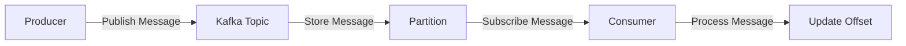
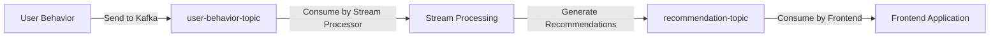
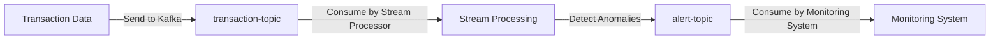

# Kafka 消息系统应用

## 介绍

Kafka 是一个分布式流处理平台，最初由 LinkedIn 开发，后来成为 Apache 基金会的顶级项目。它被设计用于处理高吞吐量、低延迟的数据流。Kafka 的核心功能是作为一个消息系统，允许应用程序之间通过发布和订阅消息的方式进行通信。

Kafka 的主要特点包括：
- **高吞吐量**：能够处理每秒数百万条消息。
- **持久性**：消息可以持久化存储，确保数据不会丢失。
- **分布式**：支持水平扩展，能够处理大规模数据流。
- **容错性**：即使部分节点失效，系统仍能继续运行。

## Kafka 消息系统的基本概念

在深入探讨 Kafka 的应用场景之前，我们需要了解一些基本概念：

1. **Producer（生产者）**：负责将消息发布到 Kafka 的特定主题（Topic）。
2. **Consumer（消费者）**：从 Kafka 的主题中订阅并消费消息。
3. **Broker（代理）**：Kafka 集群中的单个节点，负责存储和转发消息。
4. **Topic（主题）**：消息的分类，生产者将消息发布到特定主题，消费者从主题中订阅消息。
5. **Partition（分区）**：每个主题可以分为多个分区，分区允许 Kafka 并行处理消息。
6. **Offset（偏移量）**：每条消息在分区中的唯一标识符，消费者通过偏移量来跟踪已消费的消息。

## Kafka 消息系统的工作流程

Kafka 的工作流程可以简化为以下几个步骤：

1. **生产者发布消息**：生产者将消息发布到 Kafka 的特定主题。
2. **消息存储**：Kafka 将消息持久化存储在分区中。
3. **消费者订阅消息**：消费者从主题中订阅消息，并从指定的偏移量开始消费。
4. **消息处理**：消费者处理消息，并更新偏移量以跟踪已消费的消息。



## Kafka 消息系统的应用场景

Kafka 广泛应用于各种场景，以下是一些常见的应用场景：

### 1. 日志收集与聚合

Kafka 常用于日志收集系统，多个应用程序将日志发送到 Kafka，然后由日志处理系统（如 ELK Stack）从 Kafka 中消费日志并进行处理。

```java
// 生产者示例：发送日志消息到 Kafka
Properties props = new Properties();
props.put("bootstrap.servers", "localhost:9092");
props.put("key.serializer", "org.apache.kafka.common.serialization.StringSerializer");
props.put("value.serializer", "org.apache.kafka.common.serialization.StringSerializer");

Producer<String, String> producer = new KafkaProducer<>(props);
producer.send(new ProducerRecord<>("log-topic", "log-message"));
producer.close();
```

```java
// 消费者示例：从 Kafka 消费日志消息
Properties props = new Properties();
props.put("bootstrap.servers", "localhost:9092");
props.put("group.id", "log-consumer-group");
props.put("key.deserializer", "org.apache.kafka.common.serialization.StringDeserializer");
props.put("value.deserializer", "org.apache.kafka.common.serialization.StringDeserializer");

Consumer<String, String> consumer = new KafkaConsumer<>(props);
consumer.subscribe(Arrays.asList("log-topic"));

while (true) {
    ConsumerRecords<String, String> records = consumer.poll(Duration.ofMillis(100));
    for (ConsumerRecord<String, String> record : records) {
        System.out.println("Received log: " + record.value());
    }
}
```

### 2. 实时流处理

Kafka 可以与流处理框架（如 Apache Flink、Apache Spark Streaming）集成，用于实时处理数据流。例如，实时分析用户行为、实时推荐系统等。

### 3. 事件驱动架构

在微服务架构中，Kafka 可以作为事件总线，用于服务之间的异步通信。当一个服务发生状态变化时，它会发布事件到 Kafka，其他服务可以订阅这些事件并做出相应的反应。

### 4. 数据管道

Kafka 可以作为数据管道，将数据从一个系统传输到另一个系统。例如，将数据从关系型数据库传输到数据仓库或大数据平台。

## 实际案例

### 案例 1：电商网站的实时推荐系统

假设我们有一个电商网站，希望根据用户的实时行为（如浏览、点击、购买）来推荐相关商品。我们可以使用 Kafka 来收集用户行为数据，并通过流处理框架实时分析这些数据，生成推荐结果。

1. **用户行为数据收集**：用户在网站上的行为（如点击商品）被发送到 Kafka 的 `user-behavior-topic`。
2. **实时流处理**：流处理框架从 Kafka 中消费数据，分析用户行为，并生成推荐结果。
3. **推荐结果存储**：推荐结果被发送到 Kafka 的 `recommendation-topic`，供前端应用使用。



### 案例 2：金融交易监控系统

在金融领域，Kafka 可以用于实时监控交易数据。例如，银行可以使用 Kafka 来收集交易数据，并通过流处理框架实时检测异常交易。

1. **交易数据收集**：交易数据被发送到 Kafka 的 `transaction-topic`。
2. **实时监控**：流处理框架从 Kafka 中消费数据，实时分析交易行为，检测异常。
3. **报警系统**：如果检测到异常交易，系统会发送报警信息到 Kafka 的 `alert-topic`，供监控系统处理。



## 总结

Kafka 作为一个高吞吐量、低延迟的消息系统，广泛应用于日志收集、实时流处理、事件驱动架构和数据管道等场景。通过本文的介绍和实际案例，你应该对 Kafka 的基本概念和应用场景有了初步的了解。

## 附加资源与练习

- **官方文档**：阅读 [Kafka 官方文档](https://kafka.apache.org/documentation/) 以深入了解 Kafka 的配置和使用。
- **练习**：尝试搭建一个简单的 Kafka 集群，并使用生产者与消费者进行消息的发布与订阅。
- **进一步学习**：探索 Kafka 与流处理框架（如 Apache Flink、Apache Spark Streaming）的集成，了解如何实现实时数据处理。

:::tip
Kafka 是一个强大的工具，但在实际应用中需要注意其配置和调优，以确保系统的稳定性和性能。
:::