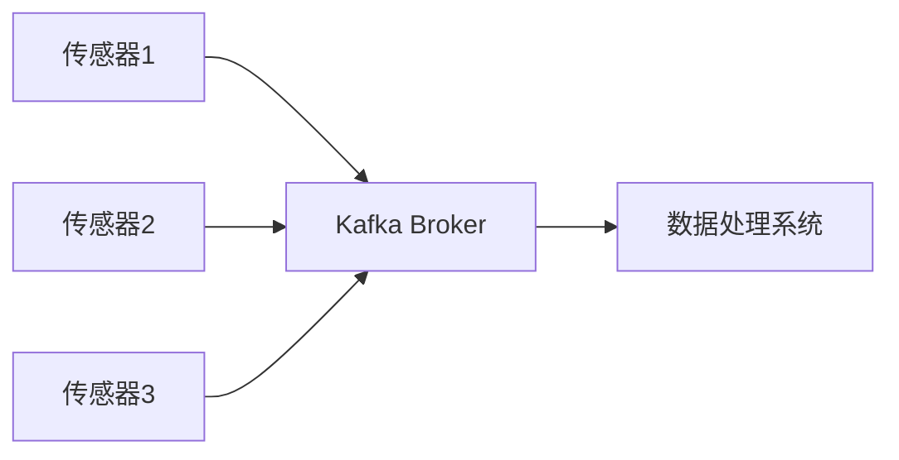
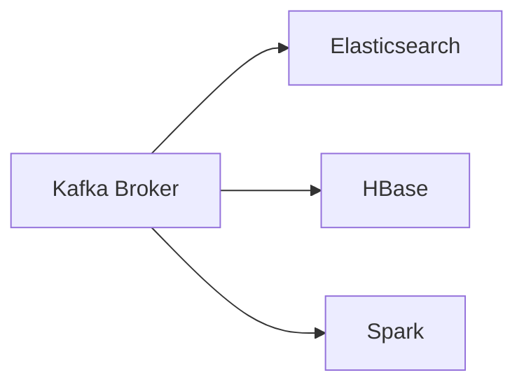
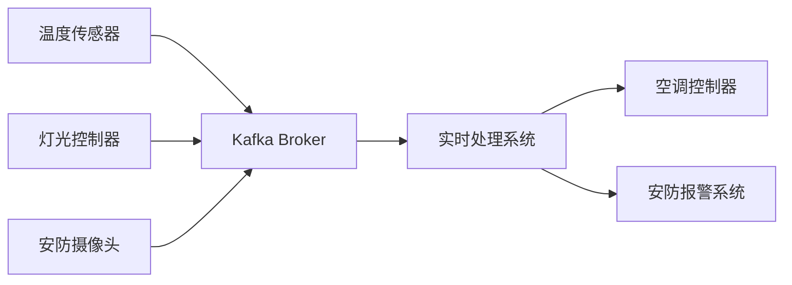
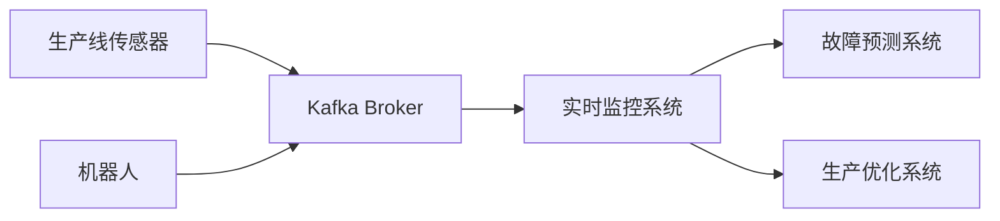

# Kafka 物联网应用

## 介绍

物联网（IoT）是指通过互联网连接各种设备，使其能够收集和交换数据。随着物联网设备的普及，数据量呈指数级增长，如何高效地处理这些数据成为了一个关键问题。Apache Kafka 作为一个分布式流处理平台，因其高吞吐量、低延迟和可扩展性，成为了物联网数据处理的首选工具之一。

在物联网场景中，Kafka 主要用于以下方面：
- **设备数据采集**：从传感器、智能设备等收集实时数据。
- **数据流处理**：对采集到的数据进行实时处理和分析。
- **数据存储与转发**：将处理后的数据存储到数据库或转发到其他系统。

## Kafka 在物联网中的核心作用

### 1. 设备数据采集

物联网设备（如传感器、智能家居设备等）会持续生成大量数据。Kafka 可以作为这些数据的集中收集点，确保数据的高效传输和存储。



### 2. 数据流处理

Kafka 不仅能够收集数据，还可以通过 Kafka Streams 或 Kafka Connect 对数据进行实时处理。例如，过滤无效数据、计算平均值或检测异常。

```java
// 示例：使用Kafka Streams处理传感器数据
KStream<String, Double> sensorDataStream = builder.stream("sensor-data");
sensorDataStream
    .filter((key, value) -> value > 0) // 过滤无效数据
    .mapValues(value -> value * 1.8 + 32) // 温度单位转换
    .to("processed-sensor-data");
```

### 3. 数据存储与转发

处理后的数据可以存储到数据库（如HBase、Cassandra）或转发到其他系统（如Elasticsearch、Spark）进行进一步分析。



## 实际案例

### 案例1：智能家居系统

在一个智能家居系统中，各种设备（如温度传感器、灯光控制器、安防摄像头）会持续生成数据。Kafka 可以用于收集这些数据，并通过实时处理系统进行分析。例如：
- 检测温度异常并自动调节空调。
- 分析安防摄像头数据，识别异常行为。



### 案例2：工业物联网（IIoT）

在工业物联网中，设备（如生产线传感器、机器人）会生成大量数据。Kafka 可以用于：
- 实时监控设备状态，预测故障。
- 优化生产流程，提高效率。



## 总结

Kafka 在物联网中的应用非常广泛，能够高效地处理海量设备数据，并支持实时分析和存储。通过 Kafka，物联网系统可以实现更高的可靠性和可扩展性。

:::tip 提示
如果你对 Kafka 的更多功能感兴趣，可以尝试以下练习：
1. 使用 Kafka 和 Kafka Streams 实现一个简单的温度监控系统。
2. 将 Kafka 与 Elasticsearch 集成，存储和分析设备数据。
:::

## 附加资源

- [Kafka 官方文档](https://kafka.apache.org/documentation/)
- [Kafka Streams 入门指南](https://kafka.apache.org/documentation/streams/)
- [Kafka Connect 教程](https://docs.confluent.io/platform/current/connect/index.html)