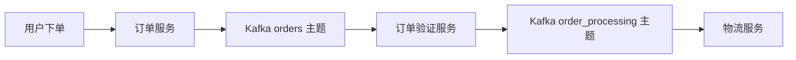
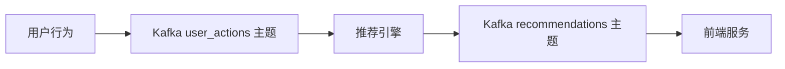
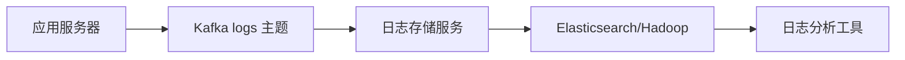

# Kafka 电商应用

Kafka 是一个分布式流处理平台，广泛应用于实时数据管道和流处理场景。在电商领域，Kafka 的高吞吐量、低延迟和可扩展性使其成为处理大量实时数据的理想选择。本文将介绍 Kafka 在电商中的典型应用场景，并通过实际案例帮助你理解其工作原理。

## 1. 订单处理系统

在电商平台中，订单处理是一个核心功能。Kafka 可以作为订单处理系统的消息中间件，确保订单数据的高效传递和处理。

### 1.1 订单处理流程

1. **订单创建**：用户下单后，订单信息被发送到 Kafka 的 `orders` 主题。
2. **订单验证**：订单服务从 `orders` 主题消费消息，进行库存检查和支付验证。
3. **订单处理**：验证通过后，订单信息被发送到 `order_processing` 主题，由物流服务处理。



### 1.2 代码示例

以下是一个简单的订单处理服务示例，使用 Kafka 的 Java 客户端库：

```java
// 生产者：发送订单信息到 Kafka
Properties props = new Properties();
props.put("bootstrap.servers", "localhost:9092");
props.put("key.serializer", "org.apache.kafka.common.serialization.StringSerializer");
props.put("value.serializer", "org.apache.kafka.common.serialization.StringSerializer");

Producer<String, String> producer = new KafkaProducer<>(props);
producer.send(new ProducerRecord<>("orders", "orderId123", "{\"productId\":\"123\",\"quantity\":2}"));
producer.close();

// 消费者：从 Kafka 消费订单信息
Properties consumerProps = new Properties();
consumerProps.put("bootstrap.servers", "localhost:9092");
consumerProps.put("group.id", "order-validation");
consumerProps.put("key.deserializer", "org.apache.kafka.common.serialization.StringDeserializer");
consumerProps.put("value.deserializer", "org.apache.kafka.common.serialization.StringDeserializer");

Consumer<String, String> consumer = new KafkaConsumer<>(consumerProps);
consumer.subscribe(Arrays.asList("orders"));

while (true) {
    ConsumerRecords<String, String> records = consumer.poll(Duration.ofMillis(100));
    for (ConsumerRecord<String, String> record : records) {
        System.out.println("Validating order: " + record.value());
        // 订单验证逻辑
    }
}
```

## 2. 实时推荐系统

电商平台通常需要根据用户的实时行为（如浏览、点击、购买）来推荐相关商品。Kafka 可以用于收集用户行为数据，并将其传递给推荐引擎进行实时处理。

### 2.1 推荐系统流程

1. **用户行为收集**：用户的行为数据（如点击、浏览）被发送到 Kafka 的 `user_actions` 主题。
2. **实时处理**：推荐引擎从 `user_actions` 主题消费数据，生成推荐结果。
3. **推荐结果展示**：推荐结果被发送到 `recommendations` 主题，由前端服务展示给用户。



### 2.2 代码示例

以下是一个简单的推荐引擎示例，使用 Kafka 的 Python 客户端库：

```python
from kafka import KafkaConsumer, KafkaProducer

# 消费者：从 Kafka 消费用户行为数据
consumer = KafkaConsumer('user_actions', bootstrap_servers='localhost:9092')
producer = KafkaProducer(bootstrap_servers='localhost:9092')

for message in consumer:
    user_action = message.value.decode('utf-8')
    print(f"Processing user action: {user_action}")
    # 推荐逻辑
    recommendation = "recommended_product_123"
    producer.send('recommendations', recommendation.encode('utf-8'))
```

## 3. 日志收集与分析

电商平台需要收集和分析大量的日志数据，以监控系统性能和用户行为。Kafka 可以作为日志收集的中间件，将日志数据发送到日志存储和分析系统（如 Elasticsearch、Hadoop）。

### 3.1 日志收集流程

1. **日志生成**：应用服务器生成日志数据，并发送到 Kafka 的 `logs` 主题。
2. **日志存储**：日志存储服务从 `logs` 主题消费数据，并将其存储到 Elasticsearch 或 Hadoop 中。
3. **日志分析**：日志分析工具从存储系统中读取数据，进行实时或批量分析。



### 3.2 代码示例

以下是一个简单的日志收集服务示例，使用 Kafka 的 Python 客户端库：

```python
from kafka import KafkaProducer

# 生产者：发送日志数据到 Kafka
producer = KafkaProducer(bootstrap_servers='localhost:9092')
log_data = "2023-10-01 12:00:00 INFO User logged in"
producer.send('logs', log_data.encode('utf-8'))
producer.flush()
```

## 总结

Kafka 在电商领域的应用非常广泛，从订单处理到实时推荐系统，再到日志收集与分析，Kafka 都发挥着重要作用。通过本文的介绍和代码示例，你应该对 Kafka 在电商中的应用有了初步的了解。

:::tip 附加资源
- [Kafka 官方文档](https://kafka.apache.org/documentation/)
- [Kafka 入门教程](https://www.tutorialspoint.com/apache_kafka/index.htm)
:::

:::caution 练习
1. 尝试在本地搭建一个 Kafka 集群，并实现一个简单的订单处理系统。
2. 修改推荐引擎的代码，使其能够根据用户的历史行为生成更复杂的推荐结果。
:::