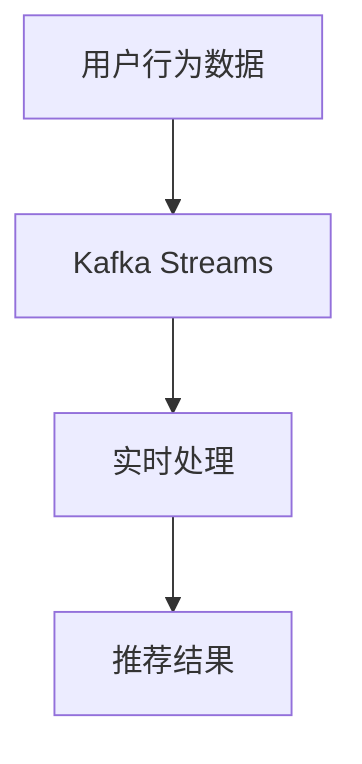

# Kafka 流处理应用

## 介绍

Kafka流处理（Kafka Streams）是Apache Kafka提供的一个轻量级库，用于构建实时流处理应用程序。它允许开发者以简单、高效的方式处理和分析实时数据流。Kafka Streams的核心思想是将数据流视为一系列连续的事件，并通过一系列操作（如过滤、转换、聚合等）来处理这些事件。

Kafka Streams的主要特点包括：
- **实时处理**：能够处理实时数据流，延迟低。
- **可扩展性**：可以轻松扩展到多个节点，处理大规模数据。
- **容错性**：具备自动故障恢复机制，确保数据处理的可靠性。
- **与Kafka无缝集成**：直接使用Kafka作为数据源和目的地，无需额外的中间件。

## Kafka 流处理的基本概念

### 1. 数据流（Stream）

在Kafka Streams中，数据流是一个无界的事件序列。每个事件都是一个键值对（key-value pair），表示某个时间点发生的事件。例如，一个用户点击事件可以表示为 `{"user_id": 123, "action": "click"}`。

### 2. 流处理拓扑（Topology）

流处理拓扑定义了数据流的处理逻辑。它由一系列的处理节点（Processor）组成，每个节点执行特定的操作（如过滤、映射、聚合等）。Kafka Streams会自动将拓扑部署到集群中，并处理数据流。

### 3. 状态存储（State Store）

Kafka Streams允许在流处理过程中维护状态。状态存储是一个本地存储，用于保存中间结果或聚合数据。例如，在计算用户点击次数时，可以使用状态存储来保存每个用户的点击计数。

## Kafka 流处理的实际应用

### 1. 实时数据聚合

假设我们有一个电商网站，需要实时统计每个用户的点击次数。我们可以使用Kafka Streams来实现这一功能。

```java
KStream<String, String> userClicks = builder.stream("user-clicks");

KTable<String, Long> userClickCounts = userClicks
    .groupByKey()
    .count();

userClickCounts.toStream().to("user-click-counts");
```

在这个例子中，`user-clicks` 是输入主题，包含用户的点击事件。`userClickCounts` 是一个KTable，保存了每个用户的点击次数。最后，结果被写入到 `user-click-counts` 主题中。

### 2. 实时数据过滤

假设我们需要过滤掉所有无效的点击事件（例如，点击时间早于某个时间戳的事件）。我们可以使用Kafka Streams的过滤操作来实现。

```java
KStream<String, String> userClicks = builder.stream("user-clicks");

KStream<String, String> validClicks = userClicks
    .filter((key, value) -> {
        long clickTime = Long.parseLong(value.split(",")[0]);
        return clickTime > System.currentTimeMillis() - 3600 * 1000;
    });

validClicks.to("valid-clicks");
```

在这个例子中，`filter` 操作会过滤掉所有早于一小时前的点击事件，并将有效事件写入到 `valid-clicks` 主题中。

### 3. 实时数据转换

假设我们需要将用户的点击事件转换为另一种格式（例如，将JSON格式转换为CSV格式）。我们可以使用Kafka Streams的映射操作来实现。

```java
KStream<String, String> userClicks = builder.stream("user-clicks");

KStream<String, String> transformedClicks = userClicks
    .map((key, value) -> {
        JSONObject json = new JSONObject(value);
        String csv = json.getString("user_id") + "," + json.getString("action");
        return new KeyValue<>(key, csv);
    });

transformedClicks.to("transformed-clicks");
```

在这个例子中，`map` 操作将JSON格式的点击事件转换为CSV格式，并将结果写入到 `transformed-clicks` 主题中。

## 实际案例：实时推荐系统

假设我们正在构建一个实时推荐系统，需要根据用户的实时行为（如点击、购买等）来推荐商品。我们可以使用Kafka Streams来处理用户行为数据，并生成推荐结果。



在这个案例中，用户行为数据被实时发送到Kafka主题中。Kafka Streams会处理这些数据，并根据用户的实时行为生成推荐结果。推荐结果可以写入到另一个Kafka主题中，供下游系统使用。

## 总结

Kafka流处理是一个强大的工具，适用于各种实时数据处理场景。通过Kafka Streams，开发者可以轻松构建实时流处理应用程序，处理大规模数据流，并生成实时结果。无论是实时数据聚合、过滤还是转换，Kafka Streams都能提供高效、可靠的解决方案。

## 附加资源与练习

- **官方文档**：阅读 [Kafka Streams官方文档](https://kafka.apache.org/documentation/streams/) 以了解更多高级功能。
- **练习**：尝试使用Kafka Streams构建一个简单的实时数据处理应用程序，例如实时统计用户活跃度。
- **社区**：加入Kafka社区，参与讨论和分享经验。

:::tip
如果你对Kafka Streams有任何疑问，欢迎在社区中提问，或者查阅相关教程和文档。
:::