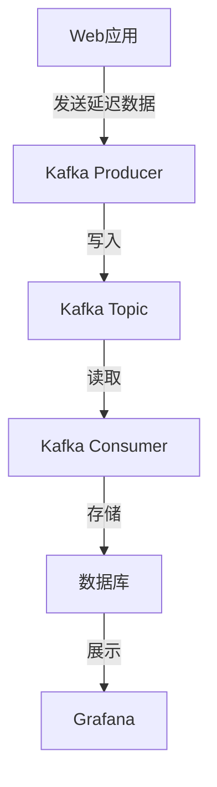

# Kafka 指标监控应用

Kafka 是一个分布式流处理平台，广泛用于构建实时数据管道和流应用。除了消息传递，Kafka 还可以用于监控系统中的关键指标。本文将介绍如何使用 Kafka 进行指标监控，并通过实际案例展示其应用场景。

## 什么是Kafka指标监控？

Kafka 指标监控是指通过 Kafka 收集、存储和分析系统中的关键性能指标（如吞吐量、延迟、错误率等）。这些指标可以帮助开发者和运维人员实时了解系统的运行状态，及时发现和解决问题。

### 为什么需要Kafka指标监控？

- **实时性**：Kafka 能够实时处理大量数据，适合用于监控实时指标。
- **可扩展性**：Kafka 的分布式架构使其能够轻松扩展，处理大规模数据。
- **灵活性**：Kafka 支持多种数据格式和协议，可以灵活地集成到现有系统中。

## Kafka 指标监控的核心概念

### 1. 生产者（Producer）
生产者负责将指标数据发送到 Kafka 主题（Topic）。每个指标数据通常包含时间戳、指标名称、指标值等信息。

### 2. 消费者（Consumer）
消费者从 Kafka 主题中读取指标数据，并进行进一步的处理和分析。常见的处理方式包括存储到数据库、展示在监控面板上或触发告警。

### 3. 主题（Topic）
主题是 Kafka 中数据的分类单位。每个主题可以包含多个分区（Partition），分区是 Kafka 实现并行处理和负载均衡的基础。

### 4. 分区（Partition）
分区是 Kafka 主题的物理存储单元。每个分区可以独立地进行读写操作，从而实现高吞吐量和低延迟。

## 实际案例：监控Web应用的请求延迟

假设我们有一个Web应用，需要监控每个API请求的延迟。我们可以使用 Kafka 来实现这一目标。

### 步骤1：生产者发送指标数据

首先，我们需要在Web应用中添加代码，将每个API请求的延迟数据发送到 Kafka。

```java
import org.apache.kafka.clients.producer.KafkaProducer;
import org.apache.kafka.clients.producer.ProducerRecord;
import java.util.Properties;

public class MetricsProducer {
    public static void main(String[] args) {
        Properties props = new Properties();
        props.put("bootstrap.servers", "localhost:9092");
        props.put("key.serializer", "org.apache.kafka.common.serialization.StringSerializer");
        props.put("value.serializer", "org.apache.kafka.common.serialization.StringSerializer");

        KafkaProducer<String, String> producer = new KafkaProducer<>(props);

        // 模拟API请求延迟
        long latency = System.currentTimeMillis() - startTime;
        String metric = "api.latency:" + latency;

        ProducerRecord<String, String> record = new ProducerRecord<>("metrics-topic", metric);
        producer.send(record);

        producer.close();
    }
}
```

### 步骤2：消费者处理指标数据

接下来，我们需要编写一个消费者，从 Kafka 主题中读取指标数据，并将其存储到数据库中。

```java
import org.apache.kafka.clients.consumer.KafkaConsumer;
import org.apache.kafka.clients.consumer.ConsumerRecords;
import org.apache.kafka.clients.consumer.ConsumerRecord;
import java.util.Properties;
import java.util.Collections;

public class MetricsConsumer {
    public static void main(String[] args) {
        Properties props = new Properties();
        props.put("bootstrap.servers", "localhost:9092");
        props.put("group.id", "metrics-group");
        props.put("key.deserializer", "org.apache.kafka.common.serialization.StringDeserializer");
        props.put("value.deserializer", "org.apache.kafka.common.serialization.StringDeserializer");

        KafkaConsumer<String, String> consumer = new KafkaConsumer<>(props);
        consumer.subscribe(Collections.singletonList("metrics-topic"));

        while (true) {
            ConsumerRecords<String, String> records = consumer.poll(100);
            for (ConsumerRecord<String, String> record : records) {
                // 处理指标数据，例如存储到数据库
                System.out.println("Received metric: " + record.value());
            }
        }
    }
}
```

### 步骤3：可视化指标数据

最后，我们可以使用 Grafana 或其他可视化工具，将存储在数据库中的指标数据展示在监控面板上。



## 总结

Kafka 不仅是一个强大的消息队列系统，还可以用于监控系统中的关键指标。通过 Kafka，我们可以实时收集、存储和分析指标数据，从而更好地了解系统的运行状态。本文通过一个实际案例，展示了如何使用 Kafka 监控 Web 应用的请求延迟。

## 附加资源

- [Kafka官方文档](https://kafka.apache.org/documentation/)
- [Grafana官方文档](https://grafana.com/docs/)
- [Kafka生产者与消费者示例代码](https://github.com/apache/kafka/tree/trunk/examples)

## 练习

1. 尝试修改上述代码，监控其他类型的指标，如错误率或吞吐量。
2. 使用 Grafana 创建一个监控面板，展示从 Kafka 中读取的指标数据。
3. 探索 Kafka 的其他应用场景，如日志聚合或事件溯源。

:::tip
在实际生产环境中，建议使用 Kafka Connect 或 Kafka Streams 来简化指标数据的处理和集成。
:::