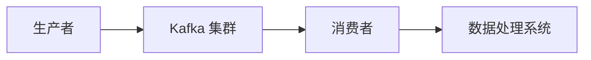

# Kafka 活动跟踪应用

## 介绍

活动跟踪是许多现代应用程序的核心功能之一。无论是用户行为分析、系统日志记录，还是实时监控，活动跟踪都扮演着至关重要的角色。Apache Kafka 作为一个分布式流处理平台，因其高吞吐量、低延迟和可扩展性，成为构建活动跟踪系统的理想选择。

在本节中，我们将探讨如何使用 Kafka 实现活动跟踪系统，并通过实际案例展示其应用场景。

## 什么是活动跟踪？

活动跟踪是指记录和分析系统中发生的各种事件或活动。这些活动可以是用户点击、页面浏览、系统日志、交易记录等。通过跟踪这些活动，我们可以获得有价值的数据，用于分析用户行为、优化系统性能或进行故障排查。

## Kafka 在活动跟踪中的优势

Kafka 在活动跟踪中的应用具有以下优势：

1. **高吞吐量**：Kafka 能够处理大量的数据流，适合高并发场景。
2. **低延迟**：Kafka 的设计使其能够以极低的延迟处理数据。
3. **可扩展性**：Kafka 的分布式架构使其能够轻松扩展以应对不断增长的数据量。
4. **持久性**：Kafka 将数据持久化到磁盘，确保数据不会丢失。

## Kafka 活动跟踪系统的基本架构

一个典型的 Kafka 活动跟踪系统通常包括以下几个组件：

1. **生产者（Producer）**：负责生成活动数据并将其发送到 Kafka 主题（Topic）。
2. **Kafka 集群**：存储和管理活动数据。
3. **消费者（Consumer）**：从 Kafka 主题中读取数据并进行处理。
4. **数据处理系统**：对活动数据进行分析、存储或可视化。



## 实际案例：用户行为跟踪

假设我们有一个电子商务网站，需要跟踪用户的浏览和购买行为。我们可以使用 Kafka 来实现这一功能。

### 1. 创建 Kafka 主题

首先，我们需要创建一个 Kafka 主题来存储用户活动数据。

```bash
kafka-topics.sh --create --topic user-activity --bootstrap-server localhost:9092 --partitions 3 --replication-factor 1
```

### 2. 生产者代码示例

以下是一个简单的生产者代码示例，用于发送用户活动数据到 Kafka 主题。

```python
from kafka import KafkaProducer
import json

producer = KafkaProducer(bootstrap_servers='localhost:9092',
                         value_serializer=lambda v: json.dumps(v).encode('utf-8'))

activity = {
    "user_id": "12345",
    "activity_type": "page_view",
    "page_url": "https://example.com/product/123",
    "timestamp": "2023-10-01T12:34:56Z"
}

producer.send('user-activity', activity)
producer.flush()
```

### 3. 消费者代码示例

以下是一个简单的消费者代码示例，用于从 Kafka 主题中读取用户活动数据并进行处理。

```python
from kafka import KafkaConsumer
import json

consumer = KafkaConsumer('user-activity',
                         bootstrap_servers='localhost:9092',
                         value_deserializer=lambda m: json.loads(m.decode('utf-8')))

for message in consumer:
    activity = message.value
    print(f"Received activity: {activity}")
    # 在这里添加处理逻辑，例如将数据存储到数据库或进行实时分析
```

### 4. 数据处理

消费者读取到的数据可以进一步处理，例如存储到数据库、进行实时分析或生成报告。以下是一个简单的示例，将用户活动数据存储到 MongoDB 中。

```python
from pymongo import MongoClient

client = MongoClient('localhost', 27017)
db = client['user_activity_db']
collection = db['activities']

for message in consumer:
    activity = message.value
    collection.insert_one(activity)
    print(f"Stored activity: {activity}")
```

## 总结

Kafka 是一个强大的工具，特别适合用于构建活动跟踪系统。通过 Kafka，我们可以轻松地收集、存储和处理大量的活动数据，从而获得有价值的洞察。

在本节中，我们介绍了 Kafka 在活动跟踪中的应用，并通过一个实际案例展示了如何实现用户行为跟踪系统。希望这些内容能够帮助你更好地理解 Kafka 的应用场景。

## 附加资源

- [Kafka 官方文档](https://kafka.apache.org/documentation/)
- [Kafka Python 客户端库](https://kafka-python.readthedocs.io/en/master/)
- [MongoDB 官方文档](https://www.mongodb.com/docs/)

## 练习

1. 尝试修改生产者代码，使其能够发送不同类型的用户活动数据（例如，购买、添加到购物车等）。
2. 扩展消费者代码，使其能够将数据存储到不同的数据库（例如，MySQL 或 PostgreSQL）。
3. 使用 Kafka Streams 或 Flink 对用户活动数据进行实时分析，并生成实时报告。

:::