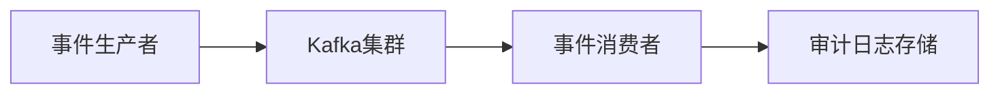

# Kafka 审计系统应用

## 介绍

在现代分布式系统中，审计系统是确保数据安全性和可追溯性的关键组件。审计系统记录了系统中发生的所有重要事件，例如用户操作、系统变更等，以便在需要时进行审查和分析。Kafka作为一个高吞吐量、分布式的消息队列系统，非常适合用于构建审计系统。本文将详细介绍如何使用Kafka来实现一个高效的审计系统。

## 为什么选择Kafka？

Kafka具有以下特点，使其成为构建审计系统的理想选择：

- **高吞吐量**：Kafka能够处理大量的消息，适合记录高频事件。
- **持久性**：Kafka将消息持久化存储在磁盘上，确保数据不会丢失。
- **分布式**：Kafka是分布式的，能够水平扩展，适合大规模系统。
- **实时性**：Kafka支持实时数据处理，能够快速响应事件。

## Kafka 审计系统的基本架构

一个典型的Kafka审计系统通常包括以下几个组件：

1. **事件生产者**：系统中的各个组件（如Web服务器、数据库等）将审计事件发送到Kafka。
2. **Kafka集群**：接收并存储这些事件。
3. **事件消费者**：从Kafka中读取事件，并将其存储到审计日志或数据库中。
4. **审计日志存储**：用于长期存储审计事件，通常使用数据库或文件系统。



## 实现步骤

### 1. 创建Kafka主题

首先，我们需要在Kafka中创建一个专门用于存储审计事件的主题。假设我们创建一个名为 `audit-events` 的主题：

```bash
kafka-topics.sh --create --topic audit-events --bootstrap-server localhost:9092 --partitions 3 --replication-factor 2
```

### 2. 发送审计事件

接下来，我们需要在系统中发送审计事件。以下是一个简单的Python示例，使用 `confluent-kafka` 库将事件发送到Kafka：

```python
from confluent_kafka import Producer

def delivery_report(err, msg):
    if err is not None:
        print(f'Message delivery failed: {err}')
    else:
        print(f'Message delivered to {msg.topic()} [{msg.partition()}]')

producer = Producer({'bootstrap.servers': 'localhost:9092'})

# 发送审计事件
event = {
    'user_id': '12345',
    'action': 'login',
    'timestamp': '2023-10-01T12:00:00Z'
}

producer.produce('audit-events', key='12345', value=str(event), callback=delivery_report)
producer.flush()
```

### 3. 消费审计事件

消费审计事件的代码示例如下：

```python
from confluent_kafka import Consumer, KafkaError

consumer = Consumer({
    'bootstrap.servers': 'localhost:9092',
    'group.id': 'audit-consumer-group',
    'auto.offset.reset': 'earliest'
})

consumer.subscribe(['audit-events'])

while True:
    msg = consumer.poll(1.0)

    if msg is None:
        continue
    if msg.error():
        if msg.error().code() == KafkaError._PARTITION_EOF:
            continue
        else:
            print(msg.error())
            break

    print(f'Received message: {msg.value().decode("utf-8")}')

consumer.close()
```

### 4. 存储审计日志

消费到的审计事件可以存储到数据库中，例如使用PostgreSQL：

```python
import psycopg2

def store_audit_event(event):
    conn = psycopg2.connect("dbname=audit user=postgres password=secret")
    cur = conn.cursor()
    cur.execute("INSERT INTO audit_log (user_id, action, timestamp) VALUES (%s, %s, %s)",
                (event['user_id'], event['action'], event['timestamp']))
    conn.commit()
    cur.close()
    conn.close()
```

## 实际案例

假设我们有一个电子商务网站，需要记录用户的登录、登出、购买等操作。我们可以使用Kafka来构建一个审计系统，记录这些操作并存储到数据库中。当需要审查用户行为时，我们可以从数据库中查询相关记录。

## 总结

Kafka作为一个高吞吐量、分布式的消息队列系统，非常适合用于构建审计系统。通过Kafka，我们可以轻松地记录和存储系统中的所有重要事件，确保数据的安全性和可追溯性。本文介绍了如何使用Kafka实现一个简单的审计系统，并提供了代码示例和实际案例。

## 附加资源

- [Kafka官方文档](https://kafka.apache.org/documentation/)
- [Confluent Kafka Python客户端](https://github.com/confluentinc/confluent-kafka-python)
- [PostgreSQL官方文档](https://www.postgresql.org/docs/)

## 练习

1. 尝试扩展本文中的代码示例，添加更多的审计事件类型（如用户注册、商品浏览等）。
2. 修改消费端代码，将审计事件存储到其他类型的数据库（如MongoDB）中。
3. 研究Kafka的日志压缩功能，了解如何利用它来优化审计日志的存储。