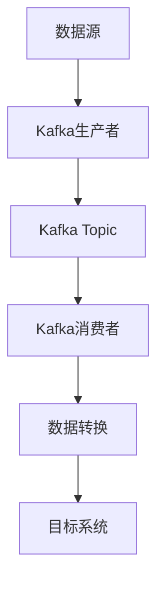

# Kafka ETL流程应用

在现代数据工程中，ETL（Extract, Transform, Load）流程是处理和分析数据的关键步骤。Apache Kafka作为一个分布式流处理平台，在ETL流程中扮演着重要角色。本文将详细介绍Kafka在ETL流程中的应用，并通过实际案例帮助初学者理解其工作原理。

## 什么是ETL流程？

ETL流程是指从多个数据源提取数据（Extract），对数据进行转换（Transform），然后将数据加载到目标系统（Load）的过程。ETL流程通常用于数据仓库、数据湖和其他数据分析系统中。

## Kafka 在ETL流程中的作用

Kafka在ETL流程中主要用于数据的提取和传输。它作为一个高吞吐量、低延迟的消息队列系统，能够高效地处理大量数据流。Kafka的核心优势在于其分布式架构和持久化存储能力，这使得它非常适合作为ETL流程中的数据管道。

### Kafka ETL流程的基本架构



1. **数据源**：数据源可以是数据库、日志文件、传感器数据等。
2. **Kafka生产者**：生产者将数据发送到Kafka的Topic中。
3. **Kafka Topic**：Topic是Kafka中存储数据的逻辑分区。
4. **Kafka消费者**：消费者从Topic中读取数据并进行处理。
5. **数据转换**：消费者可以对数据进行清洗、转换等操作。
6. **目标系统**：转换后的数据被加载到目标系统，如数据仓库或数据湖。

## 实际案例：日志数据的ETL流程

假设我们有一个Web服务器，它生成大量的访问日志。我们需要将这些日志数据提取出来，进行清洗和转换，然后加载到数据仓库中进行进一步分析。

### 步骤1：提取数据

首先，我们需要将日志数据发送到Kafka Topic中。可以使用Kafka生产者来实现这一步骤。

```python
from kafka import KafkaProducer

producer = KafkaProducer(bootstrap_servers='localhost:9092')

log_data = "192.168.1.1 - - [10/Oct/2023:13:55:36 +0000] \"GET /index.html HTTP/1.1\" 200 1024"
producer.send('web-logs', log_data.encode('utf-8'))
producer.flush()
```

### 步骤2：转换数据

接下来，我们使用Kafka消费者从Topic中读取数据，并进行清洗和转换。

```python
from kafka import KafkaConsumer

consumer = KafkaConsumer('web-logs', bootstrap_servers='localhost:9092')

for message in consumer:
    log_entry = message.value.decode('utf-8')
    # 清洗和转换数据
    cleaned_data = clean_and_transform(log_entry)
    # 将转换后的数据发送到目标系统
    load_to_data_warehouse(cleaned_data)
```

### 步骤3：加载数据

最后，我们将转换后的数据加载到数据仓库中。

```python
def load_to_data_warehouse(data):
    # 假设我们有一个函数可以将数据加载到数据仓库
    print(f"Loading data to warehouse: {data}")
```

## 总结

Kafka在ETL流程中的应用非常广泛，特别是在需要处理大量实时数据的场景中。通过Kafka，我们可以轻松地构建高效、可靠的数据管道，确保数据能够及时、准确地从数据源传输到目标系统。

## 附加资源

- [Apache Kafka官方文档](https://kafka.apache.org/documentation/)
- [Kafka生产者与消费者示例](https://kafka.apache.org/quickstart)
- [ETL流程详解](https://en.wikipedia.org/wiki/Extract,_transform,_load)

## 练习

1. 尝试使用Kafka生产者将你自己的日志数据发送到Kafka Topic中。
2. 编写一个Kafka消费者，从Topic中读取数据并进行简单的数据清洗。
3. 将清洗后的数据加载到一个模拟的数据仓库中。

通过以上练习，你将更深入地理解Kafka在ETL流程中的应用。