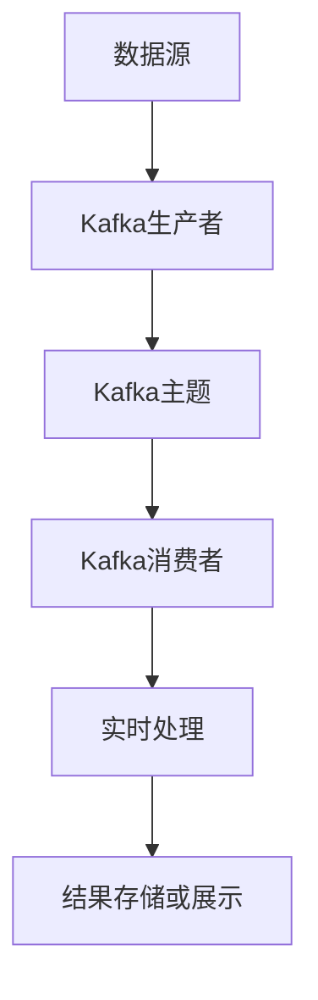

# Kafka 实时分析应用

## 介绍

Apache Kafka 是一个分布式流处理平台，广泛用于构建实时数据管道和流应用程序。它的高吞吐量、低延迟和可扩展性使其成为实时数据分析的理想选择。本文将介绍Kafka在实时分析中的应用场景，并通过代码示例和实际案例帮助你理解其工作原理。

## 什么是实时分析？

实时分析是指对数据流进行即时处理和分析，以便快速做出决策或触发操作。与传统的批处理不同，实时分析需要在数据到达时立即处理，通常用于监控、日志分析、推荐系统等场景。

## Kafka 在实时分析中的作用

Kafka 作为一个分布式消息系统，能够高效地处理大量实时数据流。它通过以下方式支持实时分析：

1. **数据收集**：Kafka 可以从多个数据源（如传感器、日志文件、数据库等）收集数据。
2. **数据存储**：Kafka 将数据存储在主题（topics）中，确保数据不会丢失。
3. **数据处理**：Kafka Streams 或 Kafka Connect 等工具可以对数据进行实时处理和分析。
4. **数据分发**：处理后的数据可以分发给其他系统或应用程序进行进一步分析或展示。

## 实时分析的基本流程

以下是使用Kafka进行实时分析的基本流程：



1. **数据源**：数据源可以是传感器、日志文件、数据库等。
2. **Kafka生产者**：生产者将数据发送到Kafka主题。
3. **Kafka主题**：主题是Kafka中存储数据的逻辑容器。
4. **Kafka消费者**：消费者从主题中读取数据并进行处理。
5. **实时处理**：使用Kafka Streams或其他流处理框架对数据进行实时分析。
6. **结果存储或展示**：处理后的结果可以存储到数据库或展示在仪表盘上。

## 代码示例

以下是一个简单的Kafka实时分析示例，使用Python和Kafka-Python库。

### 生产者代码

```python
from kafka import KafkaProducer

# 创建Kafka生产者
producer = KafkaProducer(bootstrap_servers='localhost:9092')

# 发送消息到主题
for i in range(10):
    producer.send('test-topic', key=b'message_key', value=b'message_value_%d' % i)

# 关闭生产者
producer.close()
```

### 消费者代码

```python
from kafka import KafkaConsumer

# 创建Kafka消费者
consumer = KafkaConsumer('test-topic', bootstrap_servers='localhost:9092')

# 消费消息
for message in consumer:
    print(f"Received message: {message.value.decode('utf-8')}")
```

### 输出

```
Received message: message_value_0
Received message: message_value_1
Received message: message_value_2
...
```

## 实际案例

### 案例1：实时日志分析

假设你有一个Web应用程序，需要实时监控用户活动日志。你可以使用Kafka收集日志数据，并通过实时分析工具（如Kafka Streams）对日志进行处理，识别异常行为或生成实时统计信息。

### 案例2：实时推荐系统

在电商平台上，用户的行为数据（如点击、购买）可以实时发送到Kafka。通过实时分析这些数据，系统可以立即生成个性化推荐，提高用户体验和转化率。

## 总结

Kafka 在实时分析中扮演着重要角色，能够高效地处理大量实时数据流。通过本文的介绍和示例，你应该对Kafka在实时分析中的应用有了初步了解。接下来，你可以尝试在自己的项目中应用这些概念，或者进一步学习Kafka的高级功能。

## 附加资源

- [Kafka官方文档](https://kafka.apache.org/documentation/)
- [Kafka Streams入门指南](https://kafka.apache.org/documentation/streams/)
- [Kafka-Python库文档](https://kafka-python.readthedocs.io/en/master/)

## 练习

1. 尝试修改生产者代码，发送不同类型的数据（如JSON格式）。
2. 使用Kafka Streams编写一个简单的实时处理应用程序，计算每分钟的消息数量。
3. 探索Kafka Connect，了解如何将Kafka与其他数据存储系统（如Elasticsearch、MySQL）集成。
