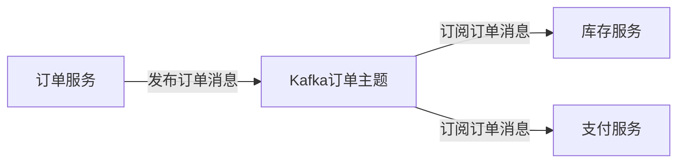

# Kafka 微服务解耦应用

在现代微服务架构中，服务之间的通信是一个关键问题。随着系统规模的扩大，服务之间的直接依赖关系可能会导致系统复杂性和耦合度增加。Kafka作为一个分布式流处理平台，能够有效地解决这一问题，帮助实现微服务之间的解耦。

## 什么是微服务解耦？

微服务解耦是指通过某种机制，使得各个微服务之间不再直接依赖，而是通过中间件进行通信。这种机制可以提升系统的可扩展性、灵活性和可维护性。

### 为什么需要解耦？

1. **降低耦合度**：服务之间不再直接依赖，减少了一个服务的变化对其他服务的影响。
2. **提高可扩展性**：通过解耦，可以更容易地扩展单个服务，而不影响整个系统。
3. **增强灵活性**：解耦后的服务可以独立开发、部署和升级。

## Kafka 如何实现微服务解耦？

Kafka通过其发布-订阅模式，允许生产者将消息发布到特定的主题（Topic），而消费者可以订阅这些主题并处理消息。这种模式使得生产者和消费者之间不需要直接通信，从而实现了解耦。

### Kafka 的基本概念

- **Producer**：消息的生产者，负责将消息发布到Kafka的主题。
- **Consumer**：消息的消费者，负责从Kafka的主题中读取消息。
- **Topic**：消息的分类，生产者将消息发布到特定的主题，消费者订阅这些主题。
- **Broker**：Kafka集群中的单个节点，负责存储和转发消息。

### 代码示例

以下是一个简单的Kafka生产者和消费者的代码示例：

```python
# 生产者代码
from kafka import KafkaProducer

producer = KafkaProducer(bootstrap_servers='localhost:9092')
producer.send('my_topic', b'Hello, Kafka!')
producer.flush()

# 消费者代码
from kafka import KafkaConsumer

consumer = KafkaConsumer('my_topic', bootstrap_servers='localhost:9092')
for message in consumer:
    print(f"Received message: {message.value.decode('utf-8')}")
```

### 输入与输出

- **生产者输入**：消息 `'Hello, Kafka!'`
- **消费者输出**：`Received message: Hello, Kafka!`

## 实际应用场景

### 电商系统中的订单处理

在一个电商系统中，订单服务、库存服务和支付服务是三个独立的微服务。当用户下单时，订单服务需要通知库存服务和支付服务进行相应的处理。

#### 传统方式

在传统方式下，订单服务需要直接调用库存服务和支付服务的API。这种方式会导致服务之间的强耦合，一旦某个服务出现问题，整个系统都会受到影响。

#### 使用Kafka解耦

通过Kafka，订单服务只需将订单信息发布到Kafka的订单主题中，库存服务和支付服务分别订阅该主题并处理消息。这样，订单服务不再直接依赖库存服务和支付服务，实现了服务之间的解耦。



### 日志收集与分析

在分布式系统中，日志的收集与分析是一个常见的需求。通过Kafka，各个服务可以将日志消息发布到Kafka的日志主题中，日志分析服务订阅该主题并进行处理。

## 总结

Kafka通过其发布-订阅模式，能够有效地实现微服务之间的解耦，提升系统的可扩展性和灵活性。在实际应用中，Kafka可以用于订单处理、日志收集等多种场景。

### 附加资源

- [Kafka官方文档](https://kafka.apache.org/documentation/)
- [Kafka入门教程](https://www.tutorialspoint.com/apache_kafka/index.htm)

### 练习

1. 尝试在自己的本地环境中搭建一个Kafka集群，并实现一个简单的生产者和消费者。
2. 思考在你的项目中，哪些场景可以使用Kafka进行微服务解耦，并尝试实现。

:::tip
Kafka的学习曲线可能较陡，建议从简单的示例开始，逐步深入理解其核心概念和应用场景。
:::