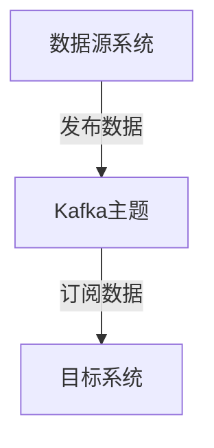

# Kafka 数据同步应用

## 介绍

Kafka是一个分布式流处理平台，广泛用于构建实时数据管道和流应用。数据同步是Kafka的一个重要应用场景，它允许不同系统之间高效、可靠地同步数据。通过Kafka，数据可以从一个系统传输到另一个系统，确保数据的一致性和实时性。

## 数据同步的基本概念

数据同步是指将数据从一个系统复制到另一个系统，以保持两个系统的数据一致性。Kafka通过其高吞吐量、低延迟的特性，成为数据同步的理想选择。Kafka的数据同步通常涉及生产者（Producer）、消费者（Consumer）和主题（Topic）。

- **生产者**：负责将数据发布到Kafka主题。
- **消费者**：从Kafka主题中读取数据。
- **主题**：Kafka中的逻辑数据分类，生产者将数据发布到主题，消费者从主题中订阅数据。

## Kafka 数据同步的实现

### 1. 创建Kafka主题

首先，我们需要创建一个Kafka主题来存储数据。可以使用Kafka命令行工具来创建主题：

```bash
kafka-topics --create --topic data_sync_topic --bootstrap-server localhost:9092 --partitions 3 --replication-factor 1
```

### 2. 生产者发布数据

接下来，我们编写一个生产者程序，将数据发布到Kafka主题中。以下是一个简单的Python生产者示例：

```python
from kafka import KafkaProducer

producer = KafkaProducer(bootstrap_servers='localhost:9092')

for i in range(10):
    producer.send('data_sync_topic', key=b'key_%d' % i, value=b'value_%d' % i)

producer.flush()
```

### 3. 消费者消费数据

然后，我们编写一个消费者程序，从Kafka主题中读取数据。以下是一个简单的Python消费者示例：

```python
from kafka import KafkaConsumer

consumer = KafkaConsumer('data_sync_topic', bootstrap_servers='localhost:9092')

for message in consumer:
    print(f"Key: {message.key}, Value: {message.value}")
```

### 4. 数据同步流程



在这个流程中，数据源系统将数据发布到Kafka主题，目标系统从Kafka主题中订阅数据，从而实现数据同步。

## 实际应用场景

### 1. 数据库同步

在微服务架构中，不同的服务可能使用不同的数据库。通过Kafka，可以将一个数据库的变更同步到另一个数据库，确保数据一致性。

### 2. 日志收集与分析

Kafka可以用于收集分布式系统中的日志数据，并将其同步到中央日志存储系统，如Elasticsearch，以便进行集中分析和监控。

### 3. 事件驱动架构

在事件驱动架构中，Kafka可以作为事件总线，将事件从一个服务同步到另一个服务，触发相应的业务逻辑。

## 总结

Kafka在数据同步中的应用非常广泛，它通过高吞吐量、低延迟的特性，确保了数据在不同系统之间的高效传输。通过生产者、消费者和主题的协作，Kafka能够实现可靠的数据同步。

## 附加资源与练习

- **练习**：尝试使用Kafka同步两个不同的数据库，观察数据的变化。
- **资源**：阅读Kafka官方文档，了解更多关于Kafka的高级特性和配置选项。

:::tip
Kafka的数据同步功能非常强大，但在实际应用中，还需要考虑数据一致性、容错性和性能优化等问题。建议在实际项目中逐步深入学习和应用。
:::