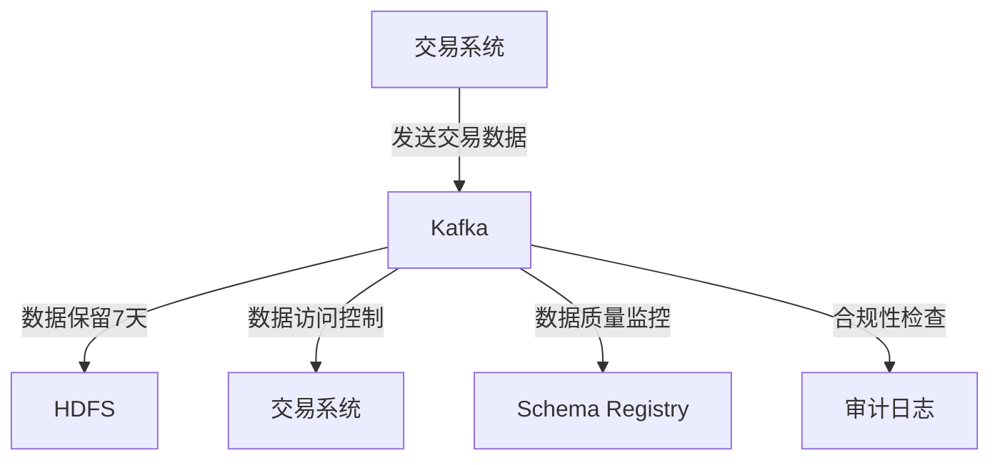

# Kafka 数据治理

## 介绍

Kafka是一个分布式流处理平台，广泛用于构建实时数据管道和流应用程序。随着数据量的增长，数据治理（Data Governance）成为了确保数据质量、安全性和合规性的关键。数据治理涉及数据的生命周期管理、访问控制、数据质量监控以及合规性检查等方面。

在Kafka中，数据治理尤为重要，因为Kafka通常用于处理大量敏感数据。如果没有适当的数据治理策略，可能会导致数据泄露、数据质量问题或违反法规。

## 数据治理的核心概念

### 1. 数据生命周期管理

数据生命周期管理涉及数据的创建、存储、使用、归档和删除。在Kafka中，数据生命周期管理可以通过以下方式实现：

- **数据保留策略**：通过配置Kafka主题的`retention.ms`或`retention.bytes`参数，控制数据在Kafka中的保留时间或大小。
- **数据归档**：将不再需要实时访问的数据归档到其他存储系统（如HDFS或S3）。

```bash
# 示例：设置Kafka主题的保留时间为7天
kafka-configs.sh --zookeeper localhost:2181 --alter --entity-type topics --entity-name my_topic --add-config retention.ms=604800000
```

### 2. 数据访问控制

Kafka提供了多种机制来控制数据的访问权限：

- **ACL（访问控制列表）**：通过Kafka的ACL机制，可以控制哪些用户或应用程序可以访问特定的主题或消费者组。
- **SASL/SSL**：通过SASL（简单认证和安全层）和SSL（安全套接字层）来加密数据传输并验证客户端身份。

```bash
# 示例：为Kafka主题添加ACL
kafka-acls.sh --authorizer-properties zookeeper.connect=localhost:2181 --add --allow-principal User:alice --operation Read --topic my_topic
```

### 3. 数据质量监控

数据质量监控是确保数据准确性和一致性的关键。在Kafka中，可以通过以下方式监控数据质量：

- **Schema Registry**：使用Schema Registry来确保消息的格式一致，避免数据格式错误。
- **监控工具**：使用Kafka自带的监控工具或第三方工具（如Prometheus、Grafana）来监控数据流的状态。

```bash
# 示例：使用Kafka自带的监控工具查看主题的消费情况
kafka-consumer-groups.sh --bootstrap-server localhost:9092 --describe --group my_consumer_group
```

### 4. 合规性检查

合规性检查确保数据处理符合相关法律法规（如GDPR、HIPAA）。在Kafka中，可以通过以下方式实现合规性检查：

- **数据加密**：使用SSL/TLS加密数据传输，确保数据在传输过程中不被窃取。
- **审计日志**：启用Kafka的审计日志功能，记录所有访问和操作，以便进行审计。

```bash
# 示例：启用Kafka的审计日志
kafka-server-start.sh config/server.properties --override log4j.logger.kafka.authorizer.logger=INFO,authorizerAppender
```

## 实际案例

### 案例：金融行业的数据治理

在金融行业，Kafka常用于处理交易数据。由于交易数据涉及敏感信息，数据治理尤为重要。以下是一个金融行业的数据治理策略示例：

1. **数据生命周期管理**：交易数据在Kafka中保留7天，之后归档到HDFS。
2. **数据访问控制**：只有经过身份验证的交易系统可以访问交易数据主题。
3. **数据质量监控**：使用Schema Registry确保交易数据的格式一致，并使用Prometheus监控数据流的状态。
4. **合规性检查**：启用SSL/TLS加密数据传输，并记录所有访问和操作的审计日志。



## 总结

Kafka数据治理是确保数据质量、安全性和合规性的关键。通过合理的数据生命周期管理、访问控制、数据质量监控和合规性检查，可以有效管理Kafka中的数据。在实际应用中，数据治理策略应根据具体行业和业务需求进行调整。

## 附加资源

- [Kafka官方文档](https://kafka.apache.org/documentation/)
- [Kafka数据治理最佳实践](https://www.confluent.io/blog/data-governance-in-kafka/)
- [Kafka Schema Registry](https://docs.confluent.io/platform/current/schema-registry/index.html)

## 练习

1. 为Kafka主题配置数据保留策略，确保数据保留30天。
2. 使用Kafka ACL机制，限制只有特定用户组可以访问某个主题。
3. 使用Schema Registry验证消息格式，确保数据一致性。
