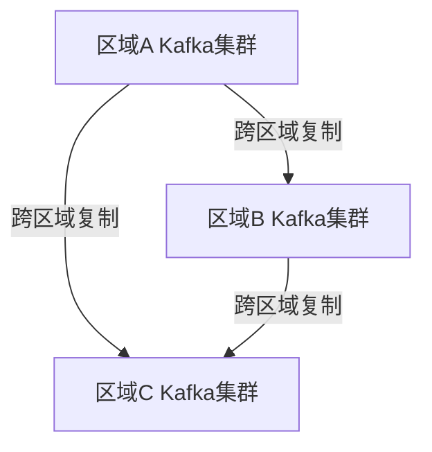

# Kafka 多区域部署

在现代分布式系统中，Kafka作为一个高吞吐量的消息队列系统，被广泛用于实时数据流处理。为了确保系统的高可用性和灾难恢复能力，Kafka的多区域部署变得至关重要。本文将详细介绍如何在多个区域中部署Kafka集群，并解释其背后的原理和实际应用场景。

## 什么是Kafka多区域部署？

Kafka多区域部署是指将Kafka集群分布在多个地理区域中，以确保即使某个区域发生故障，其他区域的集群仍然可以继续运行。这种部署方式不仅提高了系统的可用性，还能有效应对数据中心级别的灾难。

### 为什么需要多区域部署？

1. **高可用性**：通过在不同区域部署Kafka集群，可以确保即使一个区域发生故障，其他区域的集群仍然可以继续处理消息。
2. **灾难恢复**：在发生自然灾害或大规模网络故障时，多区域部署可以确保数据不会丢失，并且系统可以快速恢复。
3. **低延迟**：将Kafka集群部署在靠近用户的地理位置，可以减少消息传递的延迟，提高用户体验。

## Kafka 多区域部署的架构

在多区域部署中，Kafka集群通常会被部署在多个数据中心或云区域中。每个区域中的Kafka集群可以独立运行，同时通过跨区域复制（Cross-Region Replication, CRR）机制保持数据同步。



### 跨区域复制（CRR）

跨区域复制是Kafka多区域部署的核心机制。它允许将数据从一个Kafka集群复制到另一个Kafka集群，确保数据在多个区域之间保持一致。

#### 如何配置跨区域复制？

1. **创建MirrorMaker**：MirrorMaker是Kafka提供的一个工具，用于在不同集群之间复制数据。你可以通过以下命令启动MirrorMaker：

    ```bash
    bin/kafka-mirror-maker.sh --consumer.config consumer.properties --producer.config producer.properties --whitelist my-topic
    ```

2. **配置消费者和生产者**：在`consumer.properties`和`producer.properties`中分别配置源集群和目标集群的连接信息。

    ```properties
    # consumer.properties
    bootstrap.servers=source-cluster:9092
    group.id=mirror-maker-group

    # producer.properties
    bootstrap.servers=target-cluster:9092
    ```

3. **启动MirrorMaker**：启动MirrorMaker后，它将开始从源集群消费消息，并将消息生产到目标集群。

## 实际案例：全球电商平台的多区域Kafka部署

假设我们有一个全球电商平台，用户分布在北美、欧洲和亚洲。为了确保系统的高可用性和低延迟，我们决定在三个区域分别部署Kafka集群。

### 部署步骤

1. **在北美、欧洲和亚洲分别部署Kafka集群**：每个区域的Kafka集群独立运行，处理该区域的订单和用户行为数据。
2. **配置跨区域复制**：使用MirrorMaker将北美、欧洲和亚洲的Kafka集群相互复制，确保数据在三个区域之间保持一致。
3. **监控和故障转移**：通过监控工具实时监控各个区域的Kafka集群状态，并在某个区域发生故障时，自动将流量切换到其他区域。

### 结果

通过多区域部署，电商平台实现了以下目标：

- **高可用性**：即使某个区域的Kafka集群发生故障，其他区域的集群仍然可以继续处理数据。
- **低延迟**：用户请求被路由到最近的Kafka集群，减少了消息传递的延迟。
- **灾难恢复**：在发生大规模故障时，系统可以快速恢复，确保数据不丢失。

## 总结

Kafka多区域部署是确保分布式系统高可用性和灾难恢复能力的关键策略。通过跨区域复制机制，Kafka可以在多个地理区域之间保持数据同步，确保系统在发生故障时仍然可以正常运行。

### 附加资源

- [Kafka官方文档](https://kafka.apache.org/documentation/)
- [MirrorMaker配置指南](https://kafka.apache.org/documentation/#mirrormaker)
- [Kafka多区域部署最佳实践](https://www.confluent.io/blog/)

### 练习

1. 尝试在本地环境中模拟多区域部署，使用Docker创建多个Kafka集群，并配置跨区域复制。
2. 研究Kafka的监控工具，如Kafka Manager或Confluent Control Center，并尝试监控多区域部署的Kafka集群。

:::tip
在实际生产环境中，多区域部署可能会面临网络延迟和带宽限制等挑战。建议在部署前进行充分的测试和优化。
:::