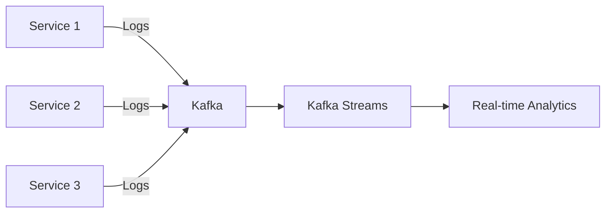
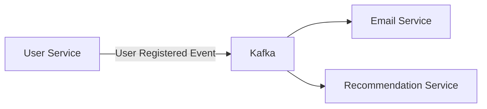

## 介绍

Apache Kafka 是一个分布式流处理平台，广泛用于构建实时数据管道和流应用。Kubernetes 是一个开源的容器编排平台，用于自动化部署、扩展和管理容器化应用。将 Kafka 部署在 Kubernetes 上，可以充分利用 Kubernetes 的弹性、可扩展性和自动化管理能力。

本文将逐步讲解如何在 Kubernetes 上部署 Kafka，并通过实际案例展示其应用场景。

## 前提条件

在开始之前，请确保你已经具备以下条件：

- 一个运行中的 Kubernetes 集群
- 安装了 `kubectl` 命令行工具
- 对 Kubernetes 和 Kafka 的基本概念有一定了解

## 部署 Kafka 到 Kubernetes

### 1. 创建 Kafka 命名空间

首先，我们需要为 Kafka 创建一个独立的命名空间，以便更好地管理资源。

```bash
kubectl create namespace kafka
```

### 2. 部署 Zookeeper

Kafka 依赖于 Zookeeper 来进行集群管理。因此，我们需要先部署 Zookeeper。

```yaml
apiVersion: apps/v1
kind: StatefulSet
metadata:
  name: zookeeper
  namespace: kafka
spec:
  serviceName: zookeeper
  replicas: 3
  selector:
    matchLabels:
      app: zookeeper
  template:
    metadata:
      labels:
        app: zookeeper
    spec:
      containers:
      - name: zookeeper
        image: zookeeper:3.7.0
        ports:
        - containerPort: 2181
        env:
        - name: ZOO_MY_ID
          value: "1"
        - name: ZOO_SERVERS
          value: "server.1=zookeeper-0.zookeeper.kafka.svc.cluster.local:2888:3888,server.2=zookeeper-1.zookeeper.kafka.svc.cluster.local:2888:3888,server.3=zookeeper-2.zookeeper.kafka.svc.cluster.local:2888:3888"
```

应用这个配置文件：

```bash
kubectl apply -f zookeeper.yaml
```

### 3. 部署 Kafka

接下来，我们部署 Kafka。Kafka 通常以 StatefulSet 的形式部署，以确保每个 Kafka 代理（broker）都有唯一的网络标识和持久化存储。

```yaml
apiVersion: apps/v1
kind: StatefulSet
metadata:
  name: kafka
  namespace: kafka
spec:
  serviceName: kafka
  replicas: 3
  selector:
    matchLabels:
      app: kafka
  template:
    metadata:
      labels:
        app: kafka
    spec:
      containers:
      - name: kafka
        image: confluentinc/cp-kafka:6.2.0
        ports:
        - containerPort: 9092
        env:
        - name: KAFKA_BROKER_ID
          valueFrom:
            fieldRef:
              fieldPath: metadata.name
        - name: KAFKA_ZOOKEEPER_CONNECT
          value: "zookeeper-0.zookeeper.kafka.svc.cluster.local:2181,zookeeper-1.zookeeper.kafka.svc.cluster.local:2181,zookeeper-2.zookeeper.kafka.svc.cluster.local:2181"
        - name: KAFKA_ADVERTISED_LISTENERS
          value: "PLAINTEXT://$(HOSTNAME).kafka.kafka.svc.cluster.local:9092"
```

应用这个配置文件：

```bash
kubectl apply -f kafka.yaml
```

### 4. 验证部署

部署完成后，你可以通过以下命令验证 Kafka 和 Zookeeper 是否正常运行：

```bash
kubectl get pods -n kafka
```

你应该看到类似以下的输出：

```
NAME         READY   STATUS    RESTARTS   AGE
kafka-0      1/1     Running   0          2m
kafka-1      1/1     Running   0          2m
kafka-2      1/1     Running   0          2m
zookeeper-0  1/1     Running   0          5m
zookeeper-1  1/1     Running   0          5m
zookeeper-2  1/1     Running   0          5m
```

## 实际应用场景

### 实时日志处理

假设你有一个微服务架构的应用，每个服务都会生成大量的日志。你可以使用 Kafka 来收集这些日志，并通过 Kafka Streams 或 Flink 进行实时处理和分析。



### 事件驱动架构

在事件驱动架构中，Kafka 可以作为事件总线，用于在不同服务之间传递事件。例如，当用户注册时，用户服务可以发布一个“用户注册”事件到 Kafka，其他服务（如邮件服务、推荐服务）可以订阅这个事件并做出相应的处理。



## 总结

通过本文，你已经学习了如何在 Kubernetes 上部署 Kafka，并了解了其在实际应用中的一些场景。Kafka 和 Kubernetes 的结合为构建高可用、可扩展的实时数据处理系统提供了强大的支持。

## 附加资源

- [Kafka 官方文档](https://kafka.apache.org/documentation/)
- [Kubernetes 官方文档](https://kubernetes.io/docs/home/)
- [Kafka on Kubernetes: A Practical Guide](https://www.confluent.io/blog/kafka-on-kubernetes-practical-guide/)

## 练习

1. 尝试在本地 Minikube 集群上部署 Kafka 和 Zookeeper。
2. 创建一个简单的生产者-消费者应用，验证 Kafka 集群的功能。
3. 探索如何使用 Kafka Streams 进行实时数据处理。

:::tip
如果你在部署过程中遇到问题，可以参考 Kubernetes 和 Kafka 的官方文档，或者在社区论坛中寻求帮助。
:::