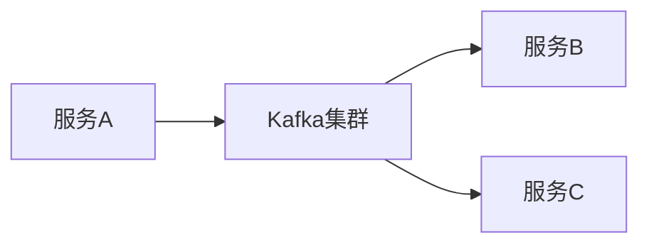

# Kafka 云平台部署

## 介绍

Apache Kafka 是一个分布式流处理平台，广泛用于构建实时数据管道和流应用程序。随着云计算的普及，越来越多的企业选择在云平台上部署Kafka，以利用云平台的可扩展性、弹性和管理便利性。本文将介绍如何在云平台上部署Kafka，并探讨其实际应用场景。

## 为什么选择云平台部署Kafka？

云平台提供了许多优势，使得Kafka的部署和管理更加简单和高效：

- **弹性扩展**：云平台可以根据需求自动扩展Kafka集群，以应对流量高峰。
- **高可用性**：云平台通常提供跨区域的高可用性支持，确保Kafka集群的稳定性。
- **简化管理**：云平台提供了自动化的监控、备份和恢复工具，减少了运维负担。

## 云平台选择

目前，主流的云平台都提供了Kafka的托管服务，例如：

- **Amazon MSK (Managed Streaming for Kafka)**
- **Confluent Cloud**
- **Google Cloud Pub/Sub**
- **Azure Event Hubs**

这些服务简化了Kafka的部署和管理，适合初学者快速上手。

## 部署步骤

### 1. 选择云平台和Kafka服务

首先，选择一个适合的云平台和Kafka服务。以Amazon MSK为例，以下是部署步骤。

### 2. 创建Kafka集群

在AWS管理控制台中，选择MSK服务并创建一个新的Kafka集群。配置集群的参数，例如实例类型、存储大小和网络设置。

```bash
aws kafka create-cluster --cluster-name my-kafka-cluster --broker-node-group-info file://broker-node-group-info.json --kafka-version 2.8.1 --number-of-broker-nodes 3
```

### 3. 配置安全组和网络

确保Kafka集群的安全组允许来自客户端的流量。配置VPC和子网，以确保Kafka集群与应用程序之间的网络通信。

```bash
aws ec2 authorize-security-group-ingress --group-id sg-0123456789abcdef0 --protocol tcp --port 9092 --cidr 0.0.0.0/0
```

### 4. 创建Topic

使用Kafka命令行工具创建一个新的Topic。

```bash
kafka-topics.sh --create --topic my-topic --bootstrap-server my-kafka-cluster-broker:9092 --partitions 3 --replication-factor 2
```

### 5. 生产和消费消息

使用Kafka生产者发送消息到Topic。

```bash
kafka-console-producer.sh --topic my-topic --bootstrap-server my-kafka-cluster-broker:9092
```

使用Kafka消费者从Topic中读取消息。

```bash
kafka-console-consumer.sh --topic my-topic --bootstrap-server my-kafka-cluster-broker:9092 --from-beginning
```

## 实际应用场景

### 实时日志处理

Kafka常用于实时日志处理系统。例如，一个电商平台可以使用Kafka收集用户行为日志，并通过流处理系统实时分析用户行为。


### 事件驱动架构

在微服务架构中，Kafka可以作为事件总线，实现服务之间的解耦和异步通信。



## 总结

在云平台上部署Kafka可以充分利用云计算的弹性、高可用性和简化管理优势。本文介绍了如何在Amazon MSK上部署Kafka集群，并探讨了Kafka在实时日志处理和事件驱动架构中的应用场景。

## 附加资源

- [Apache Kafka官方文档](https://kafka.apache.org/documentation/)
- [Amazon MSK用户指南](https://docs.aws.amazon.com/msk/latest/developerguide/what-is-msk.html)
- [Confluent Cloud文档](https://docs.confluent.io/cloud/current/overview.html)

## 练习

1. 在AWS上创建一个Kafka集群，并配置一个Topic。
2. 使用Kafka生产者和消费者工具发送和接收消息。
3. 尝试将Kafka与一个简单的流处理系统集成，例如Apache Flink或Apache Spark Streaming。

:::tip
在部署过程中，如果遇到问题，可以参考云平台的官方文档或社区论坛获取帮助。
:::