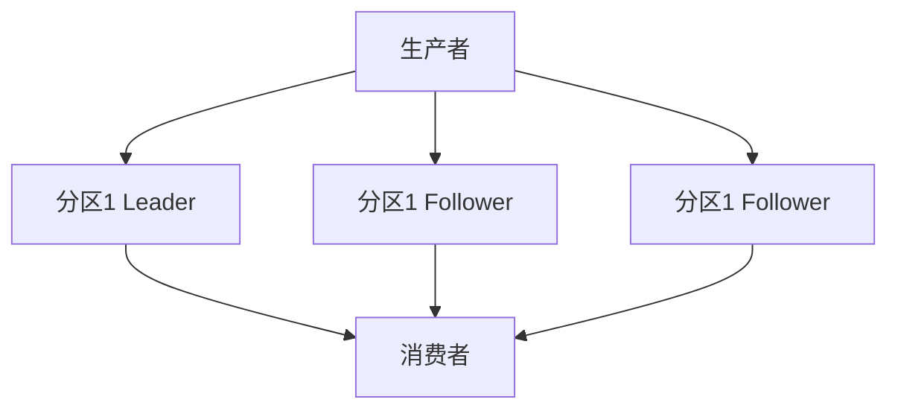

# Kafka 故障预防措施

Kafka是一个分布式流处理平台，广泛用于构建实时数据管道和流应用。然而，由于其分布式特性，Kafka系统可能会遇到各种故障。为了确保系统的稳定性和可靠性，采取适当的预防措施至关重要。本文将介绍一些常见的Kafka故障预防措施，帮助初学者更好地理解和应用这些策略。

## 1. 集群配置优化

### 1.1 副本机制

Kafka通过副本机制来确保数据的可靠性。每个分区可以有多个副本，其中一个副本是领导者（Leader），其他副本是追随者（Follower）。如果领导者副本发生故障，追随者副本可以接管成为新的领导者。



:::tip
建议为每个分区配置至少3个副本，以确保在单个节点故障时，数据仍然可用。
:::

### 1.2 分区与副本分布

确保分区和副本均匀分布在不同的Broker上，以避免单点故障。可以使用Kafka的`replica.assignment`工具来手动分配副本。

```bash
kafka-reassign-partitions --zookeeper localhost:2181 --reassignment-json-file reassignment.json --execute
```

## 2. 监控与告警

### 2.1 监控指标

监控Kafka集群的关键指标，如Broker的CPU、内存、磁盘使用率，以及生产者和消费者的延迟。可以使用工具如Prometheus和Grafana来可视化这些指标。


### 2.2 告警设置

设置合理的告警阈值，如磁盘使用率超过80%时触发告警，以便及时采取措施。

```yaml
alert: HighDiskUsage
expr: disk_usage_percent > 80
for: 5m
labels:
  severity: critical
annotations:
  summary: "High Disk Usage on {{ $labels.instance }}"
  description: "Disk usage is above 80% for more than 5 minutes."
```

## 3. 数据备份与恢复

### 3.1 定期备份

定期备份Kafka的数据目录和Zookeeper的元数据，以防止数据丢失。

```bash
tar -czvf kafka-backup-$(date +%F).tar.gz /path/to/kafka/data
```

### 3.2 恢复策略

在数据丢失或损坏时，可以从备份中恢复数据。确保备份策略包括完整的元数据和数据文件。

```bash
tar -xzvf kafka-backup-2023-10-01.tar.gz -C /path/to/kafka/data
```

## 4. 网络与硬件冗余

### 4.1 网络冗余

确保Kafka集群的网络连接具有冗余性，使用多个网络接口或交换机，以避免单点故障。

### 4.2 硬件冗余

使用RAID配置或分布式存储系统来确保数据的冗余存储，防止硬件故障导致的数据丢失。

## 5. 实际案例

### 5.1 案例一：副本不足导致数据丢失

某公司Kafka集群配置了单副本，结果在一次Broker故障中丢失了大量数据。通过增加副本数量，问题得到解决。

### 5.2 案例二：磁盘空间不足导致服务中断

另一家公司由于未监控磁盘使用率，导致磁盘空间耗尽，Kafka服务中断。通过设置磁盘使用率告警和定期清理旧数据，问题得以避免。

## 总结

通过优化集群配置、设置监控与告警、定期备份数据以及确保网络和硬件冗余，可以显著减少Kafka系统中的故障。这些预防措施不仅提高了系统的可靠性，还确保了数据流的稳定性。

## 附加资源

- [Kafka官方文档](https://kafka.apache.org/documentation/)
- [Prometheus监控指南](https://prometheus.io/docs/introduction/overview/)
- [Grafana可视化工具](https://grafana.com/docs/)

## 练习

1. 配置一个Kafka集群，确保每个分区有3个副本。
2. 设置Prometheus和Grafana监控Kafka集群的关键指标。
3. 编写一个脚本，定期备份Kafka的数据目录。

通过完成这些练习，您将更好地掌握Kafka故障预防措施的实际应用。