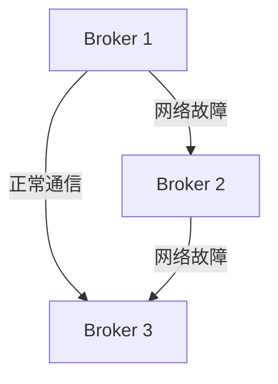

# Kafka 网络分区处理

在分布式系统中，网络分区（Network Partition）是一个常见的问题。它指的是由于网络故障，导致集群中的某些节点无法与其他节点通信。Kafka作为一个分布式消息系统，也可能面临网络分区问题。本文将详细介绍Kafka网络分区的概念、原因及其处理方法，帮助你更好地理解和应对这一问题。

## 什么是网络分区？

网络分区是指由于网络故障，导致集群中的某些节点无法与其他节点通信。在Kafka中，网络分区可能导致以下问题：

- **数据不一致**：分区内的节点可能无法同步数据，导致数据不一致。
- **服务不可用**：某些分区可能无法提供服务，导致部分消息无法被消费或生产。

## 网络分区的原因

网络分区可能由多种原因引起，包括但不限于：

- **网络故障**：如路由器故障、网络拥塞等。
- **硬件故障**：如网卡故障、交换机故障等。
- **配置错误**：如错误的网络配置、防火墙规则等。

## Kafka 网络分区的处理

### 1. 检测网络分区

Kafka通过Zookeeper或Kafka自身的元数据管理机制来检测网络分区。当某个节点无法与其他节点通信时，Kafka会将其标记为不可用。

### 2. 处理网络分区

一旦检测到网络分区，Kafka会采取以下措施：

- **重新选举Leader**：如果某个分区的Leader节点无法与其他节点通信，Kafka会重新选举一个新的Leader。
- **数据同步**：新的Leader会尝试与其他副本同步数据，以确保数据一致性。

:::note
在Kafka中，Leader负责处理所有的读写请求，而Follower则负责同步数据。当Leader不可用时，Kafka会从Follower中选举一个新的Leader。
:::

### 3. 恢复网络分区

当网络分区问题解决后，Kafka会自动恢复受影响的分区。具体步骤如下：

1. **重新加入集群**：受影响的节点会重新加入集群，并与其他节点建立通信。
2. **数据同步**：重新加入的节点会与Leader同步数据，以确保数据一致性。
3. **恢复正常服务**：一旦数据同步完成，分区将恢复正常服务。

## 实际案例

假设我们有一个由三个Broker组成的Kafka集群，分别是Broker 1、Broker 2和Broker 3。由于网络故障，Broker 1和Broker 2之间的通信中断，导致网络分区。

在这种情况下，Kafka会检测到Broker 1和Broker 2之间的网络分区，并重新选举一个新的Leader。假设Broker 3被选为新的Leader，它将负责处理所有的读写请求，并与其他副本同步数据。

当网络故障解决后，Broker 1和Broker 2会重新加入集群，并与Broker 3同步数据。一旦数据同步完成，分区将恢复正常服务。

## 总结

网络分区是分布式系统中常见的问题，Kafka通过检测、处理和恢复网络分区来确保系统的可用性和数据一致性。理解Kafka网络分区的处理机制，对于构建高可用的分布式系统至关重要。

## 附加资源

- [Kafka官方文档](https://kafka.apache.org/documentation/)
- [分布式系统设计与实践](https://example.com/distributed-systems)

## 练习

1. 在一个由三个Broker组成的Kafka集群中，模拟网络分区并观察Kafka的处理过程。
2. 尝试配置Kafka的网络超时参数，观察其对网络分区处理的影响。

:::tip
在实际生产环境中，建议定期进行网络分区模拟测试，以确保系统在真实故障情况下的稳定性。
:::