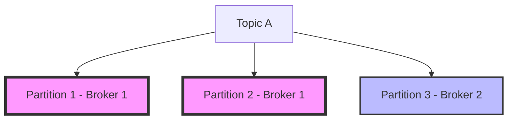

# Kafka 性能下降分析

Kafka是一个高性能的分布式消息系统，广泛应用于实时数据流处理场景。然而，随着数据量的增加或配置不当，Kafka的性能可能会下降，导致消息延迟、吞吐量降低等问题。本文将逐步分析Kafka性能下降的常见原因，并提供解决方案。

## 1. 什么是Kafka性能下降？

Kafka性能下降通常表现为以下现象：
- **消息延迟增加**：消费者处理消息的时间变长。
- **吞吐量降低**：单位时间内处理的消息数量减少。
- **资源利用率过高**：CPU、内存、磁盘或网络资源被过度占用。

这些现象可能是由多种因素引起的，包括硬件资源不足、配置不当、网络问题或应用程序逻辑问题。

---

## 2. Kafka性能下降的常见原因

### 2.1 硬件资源不足
Kafka的性能高度依赖于硬件资源。如果CPU、内存、磁盘或网络资源不足，可能会导致性能下降。

:::tip
**检查硬件资源使用情况**：
- 使用工具如 `top` 或 `htop` 检查CPU和内存使用率。
- 使用 `iostat` 或 `df` 检查磁盘I/O和磁盘空间。
:::

### 2.2 配置不当
Kafka的配置参数对性能有重要影响。以下是一些常见的配置问题：
- **`num.io.threads` 和 `num.network.threads` 设置过低**：这些参数控制Kafka处理I/O和网络请求的线程数。如果设置过低，可能会导致请求积压。
- **`log.flush.interval.messages` 和 `log.flush.interval.ms` 设置不合理**：这些参数控制日志刷盘的频率。如果设置过于频繁，可能会导致磁盘I/O过高。

### 2.3 网络问题
网络延迟或带宽不足可能会导致Kafka生产者或消费者无法及时发送或接收消息。

:::caution
**检查网络状况**：
- 使用 `ping` 或 `traceroute` 检查网络延迟。
- 使用 `iftop` 或 `nload` 检查网络带宽使用情况。
:::

### 2.4 分区不均衡
如果Kafka主题的分区分布不均衡，可能会导致某些Broker负载过高，而其他Broker负载较低。



如上图所示，Partition 1和Partition 2集中在Broker 1上，导致Broker 1负载过高。

---

## 3. 如何分析Kafka性能下降？

### 3.1 监控Kafka集群
使用Kafka自带的监控工具或第三方工具（如Prometheus、Grafana）监控以下指标：
- **Broker的CPU、内存、磁盘和网络使用率**。
- **消息生产和消费的延迟**。
- **分区和副本的状态**。

### 3.2 分析日志
检查Kafka Broker和客户端的日志，查找可能的错误或警告信息。

```bash
# 查看Kafka Broker日志
tail -f /var/log/kafka/server.log
```

### 3.3 使用Kafka命令行工具
Kafka提供了多种命令行工具，可以帮助诊断性能问题。例如：
- **`kafka-topics.sh`**：查看主题和分区的状态。
- **`kafka-consumer-groups.sh`**：查看消费者组的消费延迟。

```bash
# 查看消费者组的消费延迟
kafka-consumer-groups.sh --bootstrap-server localhost:9092 --describe --group my-group
```

---

## 4. 实际案例：分区不均衡导致性能下降

### 场景描述
某公司的Kafka集群在处理大量订单数据时，发现部分Broker的CPU使用率远高于其他Broker，导致消息延迟增加。

### 分析过程
1. 使用 `kafka-topics.sh` 检查主题的分区分布，发现某些Broker承载了过多的分区。
2. 使用 `kafka-reassign-partitions.sh` 重新分配分区，使负载均衡。

### 解决方案
重新分配分区后，集群的负载均衡，性能恢复正常。

---

## 5. 总结

Kafka性能下降可能由多种原因引起，包括硬件资源不足、配置不当、网络问题或分区不均衡。通过监控集群、分析日志和使用命令行工具，可以有效地诊断和解决性能问题。

:::note
**附加资源**：
- [Kafka官方文档](https://kafka.apache.org/documentation/)
- [Kafka性能调优指南](https://developer.confluent.io/learn-kafka/performance/)
:::

**练习**：
1. 使用 `kafka-topics.sh` 查看你所在集群的主题分区分布。
2. 使用 `kafka-consumer-groups.sh` 检查消费者组的消费延迟。