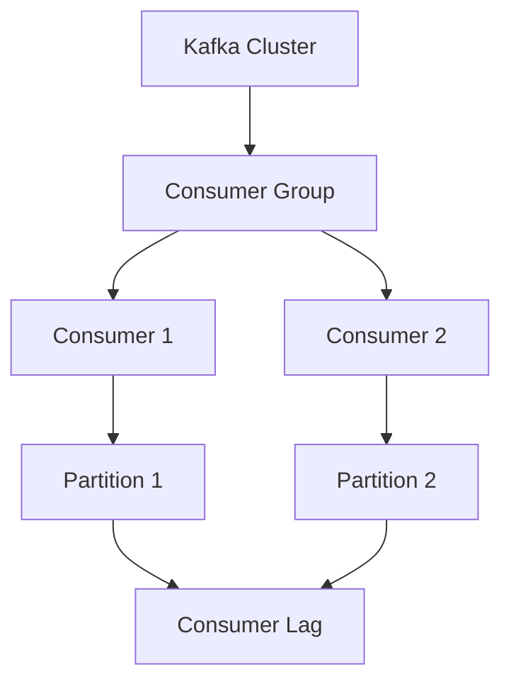

# Kafka 消费者延迟分析

Kafka是一个分布式流处理平台，广泛用于实时数据管道和流应用程序。然而，在实际使用中，消费者延迟是一个常见问题，可能导致数据处理不及时，影响系统性能。本文将深入探讨Kafka消费者延迟的原因、分析方法以及解决方案。

## 什么是Kafka消费者延迟？

Kafka消费者延迟是指消费者从Kafka主题中读取消息的速度慢于生产者写入消息的速度。这种延迟可能导致数据积压，影响实时数据处理和分析。

## 延迟的原因

Kafka消费者延迟可能由多种因素引起，包括：

1. **网络延迟**：消费者与Kafka集群之间的网络连接不稳定或带宽不足。
2. **消费者处理能力不足**：消费者的处理逻辑复杂或资源不足，导致处理速度慢。
3. **分区分配不均**：Kafka主题的分区分配不均，导致某些消费者处理的消息量远大于其他消费者。
4. **配置不当**：Kafka消费者配置参数设置不合理，如`fetch.min.bytes`、`fetch.max.wait.ms`等。

## 延迟分析方法

### 1. 监控消费者延迟

Kafka提供了多种监控工具和指标，帮助分析消费者延迟。常用的指标包括：

- **Consumer Lag**：消费者当前偏移量与分区最新偏移量之间的差值。
- **Fetch Latency**：消费者从Kafka集群获取数据的延迟时间。

```bash
kafka-consumer-groups.sh --bootstrap-server localhost:9092 --describe --group my-consumer-group
```

### 2. 使用Kafka监控工具

可以使用Kafka自带的监控工具或第三方工具（如Prometheus、Grafana）来监控消费者延迟。



### 3. 分析日志

检查消费者日志，查找可能的错误或警告信息，如网络超时、处理异常等。

```bash
tail -f /var/log/kafka/consumer.log
```

## 实际案例

### 案例：电商订单处理系统

在一个电商订单处理系统中，Kafka用于实时处理订单数据。某天，系统出现订单处理延迟，导致部分订单未能及时处理。

#### 问题分析

1. **监控发现**：消费者组的`Consumer Lag`持续增加。
2. **日志检查**：发现消费者处理订单的逻辑中存在数据库查询瓶颈。
3. **网络检查**：网络连接正常，带宽充足。

#### 解决方案

1. **优化消费者处理逻辑**：减少数据库查询次数，使用缓存提高处理速度。
2. **调整Kafka配置**：增加`fetch.min.bytes`和`fetch.max.wait.ms`，减少网络请求次数。
3. **增加消费者实例**：通过增加消费者实例，分担处理压力。

## 总结

Kafka消费者延迟是一个常见但复杂的问题，可能由多种因素引起。通过监控、日志分析和配置优化，可以有效减少延迟，提升系统性能。

## 附加资源

- [Kafka官方文档](https://kafka.apache.org/documentation/)
- [Kafka消费者配置参数详解](https://kafka.apache.org/documentation/#consumerconfigs)
- [Kafka监控工具推荐](https://prometheus.io/docs/introduction/overview/)

## 练习

1. 使用`kafka-consumer-groups.sh`工具查看你的消费者组的`Consumer Lag`。
2. 尝试调整Kafka消费者的`fetch.min.bytes`和`fetch.max.wait.ms`参数，观察延迟变化。
3. 编写一个简单的Kafka消费者程序，模拟处理延迟，并尝试优化处理逻辑。

:::tip
在实际生产环境中，建议定期监控Kafka消费者延迟，及时发现并解决问题。
:::