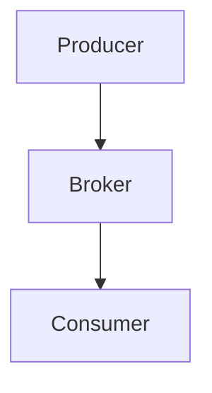
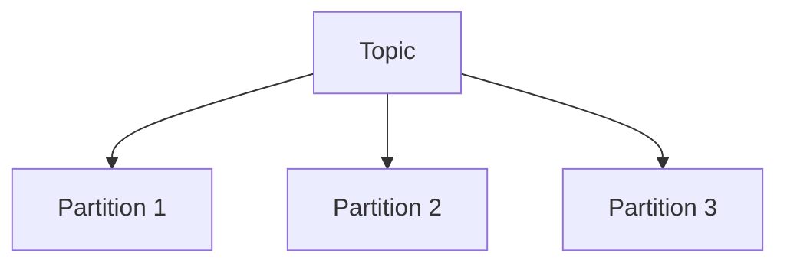

## 介绍

Apache Kafka 是一个分布式流处理平台，广泛用于构建实时数据管道和流应用程序。Kafka 生态系统不仅包括 Kafka 本身，还包含一系列与之相关的工具和框架，这些工具共同构成了一个强大的数据处理生态系统。本文将带你了解 Kafka 生态系统的核心组件及其在实际应用中的作用。

## Kafka 核心组件

### 1. Kafka Broker

Kafka Broker 是 Kafka 集群中的核心组件，负责存储和传递消息。每个 Broker 都是一个独立的 Kafka 服务器，多个 Broker 组成一个 Kafka 集群。



### 2. Topic 和 Partition

Topic 是 Kafka 中消息的分类单位，每个 Topic 可以分为多个 Partition。Partition 是 Kafka 实现水平扩展和高吞吐量的关键。



### 3. Producer 和 Consumer

Producer 是消息的生产者，负责将消息发送到 Kafka Topic。Consumer 是消息的消费者，负责从 Kafka Topic 中读取消息。

```java
// Producer 示例
Properties props = new Properties();
props.put("bootstrap.servers", "localhost:9092");
props.put("key.serializer", "org.apache.kafka.common.serialization.StringSerializer");
props.put("value.serializer", "org.apache.kafka.common.serialization.StringSerializer");

Producer<String, String> producer = new KafkaProducer<>(props);
producer.send(new ProducerRecord<>("my-topic", "key", "value"));
producer.close();
```

```java
// Consumer 示例
Properties props = new Properties();
props.put("bootstrap.servers", "localhost:9092");
props.put("group.id", "test");
props.put("key.deserializer", "org.apache.kafka.common.serialization.StringDeserializer");
props.put("value.deserializer", "org.apache.kafka.common.serialization.StringDeserializer");

Consumer<String, String> consumer = new KafkaConsumer<>(props);
consumer.subscribe(Arrays.asList("my-topic"));

while (true) {
    ConsumerRecords<String, String> records = consumer.poll(Duration.ofMillis(100));
    for (ConsumerRecord<String, String> record : records) {
        System.out.printf("offset = %d, key = %s, value = %s%n", record.offset(), record.key(), record.value());
    }
}
```

### 4. ZooKeeper

ZooKeeper 是 Kafka 的分布式协调服务，负责管理 Kafka 集群的元数据和 Broker 的状态。虽然 Kafka 正在逐步减少对 ZooKeeper 的依赖，但在当前版本中，ZooKeeper 仍然是 Kafka 集群的重要组成部分。

## Kafka 生态系统工具

### 1. Kafka Connect

Kafka Connect 是一个用于在 Kafka 和其他系统之间进行数据导入导出的工具。它提供了丰富的插件，支持与各种数据源和目标系统的集成。

### 2. Kafka Streams

Kafka Streams 是一个用于构建流处理应用程序的库。它允许开发者使用简单的 API 来处理 Kafka 中的数据流。

```java
// Kafka Streams 示例
StreamsBuilder builder = new StreamsBuilder();
KStream<String, String> source = builder.stream("my-topic");
source.mapValues(value -> value.toUpperCase()).to("output-topic");

KafkaStreams streams = new KafkaStreams(builder.build(), props);
streams.start();
```

### 3. Schema Registry

Schema Registry 是一个用于管理 Kafka 消息模式的工具。它确保生产者和消费者使用相同的模式来序列化和反序列化消息。

## 实际应用场景

### 1. 实时日志处理

Kafka 常用于实时日志处理系统。例如，一个网站可以将用户行为日志发送到 Kafka，然后由下游系统实时处理这些日志，生成实时报表或触发告警。

### 2. 事件驱动架构

在微服务架构中，Kafka 可以作为事件总线，用于服务之间的异步通信。每个服务都可以订阅感兴趣的事件，并根据事件触发相应的业务逻辑。

### 3. 数据管道

Kafka 可以作为数据管道的核心组件，用于将数据从多个源系统导入到数据仓库或数据湖中。Kafka Connect 可以简化这一过程，提供开箱即用的连接器。

## 总结

Kafka 生态系统提供了丰富的工具和框架，帮助开发者构建高效、可靠的实时数据处理系统。通过本文的介绍，你应该对 Kafka 的核心组件和生态系统工具有了初步的了解。接下来，你可以通过实践进一步掌握这些工具的使用。

:::tip 附加资源
- [Kafka 官方文档](https://kafka.apache.org/documentation/)
- [Kafka Streams 入门指南](https://kafka.apache.org/documentation/streams/)
- [Kafka Connect 教程](https://docs.confluent.io/platform/current/connect/index.html)
:::

:::caution 练习
1. 尝试在本地搭建一个 Kafka 集群，并创建一个简单的 Producer 和 Consumer。
2. 使用 Kafka Streams 处理一个简单的数据流，并将结果输出到另一个 Topic。
3. 探索 Kafka Connect，尝试将数据从 Kafka 导入到 MySQL 或其他数据库。
:::