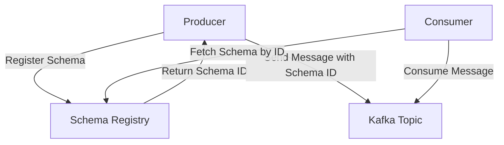

# Kafka 与Schema Registry

## 介绍

在Kafka生态系统中，Schema Registry是一个重要的组件，用于管理和存储Kafka消息的Schema（模式）。Schema Registry的主要作用是确保生产者和消费者之间数据格式的一致性，同时支持Schema的版本控制和兼容性检查。

Kafka本身是一个分布式流处理平台，能够高效地处理大量数据流。然而，Kafka并不关心消息的具体内容格式，这意味着生产者和消费者需要自行约定数据的格式。这种松散的结构可能会导致数据格式不一致的问题，尤其是在系统演化和版本迭代的过程中。

Schema Registry通过集中管理Schema，解决了这一问题。它允许生产者和消费者在发送和接收消息时，自动验证消息的格式是否符合预期的Schema，从而确保数据的一致性和兼容性。

## Schema Registry的工作原理

Schema Registry的核心功能是存储和管理Schema。每个Schema都有一个唯一的ID，并且可以关联到Kafka的Topic。当生产者发送消息时，它会将消息的Schema注册到Schema Registry，并将Schema ID嵌入到消息中。消费者在接收消息时，可以通过Schema ID从Schema Registry中获取对应的Schema，并使用它来反序列化消息。

### Schema Registry的架构



在这个架构中，Schema Registry充当了一个中央存储库，负责管理所有的Schema。生产者和消费者通过Schema ID与Schema Registry进行交互，确保消息的格式一致。

## 使用Schema Registry的步骤

### 1. 安装和配置Schema Registry

首先，你需要安装并启动Schema Registry。Schema Registry通常与Kafka一起部署，可以通过Confluent Platform或单独安装。

```bash
# 启动Schema Registry
bin/schema-registry-start etc/schema-registry/schema-registry.properties
```

### 2. 定义和注册Schema

在发送消息之前，生产者需要定义消息的Schema，并将其注册到Schema Registry。Schema通常使用Avro格式定义。

```json
{
  "type": "record",
  "name": "User",
  "fields": [
    {"name": "id", "type": "int"},
    {"name": "name", "type": "string"},
    {"name": "email", "type": "string"}
  ]
}
```

生产者可以使用Kafka的Avro序列化器将Schema注册到Schema Registry，并发送消息。

```java
Properties props = new Properties();
props.put("bootstrap.servers", "localhost:9092");
props.put("key.serializer", "io.confluent.kafka.serializers.KafkaAvroSerializer");
props.put("value.serializer", "io.confluent.kafka.serializers.KafkaAvroSerializer");
props.put("schema.registry.url", "http://localhost:8081");

Producer<String, GenericRecord> producer = new KafkaProducer<>(props);

String schemaString = "{\"type\":\"record\",\"name\":\"User\",\"fields\":[{\"name\":\"id\",\"type\":\"int\"},{\"name\":\"name\",\"type\":\"string\"},{\"name\":\"email\",\"type\":\"string\"}]}";
Schema.Parser parser = new Schema.Parser();
Schema schema = parser.parse(schemaString);

GenericRecord user = new GenericData.Record(schema);
user.put("id", 1);
user.put("name", "John Doe");
user.put("email", "john.doe@example.com");

ProducerRecord<String, GenericRecord> record = new ProducerRecord<>("users", user);
producer.send(record);
producer.close();
```

### 3. 消费者使用Schema反序列化消息

消费者在接收消息时，可以通过Schema ID从Schema Registry中获取Schema，并使用它来反序列化消息。

```java
Properties props = new Properties();
props.put("bootstrap.servers", "localhost:9092");
props.put("group.id", "test");
props.put("key.deserializer", "io.confluent.kafka.serializers.KafkaAvroDeserializer");
props.put("value.deserializer", "io.confluent.kafka.serializers.KafkaAvroDeserializer");
props.put("schema.registry.url", "http://localhost:8081");

Consumer<String, GenericRecord> consumer = new KafkaConsumer<>(props);
consumer.subscribe(Arrays.asList("users"));

while (true) {
    ConsumerRecords<String, GenericRecord> records = consumer.poll(Duration.ofMillis(100));
    for (ConsumerRecord<String, GenericRecord> record : records) {
        GenericRecord user = record.value();
        System.out.println("User ID: " + user.get("id"));
        System.out.println("User Name: " + user.get("name"));
        System.out.println("User Email: " + user.get("email"));
    }
}
```

## 实际应用场景

### 数据格式演化

在实际应用中，数据格式可能会随着时间的推移而发生变化。例如，一个用户对象可能会增加新的字段，或者修改现有字段的类型。Schema Registry支持Schema的版本控制，允许生产者和消费者在不中断服务的情况下进行数据格式的演化。

:::note
**注意**：在修改Schema时，需要确保新Schema与旧Schema兼容。Schema Registry支持多种兼容性策略，如向后兼容、向前兼容和完全兼容。
:::

### 数据一致性

在分布式系统中，数据一致性是一个重要的挑战。通过使用Schema Registry，生产者和消费者可以确保消息的格式一致，从而避免因数据格式不一致而导致的问题。

## 总结

Kafka与Schema Registry的集成为Kafka生态系统提供了强大的数据格式管理功能。通过使用Schema Registry，生产者和消费者可以确保消息的格式一致，并支持数据格式的演化和版本控制。这对于构建可靠、可扩展的分布式系统至关重要。

## 附加资源

- [Confluent Schema Registry Documentation](https://docs.confluent.io/platform/current/schema-registry/index.html)
- [Kafka Avro Serializer Example](https://github.com/confluentinc/examples)

## 练习

1. 尝试在本地环境中安装并启动Schema Registry。
2. 使用Avro格式定义一个简单的Schema，并通过Kafka生产者发送消息。
3. 编写一个Kafka消费者，使用Schema Registry反序列化消息并打印输出。