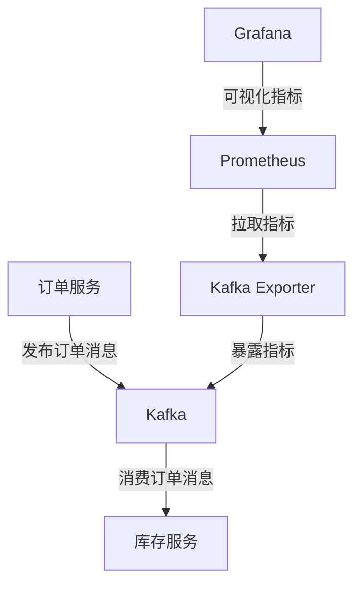

# Kafka 与Prometheus

在现代分布式系统中，监控是确保系统稳定性和性能的关键。Kafka作为一个高吞吐量的分布式消息系统，需要强大的监控工具来跟踪其性能和健康状况。Prometheus是一个开源的监控和警报工具，广泛用于监控分布式系统。本文将介绍如何将Kafka与Prometheus集成，以便更好地监控Kafka集群。

## 什么是Kafka？

Apache Kafka是一个分布式流处理平台，广泛用于构建实时数据管道和流应用程序。它能够处理高吞吐量的数据流，并确保数据的可靠性和持久性。

## 什么是Prometheus？

Prometheus是一个开源的系统监控和警报工具包，最初由SoundCloud开发。它通过HTTP拉取的方式收集指标数据，并提供了强大的查询语言（PromQL）来分析和可视化这些数据。

## 为什么需要将Kafka与Prometheus集成？

Kafka集群的性能和健康状况对于整个系统的稳定性至关重要。通过将Kafka与Prometheus集成，您可以实时监控Kafka的各项指标，如消息吞吐量、延迟、分区状态等，从而及时发现和解决问题。

## 如何将Kafka与Prometheus集成？

### 1. 安装和配置Kafka Exporter

Kafka Exporter是一个开源工具，用于从Kafka集群中提取指标并将其暴露给Prometheus。首先，您需要安装和配置Kafka Exporter。

```bash
# 下载Kafka Exporter
wget https://github.com/danielqsj/kafka_exporter/releases/download/v1.4.0/kafka_exporter-1.4.0.linux-amd64.tar.gz

# 解压缩
tar -xzf kafka_exporter-1.4.0.linux-amd64.tar.gz

# 启动Kafka Exporter
./kafka_exporter --kafka.server=localhost:9092
```

### 2. 配置Prometheus

接下来，您需要在Prometheus的配置文件中添加Kafka Exporter的地址，以便Prometheus能够拉取Kafka的指标数据。

```yaml
scrape_configs:
  - job_name: 'kafka'
    static_configs:
      - targets: ['localhost:9308']
```

### 3. 使用PromQL查询Kafka指标

Prometheus提供了强大的查询语言PromQL，您可以使用它来查询和分析Kafka的指标数据。例如，以下查询将返回Kafka集群的消息吞吐量：

```promql
rate(kafka_topic_partition_current_offset[1m])
```

### 4. 可视化Kafka指标

您可以使用Grafana等工具将Prometheus中的Kafka指标可视化。Grafana提供了丰富的仪表板模板，您可以直接导入并使用。

## 实际案例

假设您正在运行一个高流量的电子商务平台，使用Kafka来处理订单和库存更新。通过将Kafka与Prometheus集成，您可以实时监控订单处理的速度和库存更新的延迟，从而确保系统的稳定性和性能。



## 总结

通过将Kafka与Prometheus集成，您可以实时监控Kafka集群的性能和健康状况，从而确保系统的稳定性和可靠性。本文介绍了如何安装和配置Kafka Exporter、配置Prometheus、使用PromQL查询Kafka指标以及可视化这些指标。

## 附加资源

- [Kafka Exporter GitHub仓库](https://github.com/danielqsj/kafka_exporter)
- [Prometheus官方文档](https://prometheus.io/docs/)
- [Grafana官方文档](https://grafana.com/docs/)

## 练习

1. 安装并配置Kafka Exporter，确保它能够从您的Kafka集群中提取指标。
2. 配置Prometheus，使其能够拉取Kafka Exporter暴露的指标。
3. 使用PromQL查询Kafka的消息吞吐量，并在Grafana中创建一个仪表板来可视化这些指标。

:::tip
如果您在配置过程中遇到问题，可以参考Kafka Exporter和Prometheus的官方文档，或者在社区论坛中寻求帮助。
:::