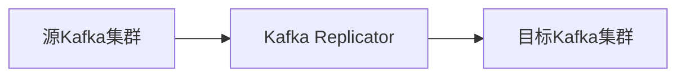

# Kafka 与Kafka Replicator

## 介绍

Kafka Replicator是Apache Kafka生态系统中的一个重要工具，用于在不同的Kafka集群之间复制数据。它可以帮助开发者在分布式系统中实现数据的高可用性、灾难恢复以及跨区域数据同步。对于初学者来说，理解Kafka Replicator的工作原理和应用场景是掌握Kafka生态系统的重要一步。

## Kafka Replicator的基本概念

Kafka Replicator的核心功能是将数据从一个Kafka集群复制到另一个Kafka集群。这种复制可以是单向的，也可以是双向的，具体取决于业务需求。Kafka Replicator通常用于以下场景：

1. **灾难恢复**：在主集群发生故障时，备用集群可以接管服务。
2. **跨区域数据同步**：在多个数据中心之间同步数据，以支持全球用户。
3. **数据迁移**：将数据从一个Kafka集群迁移到另一个集群。

## Kafka Replicator的工作原理

Kafka Replicator通过消费源集群中的消息，并将这些消息发布到目标集群中来实现数据复制。它本质上是一个Kafka消费者和Kafka生产者的组合。以下是Kafka Replicator的基本工作流程：

1. **消费源集群的消息**：Kafka Replicator从源集群的指定主题中消费消息。
2. **处理消息**：在将消息发布到目标集群之前，可以对消息进行一些处理，例如过滤、转换等。
3. **发布到目标集群**：处理后的消息被发布到目标集群的指定主题中。



## 实际案例：跨区域数据同步

假设我们有一个全球性的电商平台，用户分布在不同的地区。为了提供更好的用户体验，我们需要在多个数据中心之间同步用户行为数据。这时，Kafka Replicator就可以派上用场。

### 场景描述

- **源集群**：位于美国的数据中心，负责收集用户行为数据。
- **目标集群**：位于欧洲的数据中心，需要实时同步用户行为数据。

### 实现步骤

1. **配置源集群和目标集群**：确保两个Kafka集群都已正确配置并运行。
2. **设置Kafka Replicator**：配置Kafka Replicator以从源集群消费数据，并将数据发布到目标集群。
3. **启动Kafka Replicator**：启动Kafka Replicator，开始数据复制。

### 代码示例

以下是一个简单的Kafka Replicator配置示例：

```properties
# 源集群配置
source.bootstrap.servers=us-kafka-cluster:9092
source.group.id=replicator-group
source.topic=user-behavior

# 目标集群配置
target.bootstrap.servers=eu-kafka-cluster:9092
target.topic=user-behavior

# 其他配置
replication.factor=3
```

:::note
在实际生产环境中，Kafka Replicator的配置可能会更加复杂，包括SSL/TLS加密、认证、压缩等。
:::

## 总结

Kafka Replicator是Kafka生态系统中一个强大的工具，能够帮助开发者在不同的Kafka集群之间实现数据复制。通过本文的介绍，你应该对Kafka Replicator的基本概念、工作原理以及实际应用场景有了初步的了解。

## 附加资源

- [Apache Kafka官方文档](https://kafka.apache.org/documentation/)
- [Kafka Replicator配置指南](https://docs.confluent.io/platform/current/multi-dc-deployments/replicator/index.html)
- [Kafka实战：从入门到精通](https://www.example.com/kafka-in-action)

## 练习

1. 尝试在本地环境中设置两个Kafka集群，并使用Kafka Replicator在它们之间复制数据。
2. 修改Kafka Replicator的配置，使其能够过滤掉某些特定的消息。
3. 研究Kafka Replicator的高级功能，例如双向复制和消息转换。

通过完成这些练习，你将更深入地理解Kafka Replicator的工作原理和应用场景。