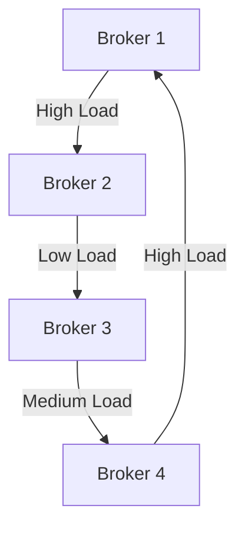

# Kafka 与Cruise Control

## 介绍

Apache Kafka 是一个分布式流处理平台，广泛用于构建实时数据管道和流应用程序。然而，随着集群规模的扩大，管理和优化Kafka集群的复杂性也随之增加。这就是 **Cruise Control** 的用武之地。

Cruise Control 是一个开源的自动化工具，专门用于管理和优化Kafka集群。它通过监控集群的状态，自动调整分区和副本的分布，以确保集群的高可用性和高性能。

## Cruise Control 的核心功能

Cruise Control 提供了以下核心功能：

1. **集群监控**：实时监控Kafka集群的健康状态，包括Broker的负载、分区分布等。
2. **自动优化**：根据监控数据，自动调整分区和副本的分布，以优化集群的性能。
3. **异常检测**：检测集群中的异常情况，如Broker宕机、分区不平衡等，并自动进行修复。
4. **资源分配**：根据集群的负载情况，动态分配资源，确保集群的高效运行。

## 安装与配置

### 安装Cruise Control

首先，你需要从 [Cruise Control GitHub仓库](https://github.com/linkedin/cruise-control) 下载并安装Cruise Control。你可以通过以下命令克隆仓库：

```bash
git clone https://github.com/linkedin/cruise-control.git
cd cruise-control
```

### 配置Cruise Control

Cruise Control 的配置文件位于 `config/cruisecontrol.properties`。你需要根据你的Kafka集群配置进行相应的修改。以下是一个简单的配置示例：

```properties
bootstrap.servers=localhost:9092
zookeeper.connect=localhost:2181
```

## 使用Cruise Control

### 启动Cruise Control

在配置完成后，你可以通过以下命令启动Cruise Control：

```bash
./kafka-cruise-control-start.sh config/cruisecontrol.properties
```

### 监控集群状态

Cruise Control 提供了一个REST API，用于监控集群状态。你可以通过以下命令获取集群的当前状态：

```bash
curl -X GET http://localhost:9090/kafkacruisecontrol/state
```

### 自动优化

Cruise Control 可以根据集群的负载情况，自动进行优化。你可以通过以下命令触发优化：

```bash
curl -X POST http://localhost:9090/kafkacruisecontrol/rebalance
```

## 实际案例

假设你有一个Kafka集群，其中包含多个Broker。随着时间的推移，某些Broker的负载过高，导致集群性能下降。通过使用Cruise Control，你可以自动检测并调整分区和副本的分布，从而优化集群的性能。



在上面的图表中，Broker 1 和 Broker 4 的负载过高，而 Broker 2 和 Broker 3 的负载较低。Cruise Control 会自动将部分分区从Broker 1 和 Broker 4 迁移到Broker 2 和 Broker 3，从而实现负载均衡。

## 总结

Cruise Control 是一个强大的工具，可以帮助你管理和优化Kafka集群。通过自动监控和调整分区和副本的分布，Cruise Control 能够显著提高集群的性能和可用性。

## 附加资源

- [Cruise Control GitHub仓库](https://github.com/linkedin/cruise-control)
- [Kafka官方文档](https://kafka.apache.org/documentation/)
- [Cruise Control REST API文档](https://github.com/linkedin/cruise-control/wiki/REST-APIs)

## 练习

1. 在你的本地环境中安装并配置Cruise Control。
2. 使用Cruise Control的REST API监控你的Kafka集群状态。
3. 尝试触发一次自动优化，并观察集群的变化。

:::tip
如果你在配置或使用Cruise Control时遇到问题，可以参考官方文档或在社区中寻求帮助。
:::