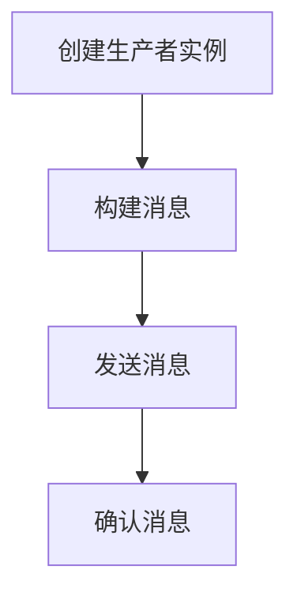

# Kafka 生产者基础

Kafka是一个分布式流处理平台，广泛用于构建实时数据管道和流应用。Kafka生产者（Producer）是Kafka生态系统中的一个核心组件，负责将数据发布到Kafka主题（Topic）中。本文将带你了解Kafka生产者的基本概念、工作原理，并通过代码示例展示如何开发一个简单的Kafka生产者。

## 什么是Kafka生产者？

Kafka生产者是一个客户端应用程序，它将数据记录（Records）发送到Kafka集群中的一个或多个主题。每条记录包含一个键（Key）、一个值（Value）和一个时间戳（Timestamp）。生产者负责将数据序列化并发送到Kafka集群中的指定分区（Partition）。

:::note
Kafka生产者是异步的，这意味着它可以在不等待服务器响应的情况下继续发送数据。这种设计使得Kafka能够处理高吞吐量的数据流。
:::

## Kafka 生产者的工作原理

Kafka生产者的工作流程可以分为以下几个步骤：

1. **创建生产者实例**：首先，你需要创建一个Kafka生产者实例，并配置相关的属性，如Kafka集群的地址、序列化器等。
2. **构建消息**：每条消息包含一个键、一个值和一个可选的时间戳。
3. **发送消息**：生产者将消息发送到指定的Kafka主题。Kafka会根据分区策略将消息分配到不同的分区。
4. **确认消息**：Kafka集群会返回一个确认（ACK），表示消息是否成功写入。



## 开发一个简单的Kafka生产者

下面是一个使用Java编写的简单Kafka生产者示例。我们将使用Kafka的Java客户端库来发送消息。

### 1. 添加依赖

首先，你需要在项目中添加Kafka客户端的依赖。如果你使用的是Maven，可以在`pom.xml`中添加以下依赖：

```xml
<dependency>
    <groupId>org.apache.kafka</groupId>
    <artifactId>kafka-clients</artifactId>
    <version>3.0.0</version>
</dependency>
```

### 2. 配置生产者

接下来，我们需要配置Kafka生产者。以下是一个简单的配置示例：

```java
import org.apache.kafka.clients.producer.KafkaProducer;
import org.apache.kafka.clients.producer.ProducerConfig;
import org.apache.kafka.clients.producer.ProducerRecord;
import org.apache.kafka.common.serialization.StringSerializer;

import java.util.Properties;

public class SimpleProducer {
    public static void main(String[] args) {
        // 配置生产者属性
        Properties props = new Properties();
        props.put(ProducerConfig.BOOTSTRAP_SERVERS_CONFIG, "localhost:9092");
        props.put(ProducerConfig.KEY_SERIALIZER_CLASS_CONFIG, StringSerializer.class.getName());
        props.put(ProducerConfig.VALUE_SERIALIZER_CLASS_CONFIG, StringSerializer.class.getName());

        // 创建生产者实例
        KafkaProducer<String, String> producer = new KafkaProducer<>(props);

        // 构建消息
        ProducerRecord<String, String> record = new ProducerRecord<>("my-topic", "key", "value");

        // 发送消息
        producer.send(record);

        // 关闭生产者
        producer.close();
    }
}
```

### 3. 运行生产者

运行上述代码后，Kafka生产者会将消息发送到名为`my-topic`的主题中。你可以使用Kafka控制台消费者来验证消息是否成功发送。

```bash
kafka-console-consumer --bootstrap-server localhost:9092 --topic my-topic --from-beginning
```

## 实际应用场景

Kafka生产者在许多实际应用场景中都有广泛的应用，例如：

- **日志收集**：将应用程序的日志发送到Kafka，以便后续的集中处理和分析。
- **事件驱动架构**：在微服务架构中，Kafka生产者可以用于发布事件，触发其他服务的操作。
- **实时数据处理**：在实时数据管道中，Kafka生产者可以将数据流发送到Kafka，供下游系统处理。

:::tip
在实际应用中，你可能需要配置更多的生产者属性，如重试机制、压缩方式等，以确保消息的可靠性和性能。
:::

## 总结

Kafka生产者是Kafka生态系统中的重要组件，负责将数据发布到Kafka主题中。本文介绍了Kafka生产者的基本概念、工作原理，并通过一个简单的Java示例展示了如何开发一个Kafka生产者。希望本文能帮助你理解Kafka生产者的基础知识，并为你在实际项目中的应用提供参考。

## 附加资源

- [Kafka官方文档](https://kafka.apache.org/documentation/)
- [Kafka生产者配置参数](https://kafka.apache.org/documentation/#producerconfigs)
- [Kafka Java客户端库](https://github.com/apache/kafka/tree/trunk/clients/src/main/java/org/apache/kafka/clients/producer)

## 练习

1. 修改上述代码，使其能够发送多条消息到Kafka主题中。
2. 尝试配置Kafka生产者的重试机制，并在发送失败时进行重试。
3. 使用Kafka控制台消费者验证消息是否成功发送到Kafka主题中。
