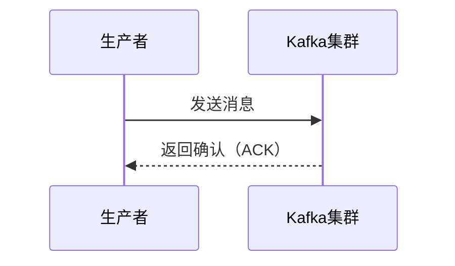

# Kafka 同步发送

在Kafka生产者开发中，**同步发送**是一种确保消息可靠传递的重要方式。与异步发送不同，同步发送会阻塞生产者线程，直到消息成功发送到Kafka集群并收到确认。这种方式适用于对消息可靠性要求较高的场景。

## 什么是同步发送？

同步发送是指生产者在发送消息时，会等待Kafka服务器的响应。只有在收到确认（ACK）后，生产者才会继续执行后续操作。这种方式确保了消息的可靠性，但可能会降低发送效率。

:::note
同步发送的优点是消息的可靠性高，缺点是发送速度较慢，因为需要等待服务器的响应。
:::

## 同步发送的工作原理

当生产者调用 `send()` 方法发送消息时，Kafka客户端会将消息放入缓冲区，然后通过网络发送到Kafka集群。在同步发送模式下，生产者会等待Kafka服务器的响应，直到收到确认（ACK）或超时。



## 代码示例

以下是一个使用Java编写的Kafka同步发送的示例代码：

```java
import org.apache.kafka.clients.producer.KafkaProducer;
import org.apache.kafka.clients.producer.ProducerRecord;
import org.apache.kafka.clients.producer.RecordMetadata;

import java.util.Properties;

public class SyncProducerExample {
    public static void main(String[] args) {
        // 配置生产者属性
        Properties props = new Properties();
        props.put("bootstrap.servers", "localhost:9092");
        props.put("key.serializer", "org.apache.kafka.common.serialization.StringSerializer");
        props.put("value.serializer", "org.apache.kafka.common.serialization.StringSerializer");

        // 创建Kafka生产者
        KafkaProducer<String, String> producer = new KafkaProducer<>(props);

        try {
            // 创建消息
            ProducerRecord<String, String> record = new ProducerRecord<>("my-topic", "key", "value");

            // 同步发送消息
            RecordMetadata metadata = producer.send(record).get();

            // 打印消息的元数据
            System.out.println("消息发送成功，分区: " + metadata.partition() + ", 偏移量: " + metadata.offset());
        } catch (Exception e) {
            e.printStackTrace();
        } finally {
            // 关闭生产者
            producer.close();
        }
    }
}
```

### 代码解释

1. **配置生产者属性**：我们首先配置了Kafka生产者的基本属性，包括Kafka集群的地址、键和值的序列化器。
2. **创建Kafka生产者**：使用配置的属性创建了一个Kafka生产者实例。
3. **创建消息**：我们创建了一个 `ProducerRecord` 对象，指定了主题、键和值。
4. **同步发送消息**：通过调用 `send()` 方法并立即调用 `get()` 方法，我们实现了同步发送。`get()` 方法会阻塞，直到收到Kafka服务器的响应。
5. **处理异常**：在发送过程中可能会抛出异常，我们通过 `try-catch` 块来捕获并处理这些异常。
6. **关闭生产者**：最后，我们关闭了生产者以释放资源。

:::tip
在实际应用中，建议将生产者的关闭操作放在 `finally` 块中，以确保资源被正确释放。
:::

## 实际应用场景

同步发送适用于以下场景：

1. **金融交易**：在金融交易中，确保消息的可靠传递至关重要。同步发送可以确保每笔交易都被成功记录。
2. **日志记录**：在某些系统中，日志消息的丢失是不可接受的。通过同步发送，可以确保每条日志都被成功写入Kafka。
3. **订单处理**：在电商系统中，订单的创建和处理需要保证消息的可靠性。同步发送可以确保订单信息被正确传递。

## 总结

Kafka同步发送是一种确保消息可靠传递的重要方式。虽然它可能会降低发送效率，但在对消息可靠性要求较高的场景中，同步发送是不可或缺的。通过本文的学习，你应该已经掌握了如何使用Kafka生产者进行同步发送，并了解了其在实际应用中的重要性。

## 附加资源

- [Kafka官方文档](https://kafka.apache.org/documentation/)
- [Kafka生产者API文档](https://kafka.apache.org/28/javadoc/index.html?org/apache/kafka/clients/producer/KafkaProducer.html)

## 练习

1. 修改上面的代码，尝试发送多条消息，并观察每条消息的元数据。
2. 在同步发送的基础上，添加异常处理逻辑，确保在发送失败时能够重试。
3. 尝试在不同的Kafka集群配置下运行代码，观察同步发送的性能差异。
