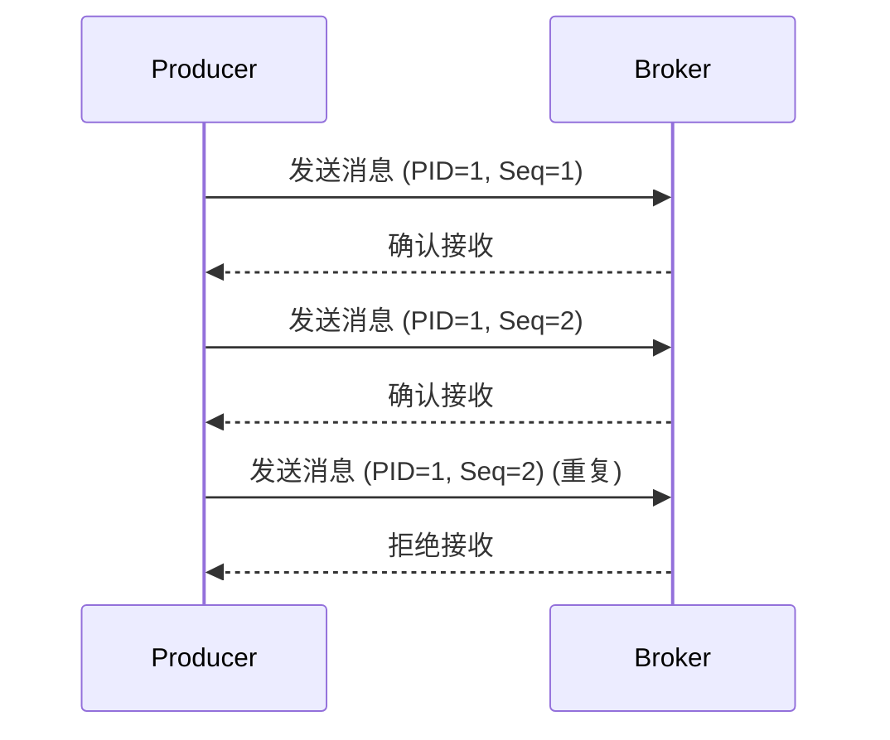

# Kafka 幂等性实现

在分布式系统中，消息传递的可靠性是一个关键问题。Kafka作为一个高吞吐量的分布式消息系统，提供了多种机制来确保消息的可靠传递。其中，**幂等性**是Kafka生产者确保消息精确一次传递的重要机制之一。本文将详细介绍Kafka幂等性的实现原理、配置方法以及实际应用场景。

## 什么是幂等性？

**幂等性**是指对同一操作的多次执行所产生的影响与一次执行的影响相同。在Kafka中，幂等性意味着即使生产者多次发送相同的消息，Kafka broker也只会将其写入日志一次，从而避免重复消息的产生。

:::note
幂等性并不是Kafka的默认行为，而是需要通过配置来启用的。
:::

## Kafka 幂等性的实现原理

Kafka通过为每个生产者分配一个唯一的`Producer ID`（PID）和序列号（Sequence Number）来实现幂等性。具体步骤如下：

1. **生产者初始化**：当生产者启动时，Kafka会为其分配一个唯一的PID。
2. **消息发送**：生产者发送消息时，会为每条消息分配一个序列号。
3. **Broker验证**：Broker接收到消息后，会检查消息的PID和序列号。如果发现序列号不连续或重复，Broker会拒绝该消息。



## 配置Kafka生产者启用幂等性

要启用Kafka生产者的幂等性，需要在生产者配置中设置`enable.idempotence`为`true`。

```java
Properties props = new Properties();
props.put("bootstrap.servers", "localhost:9092");
props.put("key.serializer", "org.apache.kafka.common.serialization.StringSerializer");
props.put("value.serializer", "org.apache.kafka.common.serialization.StringSerializer");
props.put("enable.idempotence", true); // 启用幂等性

KafkaProducer<String, String> producer = new KafkaProducer<>(props);
```

:::caution
启用幂等性后，Kafka会自动将`acks`参数设置为`all`，并且`retries`参数会被设置为`Integer.MAX_VALUE`，以确保消息的可靠传递。
:::

## 实际应用场景

### 金融交易系统

在金融交易系统中，确保每笔交易只被处理一次是至关重要的。通过启用Kafka生产者的幂等性，可以避免因网络抖动或生产者重试导致的重复交易。

### 日志收集系统

在日志收集系统中，日志数据的完整性非常重要。启用幂等性可以确保每条日志消息只被写入一次，避免因重复消息导致的日志数据冗余。

## 总结

Kafka的幂等性机制通过为每个生产者分配唯一的PID和序列号，确保了消息的精确一次传递。启用幂等性可以有效避免因网络问题或生产者重试导致的重复消息问题，特别适用于对数据一致性要求较高的场景。

## 附加资源与练习

- **官方文档**：阅读Kafka官方文档中关于[幂等性](https://kafka.apache.org/documentation/#producerconfigs_enable.idempotence)的部分，了解更多细节。
- **练习**：尝试在本地Kafka集群中配置一个幂等性生产者，并模拟网络抖动场景，观察消息的传递行为。

:::tip
如果你对Kafka的其他高级特性感兴趣，可以继续学习Kafka事务、消息压缩等内容。
:::