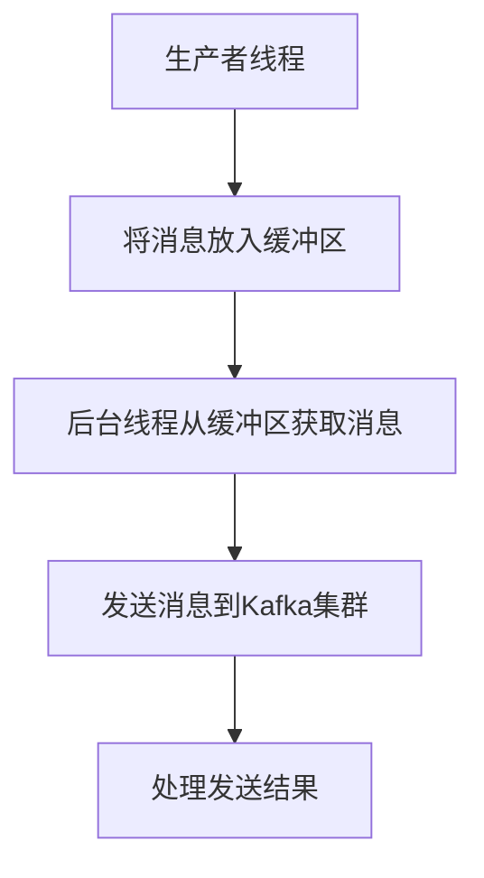

# Kafka 异步发送

在Kafka生产者开发中，消息的发送方式分为同步发送和异步发送。同步发送会阻塞生产者线程，直到消息成功发送到Kafka集群并收到确认。而异步发送则允许生产者线程在发送消息后立即返回，继续处理其他任务，从而提高生产者的性能和吞吐量。

## 异步发送的工作原理

异步发送的核心思想是将消息放入一个缓冲区，然后由后台线程负责将消息发送到Kafka集群。这种方式可以避免生产者线程在等待Kafka响应时的阻塞，从而显著提高生产者的吞吐量。

### 异步发送的流程



1. **生产者线程**：将消息放入缓冲区后立即返回，继续处理其他任务。
2. **后台线程**：从缓冲区中获取消息，并将其发送到Kafka集群。
3. **处理发送结果**：后台线程在消息发送完成后，会调用回调函数处理发送结果。

## 代码示例

以下是一个使用Kafka生产者进行异步发送的代码示例：

```java
import org.apache.kafka.clients.producer.*;

import java.util.Properties;

public class AsyncProducerExample {
    public static void main(String[] args) {
        // 配置生产者属性
        Properties props = new Properties();
        props.put("bootstrap.servers", "localhost:9092");
        props.put("key.serializer", "org.apache.kafka.common.serialization.StringSerializer");
        props.put("value.serializer", "org.apache.kafka.common.serialization.StringSerializer");

        // 创建Kafka生产者
        Producer<String, String> producer = new KafkaProducer<>(props);

        // 创建消息
        ProducerRecord<String, String> record = new ProducerRecord<>("my-topic", "key", "value");

        // 异步发送消息
        producer.send(record, new Callback() {
            @Override
            public void onCompletion(RecordMetadata metadata, Exception exception) {
                if (exception == null) {
                    System.out.println("消息发送成功，偏移量: " + metadata.offset());
                } else {
                    System.err.println("消息发送失败: " + exception.getMessage());
                }
            }
        });

        // 关闭生产者
        producer.close();
    }
}
```

### 代码解释

1. **配置生产者属性**：设置Kafka集群的地址、键和值的序列化器。
2. **创建Kafka生产者**：使用配置属性创建Kafka生产者实例。
3. **创建消息**：创建一个`ProducerRecord`对象，指定主题、键和值。
4. **异步发送消息**：调用`send`方法发送消息，并提供一个回调函数来处理发送结果。
5. **关闭生产者**：在发送完消息后，关闭生产者以释放资源。

:::note
异步发送的回调函数会在消息发送完成后被调用，无论发送成功还是失败。
:::

## 实际应用场景

异步发送在以下场景中非常有用：

1. **高吞吐量需求**：当生产者需要发送大量消息时，异步发送可以显著提高吞吐量。
2. **低延迟需求**：异步发送可以减少生产者的延迟，因为生产者线程不需要等待Kafka的响应。
3. **非关键任务**：对于不需要立即确认的消息，异步发送是一个理想的选择。

## 总结

Kafka的异步发送机制通过将消息放入缓冲区并由后台线程处理，显著提高了生产者的性能和吞吐量。这种方式特别适用于高吞吐量和低延迟的场景。通过使用回调函数，开发者可以轻松处理消息发送的结果。

## 附加资源

- [Kafka官方文档](https://kafka.apache.org/documentation/)
- [Kafka生产者API](https://kafka.apache.org/26/javadoc/org/apache/kafka/clients/producer/KafkaProducer.html)
- [Kafka异步发送示例](https://github.com/apache/kafka/tree/trunk/examples/src/main/java/kafka/examples)

## 练习

1. 修改上述代码，使其能够发送多条消息，并观察回调函数的执行顺序。
2. 尝试在回调函数中添加日志记录，记录每条消息的发送时间和偏移量。
3. 研究Kafka生产者的其他配置参数，如`acks`和`retries`，并尝试调整这些参数以观察对异步发送的影响。
