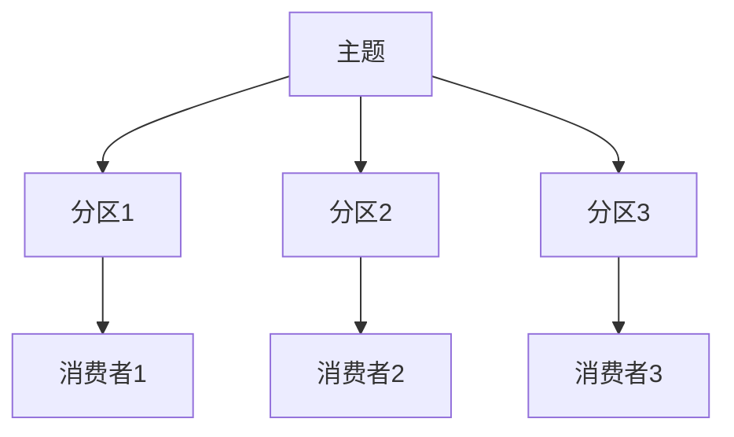

# Kafka 消费者基础

Kafka是一个分布式流处理平台，广泛用于构建实时数据管道和流应用。Kafka消费者是Kafka生态系统中至关重要的一部分，它负责从Kafka主题（Topic）中读取数据并进行处理。本文将介绍Kafka消费者的基本概念、工作原理以及如何开发一个简单的Kafka消费者。

## 什么是Kafka消费者？

Kafka消费者是一个应用程序，它从Kafka主题中订阅并读取数据。消费者可以是一个独立的进程、线程或服务，它通过Kafka的消费者API与Kafka集群进行交互。消费者的主要任务是处理从Kafka主题中读取的消息，并根据业务需求进行相应的处理。

## Kafka 消费者的工作原理

Kafka消费者通过订阅一个或多个主题来读取数据。每个主题被划分为多个分区（Partition），每个分区中的数据是有序的。消费者可以从一个或多个分区中读取数据，并且可以以不同的方式处理这些数据。

### 消费者组（Consumer Group）

Kafka消费者通常以消费者组的形式工作。消费者组是一组消费者的集合，它们共同消费一个或多个主题的数据。Kafka会将主题的分区分配给消费者组中的消费者，确保每个分区只被一个消费者消费。这样可以实现负载均衡和高可用性。



在上图中，一个主题被划分为三个分区，每个分区由一个消费者组中的不同消费者消费。

### 偏移量（Offset）

Kafka为每个分区中的每条消息分配一个唯一的偏移量（Offset）。偏移量是一个递增的整数，用于标识消息在分区中的位置。消费者通过维护每个分区的偏移量来跟踪已经读取的消息。消费者可以手动或自动提交偏移量，以确保在消费者重启或故障时能够从上次读取的位置继续消费。

## 开发一个简单的Kafka消费者

下面是一个使用Java编写的简单Kafka消费者示例。我们将使用Kafka的Java客户端库来创建一个消费者，并从指定的主题中读取数据。

### 1. 添加依赖

首先，在你的项目中添加Kafka客户端的依赖。如果你使用的是Maven，可以在`pom.xml`中添加以下依赖：

```xml
<dependency>
    <groupId>org.apache.kafka</groupId>
    <artifactId>kafka-clients</artifactId>
    <version>3.1.0</version>
</dependency>
```

### 2. 创建消费者

接下来，我们创建一个Kafka消费者，并订阅一个主题：

```java
import org.apache.kafka.clients.consumer.ConsumerConfig;
import org.apache.kafka.clients.consumer.ConsumerRecords;
import org.apache.kafka.clients.consumer.KafkaConsumer;
import org.apache.kafka.common.serialization.StringDeserializer;

import java.time.Duration;
import java.util.Collections;
import java.util.Properties;

public class SimpleConsumer {
    public static void main(String[] args) {
        // 配置消费者属性
        Properties props = new Properties();
        props.put(ConsumerConfig.BOOTSTRAP_SERVERS_CONFIG, "localhost:9092");
        props.put(ConsumerConfig.GROUP_ID_CONFIG, "test-group");
        props.put(ConsumerConfig.KEY_DESERIALIZER_CLASS_CONFIG, StringDeserializer.class.getName());
        props.put(ConsumerConfig.VALUE_DESERIALIZER_CLASS_CONFIG, StringDeserializer.class.getName());

        // 创建消费者实例
        KafkaConsumer<String, String> consumer = new KafkaConsumer<>(props);

        // 订阅主题
        consumer.subscribe(Collections.singletonList("my-topic"));

        // 持续消费消息
        while (true) {
            ConsumerRecords<String, String> records = consumer.poll(Duration.ofMillis(100));
            records.forEach(record -> {
                System.out.printf("offset = %d, key = %s, value = %s%n",
                        record.offset(), record.key(), record.value());
            });
        }
    }
}
```

### 3. 运行消费者

运行上述代码后，消费者将开始从`my-topic`主题中读取消息，并将每条消息的偏移量、键和值打印到控制台。

:::note
在实际生产环境中，你可能需要处理消费者的异常、优雅地关闭消费者以及处理消息的重复消费等问题。
:::

## 实际应用场景

Kafka消费者在许多实际应用场景中都有广泛的应用，例如：

- **实时数据处理**：消费者可以实时处理来自Kafka主题的数据，并将其存储到数据库或发送到其他系统。
- **日志聚合**：消费者可以从多个服务中收集日志数据，并将其聚合到一个中心化的日志存储系统中。
- **事件驱动架构**：消费者可以监听系统中的事件，并根据事件触发相应的业务逻辑。

## 总结

Kafka消费者是Kafka生态系统中不可或缺的一部分，它负责从Kafka主题中读取数据并进行处理。本文介绍了Kafka消费者的基本概念、工作原理，并通过一个简单的Java示例展示了如何开发一个Kafka消费者。希望本文能帮助你理解Kafka消费者的基础知识，并为你在实际项目中的应用提供参考。

## 附加资源与练习

- **Kafka官方文档**：https://kafka.apache.org/documentation/
- **Kafka消费者API文档**：https://kafka.apache.org/31/javadoc/index.html?org/apache/kafka/clients/consumer/KafkaConsumer.html
- **练习**：尝试修改上述示例代码，使其能够处理多个主题的消息，并实现手动提交偏移量。

:::tip
如果你对Kafka的更多高级特性感兴趣，可以继续学习Kafka的生产者、流处理、连接器等内容。
:::