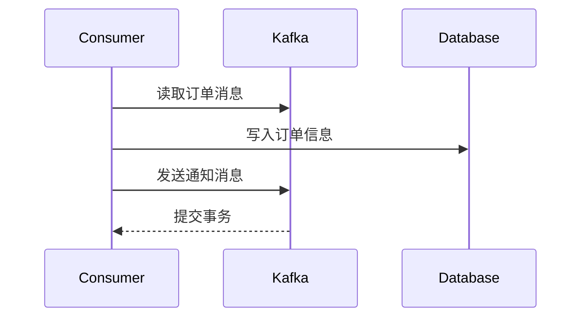

## 介绍

Kafka消费者事务是Kafka中用于确保消息处理的原子性和一致性的机制。在分布式系统中，事务可以保证一组操作要么全部成功，要么全部失败，从而避免数据不一致的问题。Kafka消费者事务允许消费者在消费消息时，将消息的消费与外部操作（如数据库更新）绑定在一起，确保两者要么同时成功，要么同时回滚。

## 为什么需要Kafka消费者事务？

在分布式系统中，消费者可能会从Kafka主题中读取消息，并根据消息内容执行一些操作（如更新数据库）。如果这些操作不是原子的，可能会导致数据不一致。例如：

1. 消费者读取消息并更新数据库，但在提交偏移量之前崩溃。此时，数据库已更新，但偏移量未提交，导致消息被重复消费。
2. 消费者提交了偏移量，但在更新数据库时失败。此时，偏移量已提交，但数据库未更新，导致消息丢失。

Kafka消费者事务通过将消息消费和外部操作绑定在一起，解决了这些问题。

## Kafka 消费者事务的实现

Kafka消费者事务的实现依赖于Kafka的生产者事务API和消费者组管理。以下是实现Kafka消费者事务的关键步骤：

1. **配置事务性生产者**：首先，需要配置一个事务性生产者，用于发送消息和提交偏移量。
2. **开启事务**：在消费者开始处理消息之前，开启一个事务。
3. **消费消息并执行操作**：消费者从Kafka主题中读取消息，并根据消息内容执行外部操作（如更新数据库）。
4. **提交事务**：如果所有操作成功，提交事务。提交事务时，Kafka会将消息的偏移量和外部操作的结果一起提交。
5. **回滚事务**：如果任何操作失败，回滚事务。回滚事务时，Kafka会撤销消息的偏移量提交和外部操作。

### 代码示例

以下是一个使用Kafka消费者事务的简单示例：

```java
import org.apache.kafka.clients.consumer.ConsumerConfig;
import org.apache.kafka.clients.consumer.KafkaConsumer;
import org.apache.kafka.clients.producer.KafkaProducer;
import org.apache.kafka.clients.producer.ProducerConfig;
import org.apache.kafka.clients.producer.ProducerRecord;
import org.apache.kafka.common.serialization.StringDeserializer;
import org.apache.kafka.common.serialization.StringSerializer;

import java.util.Collections;
import java.util.Properties;

public class KafkaTransactionalConsumer {

    public static void main(String[] args) {
        // 配置消费者
        Properties consumerProps = new Properties();
        consumerProps.put(ConsumerConfig.BOOTSTRAP_SERVERS_CONFIG, "localhost:9092");
        consumerProps.put(ConsumerConfig.GROUP_ID_CONFIG, "my-group");
        consumerProps.put(ConsumerConfig.KEY_DESERIALIZER_CLASS_CONFIG, StringDeserializer.class.getName());
        consumerProps.put(ConsumerConfig.VALUE_DESERIALIZER_CLASS_CONFIG, StringDeserializer.class.getName());
        consumerProps.put(ConsumerConfig.ISOLATION_LEVEL_CONFIG, "read_committed");

        KafkaConsumer<String, String> consumer = new KafkaConsumer<>(consumerProps);
        consumer.subscribe(Collections.singletonList("my-topic"));

        // 配置生产者
        Properties producerProps = new Properties();
        producerProps.put(ProducerConfig.BOOTSTRAP_SERVERS_CONFIG, "localhost:9092");
        producerProps.put(ProducerConfig.KEY_SERIALIZER_CLASS_CONFIG, StringSerializer.class.getName());
        producerProps.put(ProducerConfig.VALUE_SERIALIZER_CLASS_CONFIG, StringSerializer.class.getName());
        producerProps.put(ProducerConfig.TRANSACTIONAL_ID_CONFIG, "my-transactional-id");

        KafkaProducer<String, String> producer = new KafkaProducer<>(producerProps);
        producer.initTransactions();

        while (true) {
            // 开启事务
            producer.beginTransaction();

            try {
                // 消费消息
                var records = consumer.poll(100);
                for (var record : records) {
                    // 处理消息（例如更新数据库）
                    System.out.println("Processing: " + record.value());

                    // 发送处理结果到另一个主题
                    producer.send(new ProducerRecord<>("output-topic", record.key(), "Processed: " + record.value()));
                }

                // 提交事务
                producer.commitTransaction();
            } catch (Exception e) {
                // 回滚事务
                producer.abortTransaction();
                e.printStackTrace();
            }
        }
    }
}
```

### 输入和输出

假设输入主题 `my-topic` 中有以下消息：

```
key1: value1
key2: value2
```

运行上述代码后，输出主题 `output-topic` 中将包含以下消息：

```
key1: Processed: value1
key2: Processed: value2
```

如果在处理过程中发生异常，事务将回滚，输出主题中将不会包含任何消息。

## 实际案例

假设你正在开发一个电商系统，用户下单后，系统需要将订单信息写入数据库，并发送通知消息到Kafka。使用Kafka消费者事务可以确保订单信息和通知消息要么同时成功，要么同时失败。



在这个案例中，如果写入数据库或发送通知消息失败，事务将回滚，确保数据一致性。

## 总结

Kafka消费者事务是确保消息处理原子性和一致性的重要机制。通过将消息消费与外部操作绑定在一起，Kafka消费者事务可以避免数据不一致的问题。本文通过代码示例和实际案例，帮助初学者理解并掌握Kafka消费者事务的核心概念。

## 附加资源

- [Kafka官方文档](https://kafka.apache.org/documentation/)
- [Kafka生产者事务API](https://kafka.apache.org/documentation/#producerapi)
- [Kafka消费者事务示例](https://github.com/apache/kafka/tree/trunk/examples/src/main/java/kafka/examples)

## 练习

1. 修改上述代码，使其在处理消息时模拟数据库更新失败的情况，并观察事务的回滚行为。
2. 尝试在一个事务中同时消费多个主题的消息，并确保所有消息的处理要么全部成功，要么全部失败。
