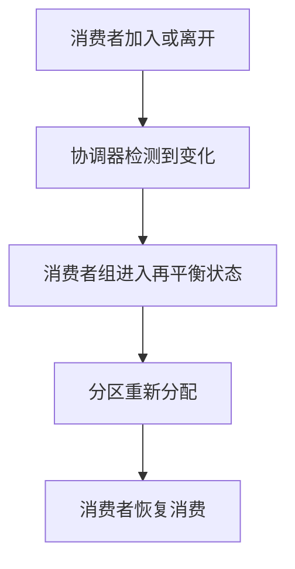

# Kafka 再平衡机制

Kafka是一个分布式流处理平台，广泛用于构建实时数据管道和流应用。在Kafka中，消费者组（Consumer Group）是消费消息的核心机制之一。消费者组中的消费者共同消费一个或多个主题（Topic）的分区（Partition）。然而，当消费者组中的消费者数量发生变化时，Kafka会触发**再平衡机制**（Rebalance），以确保分区能够被公平地分配给消费者。

本文将详细介绍Kafka再平衡机制的工作原理、触发条件以及如何在实际开发中处理再平衡问题。

## 什么是再平衡机制？

再平衡机制是Kafka消费者组中的一种机制，用于在消费者组中的消费者发生变化时，重新分配分区给消费者。这种变化可能包括：

- 新的消费者加入消费者组
- 现有的消费者离开消费者组（例如，消费者崩溃或主动退出）
- 消费者订阅的主题分区数量发生变化

再平衡机制的目标是确保每个分区只被一个消费者消费，同时尽可能均匀地分配分区给消费者。

## 再平衡机制的触发条件

再平衡机制通常在以下情况下触发：

1. **消费者加入或离开**：当消费者组中有新的消费者加入或现有消费者离开时，Kafka会触发再平衡。
2. **分区数量变化**：如果消费者订阅的主题分区数量发生变化（例如，新增或删除分区），也会触发再平衡。
3. **消费者超时**：如果消费者在指定的时间内没有发送心跳（Heartbeat）给Kafka Broker，Kafka会认为该消费者已经崩溃，并触发再平衡。

:::note
再平衡机制是Kafka保证消费者组高可用性和负载均衡的关键机制，但它也会带来一定的性能开销，因为再平衡期间消费者会暂停消费。
:::

## 再平衡机制的工作原理

再平衡机制的核心是**分区分配策略**。Kafka提供了几种内置的分区分配策略，例如：

- **RangeAssignor**：按范围分配分区。
- **RoundRobinAssignor**：按轮询方式分配分区。
- **StickyAssignor**：尽可能保持分区分配的稳定性，减少再平衡时的分区迁移。

再平衡的过程可以分为以下几个步骤：

1. **消费者组协调器（Group Coordinator）检测到变化**：当消费者加入或离开时，协调器会检测到变化并触发再平衡。
2. **消费者组进入再平衡状态**：所有消费者会停止消费，并等待新的分区分配。
3. **分区重新分配**：协调器根据分区分配策略，将分区重新分配给消费者。
4. **消费者恢复消费**：消费者接收到新的分区分配后，恢复消费。



## 实际案例：处理再平衡

在实际开发中，再平衡机制可能会导致消费者暂停消费，从而影响系统的实时性。为了减少再平衡的影响，可以采取以下措施：

1. **优化消费者心跳配置**：通过调整 `session.timeout.ms` 和 `heartbeat.interval.ms` 参数，减少误判消费者崩溃的可能性。
2. **使用StickyAssignor**：尽可能减少分区在再平衡时的迁移，保持消费的连续性。
3. **处理再平衡事件**：在消费者代码中监听再平衡事件，执行必要的清理或状态保存操作。

以下是一个Java代码示例，展示如何在消费者中监听再平衡事件：

```java
import org.apache.kafka.clients.consumer.*;
import org.apache.kafka.common.TopicPartition;

import java.time.Duration;
import java.util.Collection;
import java.util.Collections;
import java.util.Properties;

public class KafkaConsumerExample {
    public static void main(String[] args) {
        Properties props = new Properties();
        props.put("bootstrap.servers", "localhost:9092");
        props.put("group.id", "test-group");
        props.put("enable.auto.commit", "false");
        props.put("key.deserializer", "org.apache.kafka.common.serialization.StringDeserializer");
        props.put("value.deserializer", "org.apache.kafka.common.serialization.StringDeserializer");

        KafkaConsumer<String, String> consumer = new KafkaConsumer<>(props);
        consumer.subscribe(Collections.singletonList("test-topic"), new ConsumerRebalanceListener() {
            @Override
            public void onPartitionsRevoked(Collection<TopicPartition> partitions) {
                System.out.println("Partitions revoked: " + partitions);
                // 在这里执行清理操作，例如提交偏移量
            }

            @Override
            public void onPartitionsAssigned(Collection<TopicPartition> partitions) {
                System.out.println("Partitions assigned: " + partitions);
                // 在这里恢复状态或初始化消费
            }
        });

        while (true) {
            ConsumerRecords<String, String> records = consumer.poll(Duration.ofMillis(100));
            for (ConsumerRecord<String, String> record : records) {
                System.out.printf("offset = %d, key = %s, value = %s%n", record.offset(), record.key(), record.value());
            }
        }
    }
}
```

:::tip
在实际应用中，建议在 `onPartitionsRevoked` 方法中提交偏移量，以确保在分区重新分配时不会丢失数据。
:::

## 总结

Kafka再平衡机制是消费者组中确保分区公平分配的关键机制。虽然再平衡会带来一定的性能开销，但通过优化配置和使用适当的分区分配策略，可以减少其影响。在实际开发中，监听再平衡事件并执行必要的操作，可以进一步提高系统的稳定性和可靠性。

## 附加资源与练习

- **练习**：尝试在本地搭建一个Kafka集群，并模拟消费者加入和离开的场景，观察再平衡的过程。
- **资源**：阅读Kafka官方文档中关于[消费者组](https://kafka.apache.org/documentation/#consumerapi)和[再平衡机制](https://kafka.apache.org/documentation/#consumerconfigs)的部分，深入了解相关配置和最佳实践。

通过本文的学习，你应该对Kafka再平衡机制有了全面的了解，并能够在实际开发中应用这些知识。继续探索Kafka的其他高级特性，提升你的流处理技能吧！