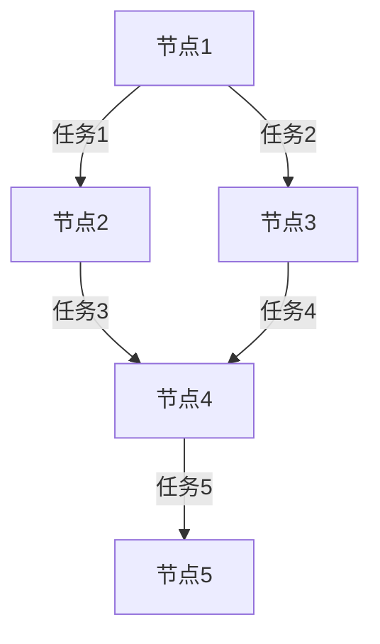

# Kafka Streams容错机制

Kafka Streams是Apache Kafka的一个客户端库，用于构建流处理应用程序。它提供了强大的容错机制，确保即使在节点故障或网络问题的情况下，应用程序仍能继续处理数据。本文将详细介绍Kafka Streams的容错机制，并通过实际案例展示其应用。

## 什么是容错机制？

容错机制是指系统在部分组件发生故障时，仍能继续正常运行的能力。在流处理系统中，容错机制尤为重要，因为数据流通常是连续且不可中断的。Kafka Streams通过以下几种方式实现容错：

1. **状态存储的持久化**：Kafka Streams将中间状态存储在Kafka主题中，确保在应用程序重启或故障恢复时，状态不会丢失。
2. **故障恢复**：当某个节点发生故障时，Kafka Streams会自动将任务重新分配给其他可用节点。
3. **数据重放**：Kafka Streams能够从Kafka主题中重新读取数据，确保数据处理的完整性。

## Kafka Streams的容错机制详解

### 1. 状态存储的持久化

Kafka Streams使用Kafka主题来持久化中间状态。这些状态存储被称为“状态存储”（State Store），它们可以是键值存储、窗口存储或其他类型的存储。状态存储的持久化确保了即使在应用程序重启或节点故障的情况下，状态也不会丢失。

```java
KStream<String, String> stream = builder.stream("input-topic");
stream.groupByKey()
      .count(Materialized.as("count-store"))
      .toStream()
      .to("output-topic");
```

在上面的代码中，`Materialized.as("count-store")`指定了一个名为`count-store`的状态存储。这个状态存储会被持久化到Kafka主题中，确保在应用程序重启时，计数状态不会丢失。

### 2. 故障恢复

Kafka Streams应用程序通常由多个任务（Task）组成，每个任务负责处理一部分数据。当某个节点发生故障时，Kafka Streams会自动将这些任务重新分配给其他可用节点。这种机制确保了即使部分节点不可用，应用程序仍能继续处理数据。



在上面的图中，如果节点2发生故障，任务1和任务3会被重新分配给其他节点，确保数据处理不会中断。

### 3. 数据重放

Kafka Streams能够从Kafka主题中重新读取数据，确保数据处理的完整性。如果某个任务在处理数据时发生故障，Kafka Streams会从Kafka主题中重新读取数据，并重新处理这些数据。

```java
stream.foreach((key, value) -> {
    // 处理数据
    System.out.println("Processing: " + key + " -> " + value);
});
```

在上面的代码中，如果处理数据的代码发生异常，Kafka Streams会从Kafka主题中重新读取数据，并重新处理这些数据。

## 实际案例

假设我们有一个电商网站，需要实时统计每个用户的订单数量。我们可以使用Kafka Streams来实现这个功能，并利用其容错机制确保在节点故障时，统计数据不会丢失。

```java
KStream<String, Order> orders = builder.stream("orders-topic");
orders.groupByKey()
      .count(Materialized.as("order-count-store"))
      .toStream()
      .to("order-count-topic");
```

在这个案例中，`order-count-store`状态存储会被持久化到Kafka主题中。即使某个节点发生故障，Kafka Streams也会自动将任务重新分配给其他节点，并从Kafka主题中重新读取数据，确保统计数据的完整性。

## 总结

Kafka Streams的容错机制确保了流处理应用在故障发生时仍能正常运行。通过状态存储的持久化、故障恢复和数据重放，Kafka Streams能够处理各种故障场景，确保数据处理的完整性和一致性。

## 附加资源

- [Kafka Streams官方文档](https://kafka.apache.org/documentation/streams/)
- [Kafka Streams开发者指南](https://kafka.apache.org/25/documentation/streams/developer-guide)

## 练习

1. 尝试在本地运行一个Kafka Streams应用程序，并模拟节点故障，观察Kafka Streams的容错机制如何工作。
2. 修改上面的电商案例，增加更多的统计功能，例如统计每个用户的总消费金额。