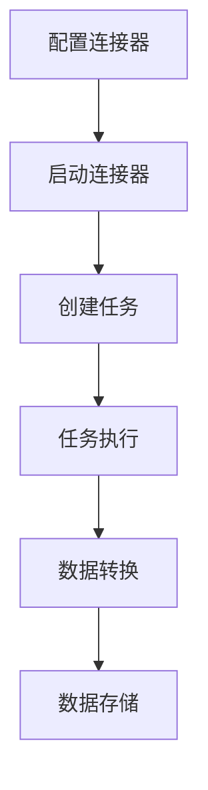

# Kafka Connect 架构

Kafka Connect 是 Apache Kafka 生态系统中的一个关键组件，用于在 Kafka 和其他系统之间高效、可靠地传输数据。它提供了一种可扩展且易于管理的方式，将数据从外部系统（如数据库、文件系统、消息队列等）导入 Kafka，或者将 Kafka 中的数据导出到外部系统。本文将深入探讨 Kafka Connect 的架构及其核心组件。

## 什么是 Kafka Connect？

Kafka Connect 是一个用于数据集成和流式数据传输的工具。它通过**连接器（Connectors）**和**任务（Tasks）**来实现数据的导入和导出。Kafka Connect 的主要优势在于其**可扩展性**和**易用性**，开发者可以通过简单的配置快速实现数据集成，而无需编写复杂的代码。

:::note
Kafka Connect 支持两种运行模式：**独立模式（Standalone Mode）**和**分布式模式（Distributed Mode）**。独立模式适合开发和测试，而分布式模式适合生产环境。
:::

## Kafka Connect 的核心架构

Kafka Connect 的架构由以下几个核心组件组成：

1. **连接器（Connectors）**
2. **任务（Tasks）**
3. **工作线程（Workers）**
4. **转换器（Converters）**
5. **插件（Plugins）**

下面我们将逐一介绍这些组件。

### 1. 连接器（Connectors）

连接器是 Kafka Connect 的核心组件之一，负责定义数据源或数据目标的配置。连接器分为两种类型：

- **源连接器（Source Connector）**：从外部系统读取数据并将其写入 Kafka。
- **接收连接器（Sink Connector）**：从 Kafka 读取数据并将其写入外部系统。

连接器的主要职责是管理任务的创建和分配，并监控任务的状态。

### 2. 任务（Tasks）

任务是实际执行数据传输的单元。每个连接器可以创建多个任务，以实现并行处理。任务负责从数据源读取数据或向数据目标写入数据。

:::tip
任务的并行度可以通过配置参数 `tasks.max` 来控制。适当增加任务数量可以提高数据传输的吞吐量。
:::

### 3. 工作线程（Workers）

工作线程是 Kafka Connect 的运行时环境，负责执行连接器和任务。在分布式模式下，多个工作线程可以组成一个集群，共同处理数据传输任务。

### 4. 转换器（Converters）

转换器用于在 Kafka 和外部系统之间进行数据格式的转换。常见的转换器包括：

- `StringConverter`：将数据转换为字符串格式。
- `JsonConverter`：将数据转换为 JSON 格式。
- `AvroConverter`：将数据转换为 Avro 格式。

### 5. 插件（Plugins）

插件是 Kafka Connect 的扩展机制，允许开发者自定义连接器、转换器和数据格式。Kafka Connect 提供了丰富的插件生态系统，支持与多种数据源和目标系统的集成。

## Kafka Connect 的工作流程

以下是 Kafka Connect 的典型工作流程：

1. **配置连接器**：定义数据源或数据目标的配置。
2. **启动连接器**：连接器根据配置创建任务。
3. **任务执行**：任务从数据源读取数据或向数据目标写入数据。
4. **数据转换**：转换器将数据转换为目标格式。
5. **数据存储**：数据被写入 Kafka 或外部系统。



## 实际案例：从 MySQL 导入数据到 Kafka

以下是一个简单的案例，展示如何使用 Kafka Connect 从 MySQL 数据库导入数据到 Kafka。

### 1. 安装 MySQL 连接器插件

首先，下载并安装 MySQL 连接器插件：

```bash
wget https://example.com/mysql-connector-plugin.zip
unzip mysql-connector-plugin.zip -d /path/to/kafka/connect/plugins
```

### 2. 配置源连接器

创建一个配置文件 `mysql-source-connector.properties`，内容如下：

```properties
name=mysql-source-connector
connector.class=io.confluent.connect.jdbc.JdbcSourceConnector
tasks.max=1
connection.url=jdbc:mysql://localhost:3306/mydb
connection.user=root
connection.password=password
table.whitelist=mytable
mode=incrementing
incrementing.column.name=id
topic.prefix=mysql-
```

### 3. 启动连接器

使用以下命令启动连接器：

```bash
bin/connect-standalone.sh config/connect-standalone.properties mysql-source-connector.properties
```

### 4. 验证数据导入

启动 Kafka 消费者，查看数据是否成功导入 Kafka：

```bash
bin/kafka-console-consumer.sh --bootstrap-server localhost:9092 --topic mysql-mytable --from-beginning
```

## 总结

Kafka Connect 是一个强大的数据集成工具，通过其模块化的架构和丰富的插件生态系统，可以轻松实现 Kafka 与外部系统之间的数据传输。本文介绍了 Kafka Connect 的核心组件、工作流程以及一个实际案例，帮助你快速上手 Kafka Connect。

## 附加资源

- [Kafka Connect 官方文档](https://kafka.apache.org/documentation/#connect)
- [Confluent Kafka Connect 教程](https://docs.confluent.io/platform/current/connect/index.html)
- [Kafka Connect 插件库](https://www.confluent.io/hub/)

## 练习

1. 尝试配置一个接收连接器，将 Kafka 中的数据导出到 Elasticsearch。
2. 修改连接器配置，增加任务的并行度，观察数据传输性能的变化。