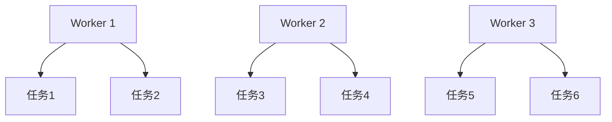

## 介绍

Kafka Connect 是 Apache Kafka 生态系统中的一个重要组件，用于在 Kafka 和其他系统之间高效、可靠地传输数据。在实际生产环境中，数据管道的稳定性和可靠性至关重要。Kafka Connect 提供了强大的容错机制，确保即使在发生故障时，数据也不会丢失，并且系统能够快速恢复。

本文将详细介绍 Kafka Connect 的容错机制，包括其工作原理、配置方法以及实际应用场景。

## Kafka Connect 容错机制

Kafka Connect 的容错机制主要依赖于以下几个方面：

1. **任务重启**：当某个任务失败时，Kafka Connect 会自动重启该任务，尝试恢复处理。
2. **偏移量管理**：Kafka Connect 使用 Kafka 的偏移量（offset）来跟踪每个任务的进度。如果任务失败，Kafka Connect 可以从上次成功处理的偏移量处重新开始。
3. **分布式架构**：Kafka Connect 支持分布式部署，多个 worker 节点可以协同工作。如果一个 worker 节点失败，其他节点可以接管其任务。

### 任务重启

Kafka Connect 的任务重启机制是其容错功能的核心。当某个任务失败时，Kafka Connect 会自动检测到故障，并尝试重新启动该任务。任务重启的次数和间隔可以通过配置参数进行控制。

```properties
# 配置任务重启的最大次数
task.max.retries=3

# 配置任务重启的间隔时间（毫秒）
task.retry.backoff.ms=1000
```

### 偏移量管理

Kafka Connect 使用 Kafka 的偏移量来跟踪每个任务的进度。偏移量是 Kafka 中用于标识消息位置的元数据。如果任务失败，Kafka Connect 可以从上次成功处理的偏移量处重新开始，确保数据不会丢失。


### 分布式架构

Kafka Connect 支持分布式部署，多个 worker 节点可以协同工作。如果一个 worker 节点失败，其他节点可以接管其任务。这种分布式架构不仅提高了系统的可用性，还增强了系统的扩展性。



## 实际应用场景

### 场景一：数据库同步

假设我们有一个需求，需要将 MySQL 数据库中的数据实时同步到 Elasticsearch 中。我们可以使用 Kafka Connect 的 JDBC Source Connector 和 Elasticsearch Sink Connector 来实现这一需求。

```properties
# JDBC Source Connector 配置
name=mysql-source
connector.class=io.confluent.connect.jdbc.JdbcSourceConnector
tasks.max=1
connection.url=jdbc:mysql://localhost:3306/mydb
connection.user=root
connection.password=password
table.whitelist=mytable
mode=incrementing
incrementing.column.name=id
topic.prefix=mysql-

# Elasticsearch Sink Connector 配置
name=elasticsearch-sink
connector.class=io.confluent.connect.elasticsearch.ElasticsearchSinkConnector
tasks.max=1
connection.url=http://localhost:9200
type.name=_doc
topics=mysql-mytable
key.ignore=true
```

在这个场景中，如果某个任务失败，Kafka Connect 会自动重启任务，并从上次成功处理的偏移量处重新开始，确保数据不会丢失。

### 场景二：日志收集

另一个常见的应用场景是日志收集。我们可以使用 Kafka Connect 的 File Source Connector 将日志文件中的数据实时传输到 Kafka 中，然后再使用 Kafka Connect 的 HDFS Sink Connector 将数据存储到 HDFS 中。

```properties
# File Source Connector 配置
name=file-source
connector.class=org.apache.kafka.connect.file.FileStreamSourceConnector
tasks.max=1
file=/var/log/application.log
topic=logs

# HDFS Sink Connector 配置
name=hdfs-sink
connector.class=io.confluent.connect.hdfs.HdfsSinkConnector
tasks.max=1
hdfs.url=hdfs://localhost:9000
topics=logs
flush.size=1000
```

在这个场景中，Kafka Connect 的容错机制确保了即使在日志文件处理过程中发生故障，数据也不会丢失，并且系统能够快速恢复。

## 总结

Kafka Connect 的容错机制是其在大规模数据处理中不可或缺的一部分。通过任务重启、偏移量管理和分布式架构，Kafka Connect 能够确保数据管道的高可用性和可靠性。对于初学者来说，理解这些机制并合理配置 Kafka Connect 是构建稳定数据管道的关键。

## 附加资源

- [Kafka Connect 官方文档](https://kafka.apache.org/documentation/#connect)
- [Kafka Connect 配置指南](https://docs.confluent.io/platform/current/connect/references/allconfigs.html)
- [Kafka Connect 实战教程](https://www.confluent.io/blog/kafka-connect-tutorial/)

## 练习

1. 配置一个简单的 Kafka Connect 任务，模拟任务失败并观察其重启行为。
2. 尝试在分布式环境中部署 Kafka Connect，并测试 worker 节点故障时的任务接管情况。
3. 使用 Kafka Connect 实现一个实际的数据同步场景，并验证其容错机制。

通过以上练习，您将更深入地理解 Kafka Connect 的容错机制，并能够在实际项目中应用这些知识。