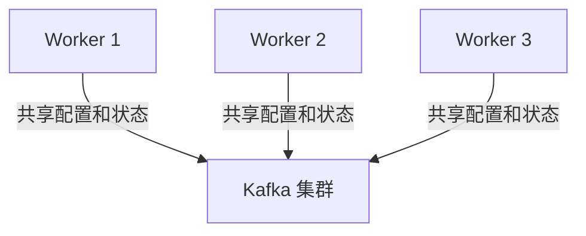

# Kafka Connect 部署模式

Kafka Connect 是 Apache Kafka 生态系统中的一个重要组件，用于在 Kafka 和其他系统之间高效地传输数据。它提供了一种可扩展且可靠的方式来集成各种数据源和数据接收器。为了满足不同的需求，Kafka Connect 支持两种主要的部署模式：**独立模式（Standalone Mode）** 和 **分布式模式（Distributed Mode）**。本文将详细介绍这两种模式的特点、配置方法以及适用场景。

---

## 什么是 Kafka Connect 部署模式？

Kafka Connect 的部署模式决定了如何运行和管理 Connect 工作节点（Worker）。不同的部署模式适用于不同的场景，例如开发测试、生产环境或高可用性需求。以下是两种模式的概述：

1. **独立模式（Standalone Mode）**：  
   适用于单节点环境，通常用于开发、测试或小规模数据集成任务。所有 Connector 和 Task 都在单个进程中运行。

2. **分布式模式（Distributed Mode）**：  
   适用于生产环境，支持多节点部署，具有高可用性和负载均衡能力。多个工作节点协同工作，共享配置和状态。

接下来，我们将深入探讨这两种模式的具体细节。

---

## 独立模式（Standalone Mode）

独立模式是 Kafka Connect 最简单的部署方式。它适合以下场景：
- 开发和测试环境。
- 小规模数据集成任务。
- 快速验证 Connector 的功能。

### 配置独立模式

要启动 Kafka Connect 独立模式，只需运行以下命令：

```bash
bin/connect-standalone.sh config/connect-standalone.properties connector1.properties connector2.properties
```

- `connect-standalone.properties`：Kafka Connect 的配置文件，包含 Kafka 集群的连接信息和其他全局配置。
- `connector1.properties` 和 `connector2.properties`：Connector 的配置文件，定义了数据源或数据接收器的具体配置。

#### 示例配置文件

**connect-standalone.properties**：
```properties
bootstrap.servers=localhost:9092
key.converter=org.apache.kafka.connect.json.JsonConverter
value.converter=org.apache.kafka.connect.json.JsonConverter
key.converter.schemas.enable=true
value.converter.schemas.enable=true
offset.storage.file.filename=/tmp/connect.offsets
```

**connector1.properties**（以文件源为例）：
```properties
name=file-source
connector.class=FileStreamSource
tasks.max=1
file=/tmp/test.txt
topic=test-topic
```

### 独立模式的优缺点

:::note
**优点**：
- 简单易用，适合快速启动和测试。
- 无需额外的依赖或配置。

**缺点**：
- 单点故障，不适合生产环境。
- 无法扩展，性能受限于单节点。
:::

---

## 分布式模式（Distributed Mode）

分布式模式是 Kafka Connect 在生产环境中的推荐部署方式。它支持多节点部署，具有高可用性和负载均衡能力。

### 配置分布式模式

要启动 Kafka Connect 分布式模式，运行以下命令：

```bash
bin/connect-distributed.sh config/connect-distributed.properties
```

- `connect-distributed.properties`：Kafka Connect 的配置文件，包含 Kafka 集群的连接信息、REST API 配置和其他全局设置。

#### 示例配置文件

**connect-distributed.properties**：
```properties
bootstrap.servers=localhost:9092
group.id=connect-cluster
key.converter=org.apache.kafka.connect.json.JsonConverter
value.converter=org.apache.kafka.connect.json.JsonConverter
key.converter.schemas.enable=true
value.converter.schemas.enable=true
offset.storage.topic=connect-offsets
config.storage.topic=connect-configs
status.storage.topic=connect-status
```

### 分布式模式的工作原理

在分布式模式下，多个工作节点组成一个集群，共享配置和状态。Kafka Connect 使用 Kafka 主题来存储以下信息：
- **Offset 信息**：记录每个 Connector 的进度。
- **配置信息**：存储 Connector 的配置。
- **状态信息**：跟踪 Connector 和 Task 的运行状态。



### 分布式模式的优缺点

:::note
**优点**：
- 高可用性，支持故障转移。
- 可扩展性强，支持负载均衡。
- 适合大规模生产环境。

**缺点**：
- 配置和管理相对复杂。
- 需要额外的 Kafka 主题来存储状态和配置。
:::

---

## 实际应用场景

### 场景 1：开发测试

在开发阶段，使用独立模式可以快速验证 Connector 的功能。例如，开发人员可以使用文件源 Connector 将本地文件中的数据导入 Kafka，然后使用文件接收器 Connector 将数据导出到另一个文件。

### 场景 2：生产环境

在生产环境中，分布式模式是首选。例如，一个电商平台可能需要将订单数据从 MySQL 数据库实时同步到 Kafka，然后再将数据导出到 Elasticsearch 进行搜索和分析。分布式模式可以确保数据同步的高可用性和可扩展性。

---

## 总结

Kafka Connect 提供了两种部署模式：独立模式和分布式模式。独立模式适合开发和测试，而分布式模式适合生产环境。选择哪种模式取决于具体的需求和场景。

- **独立模式**：简单易用，适合小规模任务。
- **分布式模式**：高可用性和可扩展性，适合大规模生产环境。

---

## 附加资源与练习

### 资源
- [Kafka Connect 官方文档](https://kafka.apache.org/documentation/#connect)
- [Kafka Connect 配置指南](https://docs.confluent.io/platform/current/connect/references/allconfigs.html)

### 练习
1. 在本地环境中配置并运行 Kafka Connect 独立模式，使用文件源 Connector 将数据导入 Kafka。
2. 尝试在分布式模式下部署 Kafka Connect，并观察多个工作节点如何协同工作。

通过实践这些练习，您将更好地理解 Kafka Connect 的部署模式及其应用场景。