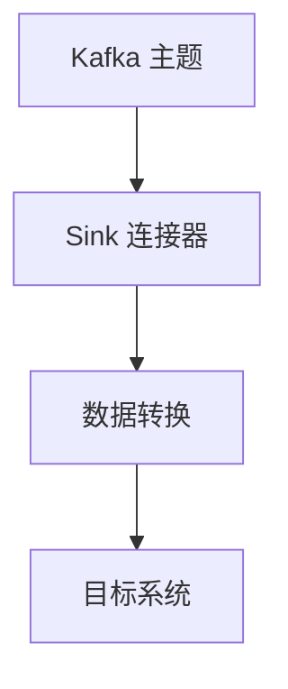

# Kafka Sink 连接器

Kafka Sink 连接器是 Apache Kafka 生态系统中的一个重要组件，用于将数据从 Kafka 主题传输到外部系统（如数据库、数据仓库或其他存储系统）。它是 Kafka Connect 框架的一部分，旨在简化数据集成和传输的过程。本文将详细介绍 Kafka Sink 连接器的概念、工作原理以及如何在实际应用中使用它。

## 什么是 Kafka Sink 连接器？

Kafka Sink 连接器是一种特殊类型的 Kafka Connect 连接器，负责从 Kafka 主题中消费数据，并将其写入到外部系统中。与 Kafka Source 连接器（负责将数据从外部系统导入 Kafka）不同，Sink 连接器的任务是“下沉”数据，即将数据从 Kafka 传输到目标系统。

Kafka Sink 连接器的主要功能包括：
- 从 Kafka 主题中读取数据。
- 将数据转换为目标系统所需的格式。
- 将数据写入目标系统（如数据库、文件系统、云存储等）。

## Kafka Sink 连接器的工作原理

Kafka Sink 连接器的工作流程可以分为以下几个步骤：

1. **数据消费**：Sink 连接器从 Kafka 主题中消费数据。这些数据通常以键值对的形式存储，并且可能包含复杂的结构（如 JSON、Avro 等）。

2. **数据转换**：连接器将消费到的数据转换为目标系统所需的格式。例如，如果目标系统是关系型数据库，连接器可能需要将 JSON 数据转换为 SQL 语句。

3. **数据写入**：转换后的数据被写入目标系统。写入过程可以是批量的，也可以是实时的，具体取决于连接器的配置和目标系统的特性。

以下是一个简单的流程图，展示了 Kafka Sink 连接器的工作流程：



## 实际案例：将 Kafka 数据写入 MySQL 数据库

假设我们有一个 Kafka 主题 `user_activity`，其中存储了用户活动的日志数据。我们希望将这些数据实时写入 MySQL 数据库中的 `user_activity_logs` 表中。以下是实现这一目标的步骤：

### 1. 安装 Kafka Connect 和 MySQL Sink 连接器

首先，确保你已经安装了 Kafka Connect 和 MySQL Sink 连接器。你可以从 [Confluent Hub](https://www.confluent.io/hub/) 下载并安装 MySQL Sink 连接器。

### 2. 配置 MySQL Sink 连接器

创建一个配置文件 `mysql-sink-connector.properties`，内容如下：

```properties
name=mysql-sink-connector
connector.class=io.confluent.connect.jdbc.JdbcSinkConnector
tasks.max=1
topics=user_activity
connection.url=jdbc:mysql://localhost:3306/mydatabase
connection.user=root
connection.password=password
auto.create=true
auto.evolve=true
insert.mode=upsert
pk.mode=record_value
pk.fields=user_id
table.name.format=user_activity_logs
```

### 3. 启动 Kafka Connect 并加载连接器

使用以下命令启动 Kafka Connect 并加载 MySQL Sink 连接器：

```bash
bin/connect-standalone.sh config/connect-standalone.properties mysql-sink-connector.properties
```

### 4. 验证数据写入

启动连接器后，Kafka 主题 `user_activity` 中的数据将自动写入 MySQL 数据库的 `user_activity_logs` 表中。你可以通过查询数据库来验证数据是否成功写入。

## 总结

Kafka Sink 连接器是 Kafka Connect 框架中的一个重要组件，用于将数据从 Kafka 传输到外部系统。通过使用 Sink 连接器，你可以轻松地将 Kafka 数据集成到各种目标系统中，如数据库、数据仓库和云存储。本文通过一个实际案例展示了如何将 Kafka 数据写入 MySQL 数据库，帮助你理解 Sink 连接器的基本概念和工作原理。

## 附加资源

- [Kafka Connect 官方文档](https://kafka.apache.org/documentation/#connect)
- [Confluent Hub](https://www.confluent.io/hub/)：下载各种 Kafka 连接器。
- [Kafka Connect 实战指南](https://www.confluent.io/blog/kafka-connect-deep-dive-converters-serialization-explained/)：深入了解 Kafka Connect 的转换器和序列化机制。

## 练习

1. 尝试将 Kafka 数据写入另一个目标系统（如 Elasticsearch 或 Amazon S3）。
2. 配置一个 Sink 连接器，使其在写入数据时进行数据过滤或转换。
3. 研究如何优化 Sink 连接器的性能，以处理大规模数据流。

通过完成这些练习，你将更深入地理解 Kafka Sink 连接器的使用和优化技巧。