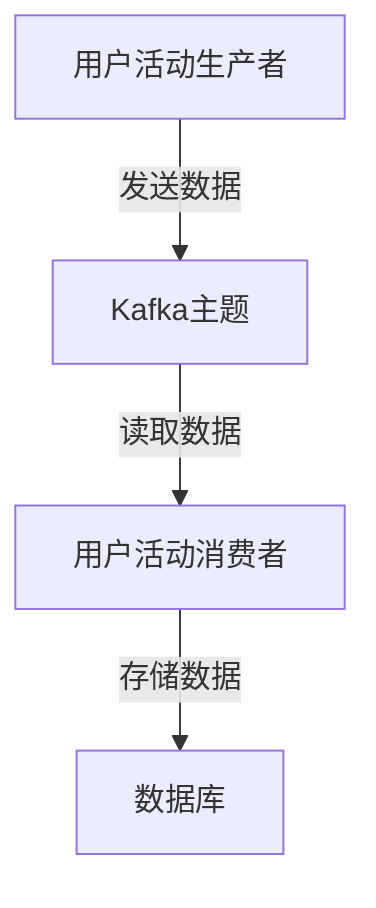

# Kafka 与数据库集成

在现代数据驱动的应用中，Kafka和数据库是两个非常重要的组件。Kafka作为一个分布式流处理平台，能够高效地处理大量实时数据流，而数据库则用于持久化存储和管理这些数据。将Kafka与数据库集成，可以实现数据的高效传输、处理和存储，从而构建强大的数据管道。

本文将逐步介绍如何将Kafka与数据库集成，并提供实际案例和代码示例，帮助你理解这一概念。

## 1. Kafka与数据库集成的基本概念

Kafka与数据库集成的核心思想是利用Kafka作为数据的中转站，将数据从生产者传输到消费者，最终存储到数据库中。这种集成方式有以下几个主要优势：

- **解耦**：Kafka作为中间层，解耦了生产者和消费者，使得系统更加灵活。
- **高吞吐量**：Kafka能够处理大量的实时数据流，确保数据的高效传输。
- **持久化**：Kafka可以将数据持久化存储，确保数据不会丢失。
- **实时处理**：Kafka支持实时数据处理，使得数据能够及时存储到数据库中。

## 2. Kafka与数据库集成的实现步骤

### 2.1 创建Kafka主题

首先，我们需要在Kafka中创建一个主题（Topic），用于存储数据流。可以使用以下命令创建一个名为 `user_activity` 的主题：

```bash
kafka-topics.sh --create --topic user_activity --bootstrap-server localhost:9092 --partitions 3 --replication-factor 1
```

### 2.2 编写Kafka生产者

接下来，我们需要编写一个Kafka生产者，将数据发送到Kafka主题中。以下是一个简单的Java示例：

```java
import org.apache.kafka.clients.producer.KafkaProducer;
import org.apache.kafka.clients.producer.ProducerRecord;
import java.util.Properties;

public class UserActivityProducer {
    public static void main(String[] args) {
        Properties props = new Properties();
        props.put("bootstrap.servers", "localhost:9092");
        props.put("key.serializer", "org.apache.kafka.common.serialization.StringSerializer");
        props.put("value.serializer", "org.apache.kafka.common.serialization.StringSerializer");

        KafkaProducer<String, String> producer = new KafkaProducer<>(props);

        String topic = "user_activity";
        String key = "user1";
        String value = "{\"userId\": \"user1\", \"activity\": \"login\", \"timestamp\": \"2023-10-01T12:00:00Z\"}";

        ProducerRecord<String, String> record = new ProducerRecord<>(topic, key, value);
        producer.send(record);

        producer.close();
    }
}
```

### 2.3 编写Kafka消费者并存储到数据库

最后，我们需要编写一个Kafka消费者，从Kafka主题中读取数据，并将其存储到数据库中。以下是一个简单的Java示例，使用JDBC将数据存储到MySQL数据库中：

```java
import org.apache.kafka.clients.consumer.ConsumerRecord;
import org.apache.kafka.clients.consumer.KafkaConsumer;
import org.apache.kafka.clients.consumer.ConsumerRecords;
import java.sql.Connection;
import java.sql.DriverManager;
import java.sql.PreparedStatement;
import java.util.Collections;
import java.util.Properties;

public class UserActivityConsumer {
    public static void main(String[] args) {
        Properties props = new Properties();
        props.put("bootstrap.servers", "localhost:9092");
        props.put("group.id", "user-activity-group");
        props.put("key.deserializer", "org.apache.kafka.common.serialization.StringDeserializer");
        props.put("value.deserializer", "org.apache.kafka.common.serialization.StringDeserializer");

        KafkaConsumer<String, String> consumer = new KafkaConsumer<>(props);
        consumer.subscribe(Collections.singletonList("user_activity"));

        String url = "jdbc:mysql://localhost:3306/user_activity_db";
        String username = "root";
        String password = "password";

        try (Connection connection = DriverManager.getConnection(url, username, password)) {
            String sql = "INSERT INTO user_activity (user_id, activity, timestamp) VALUES (?, ?, ?)";
            PreparedStatement statement = connection.prepareStatement(sql);

            while (true) {
                ConsumerRecords<String, String> records = consumer.poll(100);
                for (ConsumerRecord<String, String> record : records) {
                    String value = record.value();
                    // 解析JSON数据
                    // 假设我们已经解析出userId, activity, timestamp
                    String userId = "user1";
                    String activity = "login";
                    String timestamp = "2023-10-01T12:00:00Z";

                    statement.setString(1, userId);
                    statement.setString(2, activity);
                    statement.setString(3, timestamp);
                    statement.executeUpdate();
                }
            }
        } catch (Exception e) {
            e.printStackTrace();
        }
    }
}
```

## 3. 实际案例：用户活动跟踪系统

假设我们正在构建一个用户活动跟踪系统，该系统需要记录用户的登录、注销等操作，并将这些操作存储到数据库中。我们可以使用Kafka作为数据的中转站，将用户活动数据从生产者发送到Kafka主题，然后由消费者读取并存储到数据库中。

### 3.1 系统架构



### 3.2 数据流

1. 用户执行登录操作。
2. 生产者将登录事件发送到Kafka主题 `user_activity`。
3. 消费者从Kafka主题中读取登录事件，并将其存储到数据库中。

## 4. 总结

通过本文，我们了解了如何将Kafka与数据库集成，实现数据的高效传输和存储。我们创建了一个Kafka主题，编写了生产者和消费者，并将数据存储到数据库中。我们还通过一个实际案例展示了这一概念的应用场景。

## 5. 附加资源与练习

- **附加资源**：
  - [Kafka官方文档](https://kafka.apache.org/documentation/)
  - [JDBC官方文档](https://docs.oracle.com/javase/tutorial/jdbc/)

- **练习**：
  1. 尝试修改生产者代码，发送不同类型的用户活动数据（如注销、购买等）。
  2. 修改消费者代码，将数据存储到不同的数据库表中。
  3. 探索Kafka的其他功能，如分区、副本等，并尝试在集成中使用这些功能。

通过完成这些练习，你将更深入地理解Kafka与数据库集成的概念，并能够将其应用到实际项目中。