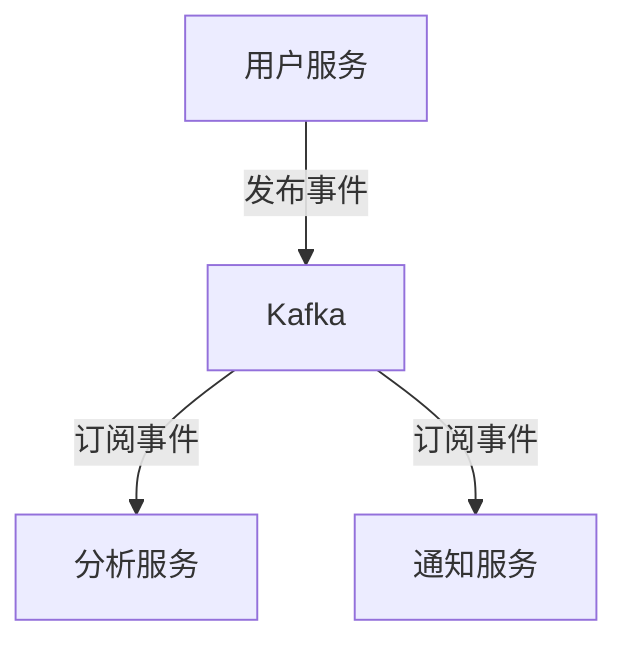

# Kafka 与微服务集成

在现代分布式系统中，微服务架构和消息队列（如Kafka）的结合是实现高效、可扩展和可靠系统的关键。本文将详细介绍如何将Kafka与微服务集成，并通过实际案例展示其应用场景。

## 什么是Kafka与微服务集成？

Kafka是一个分布式流处理平台，广泛用于构建实时数据管道和流应用程序。微服务架构则是一种将应用程序拆分为多个小型、独立服务的设计模式。将Kafka与微服务集成，可以实现服务之间的异步通信、事件驱动架构以及数据流的实时处理。

## 为什么需要Kafka与微服务集成？

1. **解耦服务**：Kafka作为消息中间件，可以解耦微服务之间的直接依赖，使服务更加独立和可维护。
2. **异步通信**：Kafka支持异步消息传递，提高系统的响应速度和吞吐量。
3. **事件驱动架构**：通过Kafka的事件流，可以实现事件驱动的微服务架构，使系统更具弹性和可扩展性。
4. **数据一致性**：Kafka的持久化和复制机制确保数据的高可用性和一致性。

## Kafka 与微服务集成的基本步骤

### 1. 设置Kafka集群

首先，需要设置一个Kafka集群。可以使用Docker快速启动一个本地Kafka集群：

```bash
docker-compose up -d
```

### 2. 创建Kafka主题

在Kafka中，数据通过主题（Topic）进行组织。创建一个主题：

```bash
kafka-topics --create --topic user-events --bootstrap-server localhost:9092 --partitions 3 --replication-factor 1
```

### 3. 生产者服务

生产者服务负责将消息发布到Kafka主题。以下是一个简单的Java生产者示例：

```java
Properties props = new Properties();
props.put("bootstrap.servers", "localhost:9092");
props.put("key.serializer", "org.apache.kafka.common.serialization.StringSerializer");
props.put("value.serializer", "org.apache.kafka.common.serialization.StringSerializer");

Producer<String, String> producer = new KafkaProducer<>(props);
producer.send(new ProducerRecord<>("user-events", "user-id", "User logged in"));
producer.close();
```

### 4. 消费者服务

消费者服务从Kafka主题中读取消息并进行处理。以下是一个简单的Java消费者示例：

```java
Properties props = new Properties();
props.put("bootstrap.servers", "localhost:9092");
props.put("group.id", "user-events-group");
props.put("key.deserializer", "org.apache.kafka.common.serialization.StringDeserializer");
props.put("value.deserializer", "org.apache.kafka.common.serialization.StringDeserializer");

Consumer<String, String> consumer = new KafkaConsumer<>(props);
consumer.subscribe(Arrays.asList("user-events"));

while (true) {
    ConsumerRecords<String, String> records = consumer.poll(Duration.ofMillis(100));
    for (ConsumerRecord<String, String> record : records) {
        System.out.printf("offset = %d, key = %s, value = %s%n", record.offset(), record.key(), record.value());
    }
}
```

## 实际案例：用户活动跟踪系统

假设我们正在构建一个用户活动跟踪系统，该系统需要记录用户的登录、注销等事件，并将这些事件实时推送到其他微服务进行处理。

### 系统架构



### 实现步骤

1. **用户服务**：当用户登录或注销时，发布事件到Kafka主题 `user-events`。
2. **分析服务**：订阅 `user-events` 主题，分析用户行为并生成报告。
3. **通知服务**：订阅 `user-events` 主题，发送实时通知给用户。

## 总结

通过将Kafka与微服务集成，我们可以构建一个高效、可扩展和可靠的分布式系统。Kafka的异步通信和事件驱动架构使微服务之间的解耦和协作变得更加简单和高效。

## 附加资源

- [Kafka官方文档](https://kafka.apache.org/documentation/)
- [微服务架构设计模式](https://microservices.io/)
- [Kafka与Spring Boot集成教程](https://spring.io/projects/spring-kafka)

## 练习

1. 尝试在本地环境中设置一个Kafka集群，并创建一个主题。
2. 编写一个简单的生产者和消费者服务，实现消息的发布和订阅。
3. 扩展用户活动跟踪系统，添加一个新的微服务来处理用户事件。

:::tip
在实际生产环境中，建议使用Kafka的集群模式和监控工具（如Kafka Manager）来确保系统的高可用性和性能。
:::