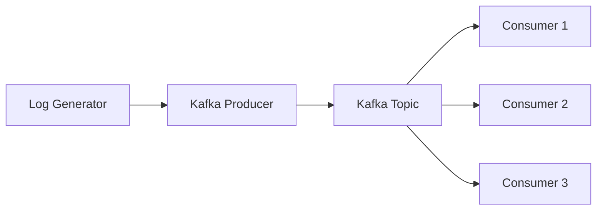
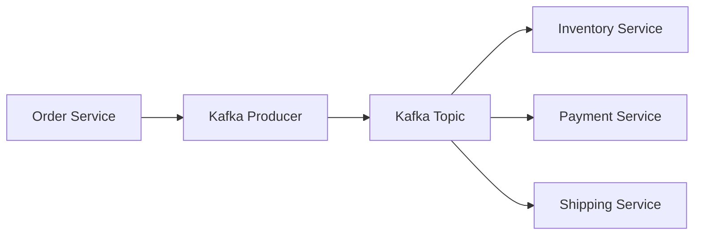

# Kafka Go客户端

Kafka是一个分布式流处理平台，广泛用于构建实时数据管道和流应用。Go语言以其简洁和高性能著称，是开发Kafka客户端的理想选择。本文将介绍如何使用Go语言与Kafka进行集成开发，适合初学者。

## 介绍

Kafka Go客户端是一个用于与Kafka集群进行通信的Go语言库。它允许开发者生产（produce）和消费（consume）消息，管理主题（topics）和分区（partitions），以及处理Kafka的其他核心功能。

### 安装Kafka Go客户端

首先，你需要安装Kafka Go客户端库。可以通过以下命令安装：

```bash
go get github.com/confluentinc/confluent-kafka-go/kafka
```

## 基本概念

在开始编写代码之前，了解一些基本概念是非常重要的：

- **Producer**：生产者，负责将消息发送到Kafka主题。
- **Consumer**：消费者，负责从Kafka主题读取消息。
- **Topic**：主题，Kafka中消息的分类。
- **Partition**：分区，主题的物理子集，用于并行处理消息。

## 代码示例

### 生产者示例

以下是一个简单的Kafka生产者示例，它将消息发送到名为`test-topic`的主题。

```go
package main

import (
    "fmt"
    "github.com/confluentinc/confluent-kafka-go/kafka"
)

func main() {
    p, err := kafka.NewProducer(&kafka.ConfigMap{"bootstrap.servers": "localhost:9092"})
    if err != nil {
        panic(err)
    }

    defer p.Close()

    topic := "test-topic"
    for _, word := range []string{"Welcome", "to", "Kafka", "Go", "Client"} {
        p.Produce(&kafka.Message{
            TopicPartition: kafka.TopicPartition{Topic: &topic, Partition: kafka.PartitionAny},
            Value:          []byte(word),
        }, nil)
    }

    p.Flush(15 * 1000)
    fmt.Println("Messages sent successfully")
}
```

### 消费者示例

以下是一个简单的Kafka消费者示例，它从`test-topic`主题读取消息。

```go
package main

import (
    "fmt"
    "github.com/confluentinc/confluent-kafka-go/kafka"
)

func main() {
    c, err := kafka.NewConsumer(&kafka.ConfigMap{
        "bootstrap.servers": "localhost:9092",
        "group.id":          "myGroup",
        "auto.offset.reset": "earliest",
    })

    if err != nil {
        panic(err)
    }

    c.SubscribeTopics([]string{"test-topic"}, nil)

    for {
        msg, err := c.ReadMessage(-1)
        if err == nil {
            fmt.Printf("Received message: %s\n", string(msg.Value))
        } else {
            fmt.Printf("Consumer error: %v (%v)\n", err, msg)
            break
        }
    }

    c.Close()
}
```

## 实际应用场景

### 实时日志处理

假设你正在开发一个实时日志处理系统，你需要将日志数据发送到Kafka，然后由多个消费者处理这些日志。使用Kafka Go客户端，你可以轻松实现这一需求。



### 电商订单处理

在电商平台中，订单数据需要实时处理。你可以使用Kafka Go客户端将订单数据发送到Kafka，然后由多个服务处理这些订单，如库存管理、支付处理和物流跟踪。



## 总结

Kafka Go客户端为Go开发者提供了一个强大而灵活的工具，用于与Kafka集群进行交互。通过本文的介绍和示例代码，你应该能够开始使用Kafka Go客户端进行基本的消息生产和消费。

## 附加资源

- [Kafka官方文档](https://kafka.apache.org/documentation/)
- [Confluent Kafka Go客户端文档](https://github.com/confluentinc/confluent-kafka-go)

## 练习

1. 修改生产者示例，使其能够发送JSON格式的消息。
2. 创建一个消费者组，多个消费者同时消费同一个主题的消息，观察消息的分发情况。
3. 尝试使用Kafka的`AdminClient`创建一个新的主题，并配置分区和副本数。

通过以上练习，你将更深入地理解Kafka Go客户端的使用和Kafka的核心概念。