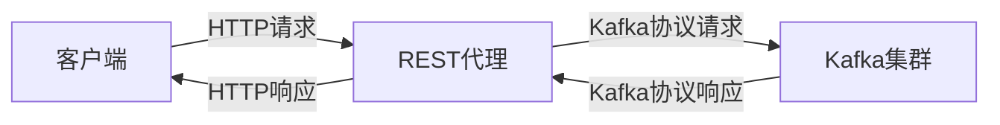

# Kafka REST代理

Kafka REST代理是一个允许开发者通过HTTP协议与Kafka集群进行交互的工具。它为那些不熟悉Kafka原生客户端或无法直接使用Kafka客户端的环境提供了一种简便的方式来访问Kafka集群。通过REST代理，开发者可以使用HTTP请求来生产和消费消息，而无需直接与Kafka的Java或Scala客户端打交道。

## 什么是Kafka REST代理？

Kafka REST代理是Confluent提供的一个开源工具，它充当了Kafka集群的HTTP接口。它允许开发者通过RESTful API与Kafka集群进行交互，从而简化了Kafka的集成开发。REST代理特别适用于以下场景：

- 无法直接使用Kafka客户端的环境（如某些云平台或受限的网络环境）。
- 需要快速集成Kafka的Web应用或移动应用。
- 开发者不熟悉Kafka的Java或Scala客户端，但熟悉HTTP协议。

## Kafka REST代理的工作原理

Kafka REST代理的核心功能是将HTTP请求转换为Kafka的原生协议请求。以下是其工作原理的简要概述：

1. **接收HTTP请求**：REST代理监听特定的HTTP端口，接收来自客户端的请求。
2. **解析请求**：REST代理解析HTTP请求，提取出Kafka相关的操作（如生产消息或消费消息）。
3. **转换为Kafka协议**：REST代理将HTTP请求转换为Kafka的原生协议请求，并发送到Kafka集群。
4. **接收Kafka响应**：REST代理接收Kafka集群的响应，并将其转换为HTTP响应返回给客户端。



## 使用Kafka REST代理

### 安装和配置

要使用Kafka REST代理，首先需要安装并配置它。以下是基本的安装步骤：

1. **下载REST代理**：从Confluent的官方网站下载REST代理的安装包。
2. **配置REST代理**：编辑配置文件（通常为`rest-proxy.properties`），指定Kafka集群的连接信息和其他相关配置。
3. **启动REST代理**：使用命令行启动REST代理服务。

```bash
# 启动REST代理
bin/kafka-rest-start etc/kafka-rest/kafka-rest.properties
```

### 生产消息

通过REST代理生产消息非常简单。以下是一个使用`curl`命令向Kafka主题发送消息的示例：

```bash
curl -X POST -H "Content-Type: application/vnd.kafka.json.v2+json" \
  --data '{"records":[{"value":{"name":"John","age":30}}]}' \
  http://localhost:8082/topics/test-topic
```

在这个示例中，我们向名为`test-topic`的主题发送了一条JSON格式的消息。REST代理会将这条消息转换为Kafka的原生协议，并将其发送到Kafka集群。

### 消费消息

消费消息的过程稍微复杂一些。首先，我们需要创建一个消费者实例，然后使用该实例来消费消息。以下是一个使用`curl`命令消费消息的示例：

```bash
# 创建消费者实例
curl -X POST -H "Content-Type: application/vnd.kafka.v2+json" \
  --data '{"name": "my-consumer", "format": "json", "auto.offset.reset": "earliest"}' \
  http://localhost:8082/consumers/my-consumer-group

# 订阅主题
curl -X POST -H "Content-Type: application/vnd.kafka.v2+json" \
  --data '{"topics":["test-topic"]}' \
  http://localhost:8082/consumers/my-consumer-group/instances/my-consumer/subscription

# 消费消息
curl -X GET -H "Accept: application/vnd.kafka.json.v2+json" \
  http://localhost:8082/consumers/my-consumer-group/instances/my-consumer/records
```

在这个示例中，我们首先创建了一个消费者实例，然后订阅了`test-topic`主题，最后从该主题中消费消息。

## 实际应用场景

Kafka REST代理在许多实际场景中都非常有用。以下是一些常见的应用场景：

1. **Web应用集成**：Web应用可以通过REST代理与Kafka集群进行交互，而无需直接使用Kafka客户端。
2. **移动应用集成**：移动应用可以通过REST代理与Kafka集群进行交互，简化了移动端的开发。
3. **跨平台集成**：在跨平台的环境中，REST代理提供了一种统一的方式来访问Kafka集群。

## 总结

Kafka REST代理是一个强大的工具，它通过HTTP协议简化了与Kafka集群的交互。无论是Web应用、移动应用还是跨平台集成，REST代理都提供了一种简便的方式来访问Kafka集群。通过本文的介绍，你应该已经掌握了Kafka REST代理的基本概念和使用方法。

## 附加资源

- [Confluent官方文档](https://docs.confluent.io/platform/current/kafka-rest/index.html)
- [Kafka REST代理GitHub仓库](https://github.com/confluentinc/kafka-rest)

## 练习

1. 尝试使用Kafka REST代理向一个Kafka主题发送多条消息，并使用消费者实例消费这些消息。
2. 探索Kafka REST代理的其他功能，如消费者组的配置和管理。