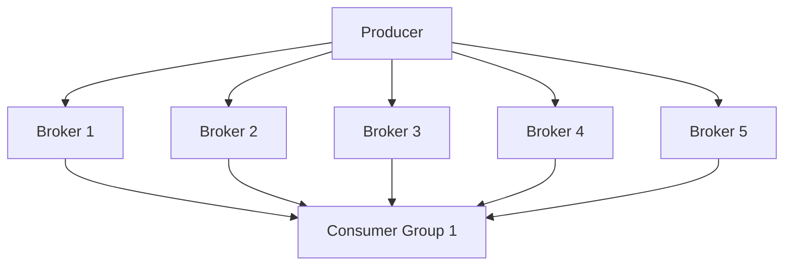

## 介绍

Kafka 是一个分布式流处理平台，广泛用于构建实时数据管道和流应用。为了确保 Kafka 集群的高效运行，合理的集群规划是至关重要的。本文将详细介绍如何规划 Kafka 集群，包括硬件选择、网络配置、分区设计等关键因素。

## 1. 硬件规划

### 1.1 磁盘

Kafka 是一个高吞吐量的系统，磁盘 I/O 是其性能的关键因素。建议使用 SSD 或高性能的 HDD，并确保磁盘有足够的容量来存储数据。

:::tip
建议为 Kafka 配置 RAID 10，以提高磁盘的读写性能和冗余性。
:::

### 1.2 CPU 和内存

Kafka 对 CPU 的要求相对较低，但内存需求较高，尤其是在处理大量消息时。建议为每个 Kafka 节点配置至少 16GB 的内存。

### 1.3 网络

Kafka 集群中的节点需要频繁地进行数据交换，因此网络带宽和延迟对集群性能有显著影响。建议使用千兆或万兆网络，并确保网络延迟尽可能低。

## 2. 集群规模

### 2.1 Broker 数量

Kafka 集群的规模取决于业务需求和预期的吞吐量。通常，建议至少部署 3 个 Broker 以确保高可用性。

:::note
Broker 数量应至少为副本因子（Replication Factor）加 1，以确保在某个 Broker 宕机时，集群仍能正常运行。
:::

### 2.2 分区数量

分区是 Kafka 并行处理的基础。分区的数量应根据预期的吞吐量和消费者数量来确定。通常，建议每个 Topic 的分区数量为 Broker 数量的倍数。

```bash
# 示例：创建一个包含 6 个分区的 Topic
kafka-topics.sh --create --topic my-topic --partitions 6 --replication-factor 3 --bootstrap-server localhost:9092
```

## 3. 数据复制与容错

### 3.1 副本因子

副本因子（Replication Factor）决定了每个分区的副本数量。建议将副本因子设置为 3，以确保在某个 Broker 宕机时，数据不会丢失。

```bash
# 示例：创建一个副本因子为 3 的 Topic
kafka-topics.sh --create --topic my-topic --partitions 6 --replication-factor 3 --bootstrap-server localhost:9092
```

### 3.2 ISR（In-Sync Replicas）

ISR 是指与 Leader 保持同步的副本集合。Kafka 只会从 ISR 中选举新的 Leader，因此确保 ISR 的大小足够大是保证数据可用性的关键。

## 4. 实际案例

假设我们有一个电商平台，需要处理每天数百万的订单数据。为了确保系统的高可用性和高性能，我们规划了一个包含 5 个 Broker 的 Kafka 集群，每个 Topic 的分区数量为 10，副本因子为 3。



在这个案例中，Producer 将订单数据发送到 Kafka 集群，Consumer Group 从集群中消费数据并进行处理。通过合理的分区和副本设计，系统能够高效地处理大量数据，并在某个 Broker 宕机时保持高可用性。

## 5. 总结

Kafka 集群规划是确保系统高效、可靠运行的关键步骤。通过合理的硬件选择、集群规模设计、分区和副本配置，可以构建一个满足业务需求并具备良好扩展性的 Kafka 集群。

## 6. 附加资源与练习

- **练习 1**：尝试在本地环境中部署一个包含 3 个 Broker 的 Kafka 集群，并创建一个副本因子为 3 的 Topic。
- **练习 2**：模拟一个 Broker 宕机的场景，观察 Kafka 集群的行为，并验证数据的可用性。

:::caution
在实际生产环境中，务必进行充分的测试和监控，以确保 Kafka 集群的稳定性和性能。
:::