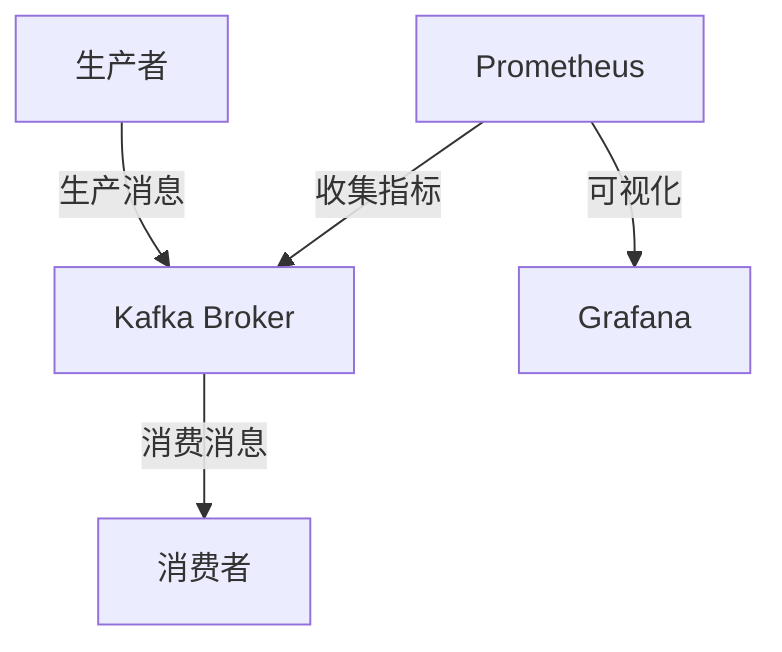

# Kafka 集群监控

Kafka是一个分布式流处理平台，广泛应用于实时数据管道和大规模数据处理场景。为了确保Kafka集群的稳定运行，监控是至关重要的。通过监控，我们可以及时发现潜在问题，优化性能，并确保数据的高可用性。

## 为什么需要监控Kafka集群？

Kafka集群通常由多个Broker组成，每个Broker负责存储和处理数据。如果某个Broker出现故障或性能下降，可能会影响整个集群的稳定性。通过监控，我们可以：

- 实时了解集群的健康状态。
- 快速发现并解决问题。
- 优化资源使用，提高性能。
- 确保数据的高可用性和一致性。

## Kafka 监控的关键指标

在监控Kafka集群时，我们需要关注以下几个关键指标：

1. **Broker状态**：包括Broker的在线状态、CPU和内存使用率、磁盘I/O等。
2. **Topic和Partition状态**：包括消息的生产和消费速率、延迟、副本同步状态等。
3. **Zookeeper状态**：Kafka依赖Zookeeper进行集群管理，因此Zookeeper的健康状态也需要监控。
4. **JVM性能**：Kafka运行在JVM上，因此需要监控JVM的GC情况、堆内存使用等。

## 常用的Kafka监控工具

以下是一些常用的Kafka监控工具：

1. **Kafka Manager**：一个开源的Kafka集群管理工具，提供了丰富的监控和管理功能。
2. **Confluent Control Center**：Confluent提供的商业监控工具，功能强大，适合大规模集群。
3. **Prometheus + Grafana**：通过Prometheus收集Kafka的监控指标，并使用Grafana进行可视化展示。
4. **Kafka Exporter**：一个Prometheus的Exporter，用于收集Kafka的监控指标。

## 使用Prometheus和Grafana监控Kafka集群

下面我们以Prometheus和Grafana为例，介绍如何监控Kafka集群。

### 1. 安装和配置Kafka Exporter

首先，我们需要安装Kafka Exporter，它将Kafka的监控指标暴露给Prometheus。

```bash
# 下载并运行Kafka Exporter
wget https://github.com/danielqsj/kafka_exporter/releases/download/v1.4.0/kafka_exporter-1.4.0.linux-amd64.tar.gz
tar -xzf kafka_exporter-1.4.0.linux-amd64.tar.gz
cd kafka_exporter-1.4.0.linux-amd64
./kafka_exporter --kafka.server=<kafka-broker-address>:9092
```

### 2. 配置Prometheus

接下来，我们需要配置Prometheus，使其能够收集Kafka Exporter的监控数据。

```yaml
# prometheus.yml
scrape_configs:
  - job_name: 'kafka'
    static_configs:
      - targets: ['<kafka-exporter-address>:9308']
```

### 3. 配置Grafana

最后，我们可以在Grafana中导入Kafka的监控仪表盘，实时查看Kafka集群的状态。

```bash
# 在Grafana中导入Kafka仪表盘
# 仪表盘ID：7589
```

## 实际案例：监控Kafka集群的生产和消费速率

假设我们有一个Kafka集群，负责处理实时日志数据。为了确保数据处理的及时性，我们需要监控消息的生产和消费速率。



通过Prometheus和Grafana，我们可以实时查看消息的生产和消费速率，确保数据处理没有延迟。

## 总结

监控Kafka集群是确保其稳定运行的关键步骤。通过监控关键指标，我们可以及时发现并解决问题，优化性能，并确保数据的高可用性。本文介绍了Kafka监控的关键指标、常用工具以及如何使用Prometheus和Grafana进行监控。

## 附加资源

- [Kafka官方文档](https://kafka.apache.org/documentation/)
- [Prometheus官方文档](https://prometheus.io/docs/)
- [Grafana官方文档](https://grafana.com/docs/)

## 练习

1. 在你的Kafka集群中安装并配置Kafka Exporter。
2. 使用Prometheus和Grafana监控Kafka集群的生产和消费速率。
3. 尝试使用Kafka Manager或Confluent Control Center监控Kafka集群。
