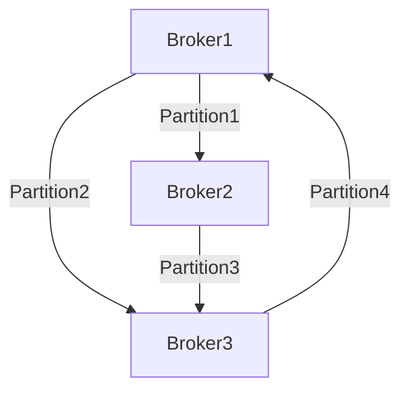

# Kafka 性能调优

Kafka是一个高性能的分布式消息系统，广泛应用于实时数据流处理场景。然而，随着数据量和并发请求的增加，Kafka集群的性能可能会受到影响。为了确保Kafka在高负载下仍能稳定运行，性能调优是必不可少的一环。本文将介绍Kafka性能调优的关键点，帮助初学者理解如何优化Kafka集群。

## 1. 性能调优概述

Kafka性能调优的目标是通过调整配置参数、优化硬件资源和改进架构设计，提升Kafka集群的吞吐量、降低延迟，并提高系统的稳定性。调优的主要方向包括：

- **生产者调优**：优化消息发送的吞吐量和延迟。
- **消费者调优**：提高消息消费的效率。
- **Broker调优**：优化Broker的资源使用和消息处理能力。
- **Topic与分区调优**：合理设计Topic和分区，提升并行处理能力。

接下来，我们将逐步讲解这些调优方向的具体方法。

---

## 2. 生产者调优

### 2.1 批量发送消息

Kafka生产者可以通过批量发送消息来减少网络请求次数，从而提高吞吐量。通过配置 `linger.ms` 和 `batch.size` 参数，可以控制批量发送的行为。

```java
Properties props = new Properties();
props.put("bootstrap.servers", "localhost:9092");
props.put("linger.ms", 10); // 等待最多10ms以批量发送消息
props.put("batch.size", 16384); // 每个批次的最大大小为16KB
props.put("key.serializer", "org.apache.kafka.common.serialization.StringSerializer");
props.put("value.serializer", "org.apache.kafka.common.serialization.StringSerializer");

Producer<String, String> producer = new KafkaProducer<>(props);
```

:::tip
- `linger.ms`：控制消息在发送前等待的时间，单位为毫秒。
- `batch.size`：控制每个批次的最大大小，单位为字节。
:::

### 2.2 压缩消息

Kafka支持对消息进行压缩，以减少网络传输的数据量。常见的压缩算法包括 `gzip`、`snappy` 和 `lz4`。

```java
props.put("compression.type", "snappy"); // 使用Snappy压缩算法
```

:::note
压缩虽然可以减少网络带宽占用，但会增加CPU的负载。因此，需要根据实际场景选择合适的压缩算法。
:::

---

## 3. 消费者调优

### 3.1 提高并行度

Kafka消费者的并行度由分区数量决定。每个分区只能由一个消费者线程消费，因此增加分区数量可以提高消费的并行度。

```java
Properties props = new Properties();
props.put("bootstrap.servers", "localhost:9092");
props.put("group.id", "test-group");
props.put("key.deserializer", "org.apache.kafka.common.serialization.StringDeserializer");
props.put("value.deserializer", "org.apache.kafka.common.serialization.StringDeserializer");

KafkaConsumer<String, String> consumer = new KafkaConsumer<>(props);
consumer.subscribe(Arrays.asList("my-topic"));

while (true) {
    ConsumerRecords<String, String> records = consumer.poll(Duration.ofMillis(100));
    for (ConsumerRecord<String, String> record : records) {
        System.out.printf("offset = %d, key = %s, value = %s%n", record.offset(), record.key(), record.value());
    }
}
```

:::caution
分区数量过多可能会导致Broker负载增加，因此需要根据实际需求合理设置分区数量。
:::

### 3.2 调整拉取大小

通过配置 `max.poll.records` 参数，可以控制每次拉取的最大记录数，从而优化消费者的处理能力。

```java
props.put("max.poll.records", 500); // 每次拉取最多500条记录
```

---

## 4. Broker调优

### 4.1 优化文件系统

Kafka的性能与底层文件系统的性能密切相关。建议使用高性能的文件系统（如XFS或EXT4），并启用文件系统的写缓存。

```bash
# 挂载文件系统时启用写缓存
mount -o defaults,noatime,nodiratime /dev/sdb1 /kafka-data
```

### 4.2 调整线程池大小

Kafka Broker使用多个线程池来处理请求。通过调整 `num.network.threads` 和 `num.io.threads` 参数，可以优化Broker的并发处理能力。

```properties
# server.properties
num.network.threads=8
num.io.threads=16
```

---

## 5. Topic与分区调优

### 5.1 合理设置分区数量

分区数量直接影响Kafka的并行处理能力。分区数量过少会导致性能瓶颈，而分区数量过多会增加Broker的负载。

```bash
# 创建Topic时指定分区数量
kafka-topics.sh --create --topic my-topic --partitions 10 --replication-factor 2 --bootstrap-server localhost:9092
```

### 5.2 分区副本分布

确保分区副本均匀分布在不同的Broker上，可以提高系统的容错能力和负载均衡。



---

## 6. 实际案例

假设我们有一个电商平台的订单处理系统，使用Kafka处理订单数据流。随着订单量的增加，系统出现了延迟和吞吐量下降的问题。通过以下调优措施，系统性能得到了显著提升：

1. **生产者调优**：启用批量发送和消息压缩，将吞吐量提升了30%。
2. **消费者调优**：增加分区数量并调整拉取大小，将消费延迟降低了50%。
3. **Broker调优**：优化文件系统和线程池配置，Broker的CPU使用率降低了20%。

---

## 7. 总结

Kafka性能调优是一个持续优化的过程，需要根据实际场景不断调整配置参数和架构设计。通过本文的学习，你应该掌握了Kafka性能调优的基本方法和技巧。

### 附加资源
- [Kafka官方文档](https://kafka.apache.org/documentation/)
- 《Kafka权威指南》书籍
- Kafka性能调优实战课程

### 练习
1. 尝试在你的Kafka集群中启用消息压缩，并观察性能变化。
2. 创建一个新的Topic，并测试不同分区数量对消费性能的影响。