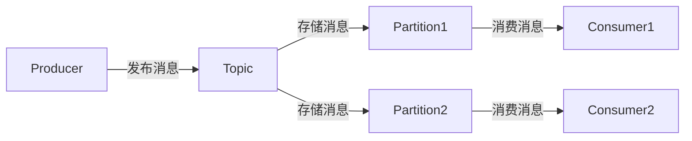
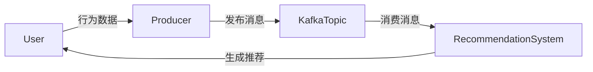

# Kafka 消息队列模式

Kafka是一个分布式流处理平台，广泛用于构建实时数据管道和流应用。**消息队列模式**是Kafka的核心设计模式之一，它允许生产者将消息发送到队列中，而消费者可以从队列中读取消息。这种模式在解耦系统组件、实现异步通信和提高系统扩展性方面非常有用。

## 什么是消息队列模式？

消息队列模式是一种异步通信机制，允许不同的系统或组件通过消息进行通信。在Kafka中，消息队列模式通过**主题（Topic）**实现。生产者将消息发布到主题，而消费者从主题中订阅并消费消息。

:::note
**主题（Topic）**：Kafka中的主题是一个逻辑上的消息分类，类似于数据库中的表。生产者将消息发布到主题，消费者从主题中订阅消息。
:::

## Kafka 消息队列模式的工作原理

Kafka的消息队列模式基于**发布-订阅模型**。以下是其工作原理的简要概述：

1. **生产者（Producer）**：生产者将消息发布到Kafka主题。
2. **主题（Topic）**：主题是消息的逻辑分类，Kafka将消息存储在主题中。
3. **分区（Partition）**：每个主题可以分为多个分区，分区是Kafka实现高吞吐量和并行处理的关键。
4. **消费者（Consumer）**：消费者从主题中订阅消息，并处理这些消息。



### 代码示例

以下是一个简单的Kafka生产者和消费者的代码示例：

#### 生产者代码

```python
from kafka import KafkaProducer

# 创建Kafka生产者
producer = KafkaProducer(bootstrap_servers='localhost:9092')

# 发送消息到主题
producer.send('my_topic', b'Hello, Kafka!')
producer.flush()
```

#### 消费者代码

```python
from kafka import KafkaConsumer

# 创建Kafka消费者
consumer = KafkaConsumer('my_topic', bootstrap_servers='localhost:9092')

# 消费消息
for message in consumer:
    print(f"Received message: {message.value.decode('utf-8')}")
```

:::tip
在实际应用中，生产者和消费者通常运行在不同的机器或容器中，以实现系统的解耦和扩展。
:::

## 实际应用场景

Kafka消息队列模式在许多实际场景中都有广泛应用，以下是一些常见的应用场景：

1. **日志收集**：Kafka可以用于收集和存储来自多个服务的日志数据，供后续分析和处理。
2. **事件驱动架构**：在微服务架构中，Kafka可以作为事件总线，用于在不同服务之间传递事件。
3. **实时数据处理**：Kafka可以用于实时处理数据流，例如实时推荐系统、实时监控等。

### 案例：实时推荐系统

假设你正在构建一个实时推荐系统，用户的行为数据（如点击、购买等）需要实时处理并生成推荐结果。Kafka消息队列模式可以用于处理这些行为数据：

1. **生产者**：用户行为数据被发送到Kafka主题。
2. **消费者**：推荐系统从主题中读取数据，并实时生成推荐结果。



## 总结

Kafka消息队列模式是一种强大的异步通信机制，适用于需要高吞吐量、低延迟和可扩展性的场景。通过主题和分区的设计，Kafka能够高效地处理大量消息，并支持多个消费者并行处理。

:::caution
在使用Kafka时，需要注意消息的顺序、分区策略以及消费者的负载均衡等问题，以确保系统的稳定性和性能。
:::

## 附加资源与练习

- **官方文档**：阅读Kafka的[官方文档](https://kafka.apache.org/documentation/)以深入了解其设计和实现。
- **练习**：尝试在自己的环境中搭建一个Kafka集群，并编写生产者和消费者代码，体验消息队列模式的实际应用。

通过本文的学习，你应该对Kafka消息队列模式有了初步的了解。接下来，可以继续探索Kafka的其他设计模式，如流处理模式、日志压缩模式等，以进一步提升你的Kafka技能。