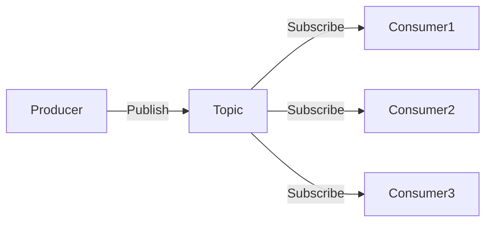

# Kafka 发布订阅模式

## 介绍

Kafka是一个分布式流处理平台，广泛用于构建实时数据管道和流应用程序。发布订阅模式（Publish-Subscribe Pattern）是Kafka的核心设计模式之一，它允许多个消费者订阅同一个主题（Topic），并从该主题中接收消息。这种模式非常适合需要将数据广播到多个消费者或系统的场景。

在发布订阅模式中，生产者（Producer）将消息发布到Kafka的主题中，而消费者（Consumer）则订阅这些主题以接收消息。每个消费者都可以独立地处理消息，从而实现解耦和扩展性。

## 核心概念

### 1. 主题（Topic）
主题是Kafka中消息的分类单位。生产者将消息发布到特定的主题，而消费者则订阅这些主题以接收消息。一个主题可以有多个分区（Partition），以实现并行处理和负载均衡。

### 2. 生产者（Producer）
生产者是向Kafka主题发布消息的客户端。它负责将消息发送到指定的主题，并可以选择将消息发送到特定的分区。

### 3. 消费者（Consumer）
消费者是从Kafka主题订阅消息的客户端。每个消费者可以订阅一个或多个主题，并从这些主题中拉取消息进行处理。

### 4. 消费者组（Consumer Group）
消费者组是一组消费者的集合，它们共同消费一个主题的消息。Kafka会将主题的分区分配给消费者组中的消费者，以确保每个分区只被一个消费者处理。

## 工作原理

在发布订阅模式中，生产者将消息发布到Kafka的主题中，而消费者则订阅这些主题以接收消息。Kafka会确保每个消息只被消费者组中的一个消费者处理，从而实现消息的负载均衡。



:::note
**注意**：在Kafka中，一个主题可以有多个分区，每个分区可以被分配给消费者组中的一个消费者。这样可以实现并行处理和负载均衡。
:::

## 代码示例

以下是一个简单的Kafka生产者和消费者的代码示例，展示了如何使用Kafka的发布订阅模式。

### 生产者代码

```python
from kafka import KafkaProducer

# 创建Kafka生产者
producer = KafkaProducer(bootstrap_servers='localhost:9092')

# 向主题发送消息
producer.send('my_topic', b'Hello, Kafka!')
producer.flush()
```

### 消费者代码

```python
from kafka import KafkaConsumer

# 创建Kafka消费者
consumer = KafkaConsumer('my_topic', bootstrap_servers='localhost:9092')

# 消费消息
for message in consumer:
    print(f"Received message: {message.value.decode('utf-8')}")
```

:::tip
**提示**：在实际应用中，生产者和消费者通常运行在不同的进程中，甚至可能在不同的机器上。Kafka的分布式特性使得这种架构非常容易实现。
:::

## 实际应用场景

### 1. 日志收集
在微服务架构中，每个服务都会生成大量的日志。通过Kafka的发布订阅模式，可以将这些日志集中收集到一个主题中，然后由多个消费者（如日志分析系统、监控系统等）进行处理。

### 2. 实时数据管道
在实时数据处理场景中，Kafka可以作为数据管道，将数据从生产者传输到消费者。例如，在电商网站中，用户的行为数据可以被实时发布到Kafka主题中，然后由推荐系统、广告系统等消费者进行处理。

### 3. 事件驱动架构
在事件驱动架构中，Kafka可以作为事件总线，将事件发布到主题中，然后由多个消费者处理这些事件。例如，在订单系统中，订单创建事件可以被发布到Kafka主题中，然后由库存系统、支付系统等消费者进行处理。

## 总结

Kafka的发布订阅模式是一种强大的消息传递模式，适用于需要将数据广播到多个消费者或系统的场景。通过主题、生产者、消费者和消费者组等核心概念，Kafka实现了高效、可靠的消息传递。

在实际应用中，Kafka的发布订阅模式可以用于日志收集、实时数据管道、事件驱动架构等多种场景。通过合理地设计主题和消费者组，可以实现高吞吐量、低延迟的数据处理。

## 附加资源

- [Kafka官方文档](https://kafka.apache.org/documentation/)
- [Kafka入门指南](https://kafka.apache.org/quickstart)
- [Kafka消费者组详解](https://kafka.apache.org/documentation/#consumerconfigs)

## 练习

1. 尝试在本地的Kafka环境中创建一个主题，并使用生产者和消费者进行消息的发布和订阅。
2. 修改消费者代码，使其能够处理多个主题的消息。
3. 研究Kafka的分区机制，并尝试在生产者代码中指定消息发送到特定的分区。
