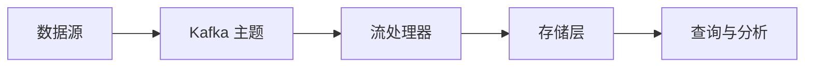

## 介绍

Kafka Kappa 架构是一种基于事件流的数据处理架构，旨在简化数据管道的设计和维护。与传统的 Lambda 架构不同，Kappa 架构通过单一的事件流处理所有数据，避免了批处理和实时处理的双重复杂性。Kappa 架构的核心思想是：**所有数据都通过事件流处理，历史数据和实时数据使用相同的处理逻辑**。

Kappa 架构特别适合需要实时处理和分析大规模数据的场景，例如日志处理、实时推荐系统和物联网数据流。

---

## Kappa 架构的核心组件

Kappa 架构的核心组件包括：

1. **事件流（Event Stream）**：所有数据都以事件的形式存储在 Kafka 中，形成一个持续的事件流。
2. **流处理器（Stream Processor）**：从 Kafka 中读取事件流，并对其进行处理（如过滤、聚合、转换等）。
3. **存储层（Storage Layer）**：处理后的数据可以存储到数据库或数据仓库中，供后续查询和分析。

---

## Kappa 架构的工作流程

以下是 Kappa 架构的典型工作流程：

1. **数据摄入**：数据源（如日志、传感器数据等）将数据写入 Kafka 主题（Topic）。
2. **流处理**：流处理器（如 Kafka Streams 或 Flink）从 Kafka 中读取数据，并对其进行处理。
3. **结果存储**：处理后的数据可以写入数据库、数据仓库或其他存储系统。
4. **查询与分析**：用户可以通过查询接口或分析工具访问处理后的数据。



---

## 代码示例：使用 Kafka Streams 实现 Kappa 架构

以下是一个简单的 Kafka Streams 示例，展示如何从 Kafka 主题中读取数据并进行处理。

```java
import org.apache.kafka.common.serialization.Serdes;
import org.apache.kafka.streams.KafkaStreams;
import org.apache.kafka.streams.StreamsBuilder;
import org.apache.kafka.streams.kstream.KStream;
import org.apache.kafka.streams.kstream.Produced;

public class KappaArchitectureExample {
    public static void main(String[] args) {
        // 创建流处理拓扑
        StreamsBuilder builder = new StreamsBuilder();
        KStream<String, String> sourceStream = builder.stream("input-topic");

        // 对数据进行处理（例如转换为大写）
        KStream<String, String> processedStream = sourceStream.mapValues(value -> value.toUpperCase());

        // 将处理后的数据写入另一个 Kafka 主题
        processedStream.to("output-topic", Produced.with(Serdes.String(), Serdes.String()));

        // 启动流处理应用
        KafkaStreams streams = new KafkaStreams(builder.build(), getStreamsConfig());
        streams.start();
    }

    private static Properties getStreamsConfig() {
        Properties props = new Properties();
        props.put(StreamsConfig.APPLICATION_ID_CONFIG, "kappa-architecture-example");
        props.put(StreamsConfig.BOOTSTRAP_SERVERS_CONFIG, "localhost:9092");
        props.put(StreamsConfig.DEFAULT_KEY_SERDE_CLASS_CONFIG, Serdes.String().getClass().getName());
        props.put(StreamsConfig.DEFAULT_VALUE_SERDE_CLASS_CONFIG, Serdes.String().getClass().getName());
        return props;
    }
}
```

### 输入与输出

- **输入**：Kafka 主题 `input-topic` 中的原始数据。
- **输出**：Kafka 主题 `output-topic` 中的处理后的数据（转换为大写）。

---

## 实际应用场景

### 场景 1：实时日志处理

在日志处理系统中，Kappa 架构可以用于实时分析日志数据。例如，从服务器日志中提取错误信息并实时告警。

### 场景 2：实时推荐系统

在电商平台中，Kappa 架构可以用于实时分析用户行为数据，并生成个性化推荐。

### 场景 3：物联网数据流

在物联网场景中，Kappa 架构可以用于实时处理传感器数据，例如监控设备状态并触发告警。

---

## 总结

Kafka Kappa 架构通过单一的事件流简化了数据处理流程，特别适合需要实时处理和分析大规模数据的场景。与 Lambda 架构相比，Kappa 架构避免了批处理和实时处理的双重复杂性，降低了系统的维护成本。

---

## 附加资源与练习

- **推荐阅读**：
  - [Kafka 官方文档](https://kafka.apache.org/documentation/)
  - 《Kafka: The Definitive Guide》 by Neha Narkhede, Gwen Shapira, and Todd Palino
- **练习**：
  - 使用 Kafka Streams 实现一个简单的 Kappa 架构应用，处理用户点击流数据并生成实时统计结果。
  - 尝试将 Kappa 架构与传统的 Lambda 架构进行对比，分析各自的优缺点。

:::tip
如果你对 Kafka 或流处理有任何疑问，欢迎在评论区留言，我们会尽快为你解答！
:::