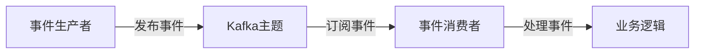

# Kafka 事件驱动架构

事件驱动架构（Event-Driven Architecture, EDA）是一种软件设计模式，其中系统的行为由事件触发和驱动。Kafka作为一个分布式流处理平台，是构建事件驱动架构的理想工具。本文将详细介绍Kafka事件驱动架构的核心概念、工作原理以及实际应用场景。

## 什么是事件驱动架构？

事件驱动架构是一种设计模式，其中系统的各个组件通过事件进行通信。事件是系统中发生的任何有意义的状态变化或动作。例如，用户注册、订单创建或库存更新都可以被视为事件。

在事件驱动架构中，事件生产者（Producer）生成事件并将其发布到事件总线（Event Bus），事件消费者（Consumer）订阅这些事件并做出相应的反应。Kafka作为事件总线，提供了高吞吐量、低延迟和持久化的消息传递能力。

## Kafka 事件驱动架构的核心组件

### 1. 事件生产者（Producer）
事件生产者是生成事件的组件。它可以是任何系统或服务，负责将事件发布到Kafka主题（Topic）。

```java
// 示例：Kafka生产者代码
Properties props = new Properties();
props.put("bootstrap.servers", "localhost:9092");
props.put("key.serializer", "org.apache.kafka.common.serialization.StringSerializer");
props.put("value.serializer", "org.apache.kafka.common.serialization.StringSerializer");

Producer<String, String> producer = new KafkaProducer<>(props);
producer.send(new ProducerRecord<>("user-events", "user123", "UserRegistered"));
producer.close();
```

### 2. Kafka主题（Topic）
Kafka主题是事件的分类或通道。生产者将事件发布到特定的主题，消费者从主题中订阅事件。

### 3. 事件消费者（Consumer）
事件消费者是订阅并处理事件的组件。它从Kafka主题中读取事件并执行相应的业务逻辑。

```java
// 示例：Kafka消费者代码
Properties props = new Properties();
props.put("bootstrap.servers", "localhost:9092");
props.put("group.id", "user-events-group");
props.put("key.deserializer", "org.apache.kafka.common.serialization.StringDeserializer");
props.put("value.deserializer", "org.apache.kafka.common.serialization.StringDeserializer");

Consumer<String, String> consumer = new KafkaConsumer<>(props);
consumer.subscribe(Arrays.asList("user-events"));

while (true) {
    ConsumerRecords<String, String> records = consumer.poll(Duration.ofMillis(100));
    for (ConsumerRecord<String, String> record : records) {
        System.out.printf("Received event: key = %s, value = %s%n", record.key(), record.value());
    }
}
```

### 4. Kafka集群（Cluster）
Kafka集群由多个Kafka代理（Broker）组成，负责存储和分发事件。Kafka集群提供了高可用性和容错能力。

## Kafka 事件驱动架构的工作原理

1. **事件生成**：事件生产者生成事件并将其发布到Kafka主题。
2. **事件存储**：Kafka集群将事件持久化存储在分区（Partition）中。
3. **事件消费**：事件消费者从Kafka主题中订阅事件并处理它们。
4. **事件处理**：消费者根据事件内容执行相应的业务逻辑。



## 实际应用场景

### 1. 实时数据处理
Kafka事件驱动架构广泛用于实时数据处理场景，如日志收集、监控和报警系统。例如，一个电商网站可以使用Kafka来实时处理用户行为数据，如点击、浏览和购买事件。

### 2. 微服务通信
在微服务架构中，Kafka可以作为服务之间的通信桥梁。每个微服务可以发布和订阅事件，实现松耦合的通信。例如，订单服务可以发布“订单创建”事件，库存服务订阅该事件并更新库存。

### 3. 事件溯源
事件溯源是一种设计模式，其中系统的状态由一系列事件决定。Kafka可以用于存储和重放这些事件，帮助系统恢复到任意时间点的状态。

## 总结

Kafka事件驱动架构是一种强大的设计模式，适用于需要高吞吐量、低延迟和持久化消息传递的场景。通过Kafka，系统可以实现松耦合、可扩展和实时的事件处理能力。

:::tip 提示
如果你对Kafka事件驱动架构感兴趣，可以尝试以下练习：
1. 使用Kafka构建一个简单的用户注册系统，用户注册时发布“用户注册”事件，并有一个消费者处理该事件。
2. 探索Kafka的流处理功能，如Kafka Streams，用于实时处理和分析事件数据。
:::

## 附加资源

- [Kafka官方文档](https://kafka.apache.org/documentation/)
- [Kafka Streams入门指南](https://kafka.apache.org/documentation/streams/)
- [事件驱动架构设计模式](https://martinfowler.com/eaaDev/EventDrivenArchitecture.html)
