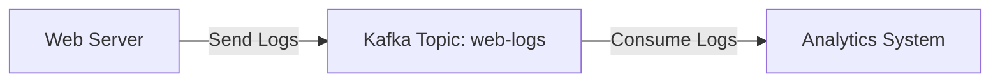

# Kafka 数据管道设计

Kafka是一个分布式流处理平台，广泛用于构建实时数据管道和流应用程序。数据管道是Kafka的核心应用场景之一，它允许数据从一个系统传输到另一个系统，同时确保数据的可靠性、可扩展性和高效性。本文将逐步介绍Kafka数据管道的设计，并通过实际案例帮助你理解其应用。

## 什么是Kafka数据管道？

Kafka数据管道是一种将数据从生产者（Producer）传输到消费者（Consumer）的架构。它通常用于以下场景：
- 实时数据传输：将数据从源系统（如数据库、日志文件）传输到目标系统（如数据仓库、分析工具）。
- 数据集成：将多个系统的数据集中到一个统一的平台进行处理。
- 事件驱动架构：通过事件流触发系统中的其他操作。

Kafka数据管道的核心组件包括：
- **生产者（Producer）**：负责将数据发布到Kafka主题（Topic）。
- **消费者（Consumer）**：从Kafka主题中读取数据并进行处理。
- **主题（Topic）**：Kafka中数据的分类单元，生产者将数据发布到主题，消费者从主题订阅数据。
- **分区（Partition）**：主题的物理分片，用于提高并行处理能力。
- **Broker**：Kafka集群中的单个节点，负责存储和传输数据。

## Kafka 数据管道的基本设计

### 1. 创建Kafka主题
首先，我们需要创建一个Kafka主题来存储数据。主题是Kafka中数据的逻辑分类单元。

```bash
kafka-topics.sh --create --topic my-topic --bootstrap-server localhost:9092 --partitions 3 --replication-factor 1
```

:::note
- `--partitions 3`：将主题分为3个分区，以提高并行处理能力。
- `--replication-factor 1`：设置副本因子为1，表示数据只存储在一个Broker上（适用于本地开发环境）。
:::

### 2. 生产者发布数据
生产者将数据发布到Kafka主题。以下是一个简单的Java生产者示例：

```java
import org.apache.kafka.clients.producer.*;

public class KafkaProducerExample {
    public static void main(String[] args) {
        Properties props = new Properties();
        props.put("bootstrap.servers", "localhost:9092");
        props.put("key.serializer", "org.apache.kafka.common.serialization.StringSerializer");
        props.put("value.serializer", "org.apache.kafka.common.serialization.StringSerializer");

        Producer<String, String> producer = new KafkaProducer<>(props);
        for (int i = 0; i < 10; i++) {
            producer.send(new ProducerRecord<>("my-topic", Integer.toString(i), "Message " + i));
        }
        producer.close();
    }
}
```

:::tip
- `ProducerRecord`：表示要发送的消息，包含主题名称、键和值。
- `send()`：异步发送消息，Kafka会确保消息被可靠地传输。
:::

### 3. 消费者订阅数据
消费者从Kafka主题中读取数据并进行处理。以下是一个简单的Java消费者示例：

```java
import org.apache.kafka.clients.consumer.*;
import java.time.Duration;
import java.util.Collections;
import java.util.Properties;

public class KafkaConsumerExample {
    public static void main(String[] args) {
        Properties props = new Properties();
        props.put("bootstrap.servers", "localhost:9092");
        props.put("group.id", "test-group");
        props.put("key.deserializer", "org.apache.kafka.common.serialization.StringDeserializer");
        props.put("value.deserializer", "org.apache.kafka.common.serialization.StringDeserializer");

        Consumer<String, String> consumer = new KafkaConsumer<>(props);
        consumer.subscribe(Collections.singletonList("my-topic"));

        while (true) {
            ConsumerRecords<String, String> records = consumer.poll(Duration.ofMillis(100));
            for (ConsumerRecord<String, String> record : records) {
                System.out.printf("Received message: key = %s, value = %s%n", record.key(), record.value());
            }
        }
    }
}
```

:::caution
- `group.id`：消费者组ID，用于标识一组消费者。Kafka会确保每个分区只能被一个消费者组中的一个消费者消费。
- `poll()`：从Kafka主题中拉取数据，`Duration.ofMillis(100)`表示最长等待100毫秒。
:::

## 实际案例：实时日志处理

假设我们有一个Web服务器，需要将日志实时传输到Kafka，并由另一个系统进行分析。以下是实现步骤：

1. **日志生产者**：Web服务器将日志发送到Kafka主题 `web-logs`。
2. **日志消费者**：分析系统从 `web-logs` 主题中读取日志并进行处理。



### 日志生产者示例

```java
import org.apache.kafka.clients.producer.*;

public class LogProducer {
    public static void main(String[] args) {
        Properties props = new Properties();
        props.put("bootstrap.servers", "localhost:9092");
        props.put("key.serializer", "org.apache.kafka.common.serialization.StringSerializer");
        props.put("value.serializer", "org.apache.kafka.common.serialization.StringSerializer");

        Producer<String, String> producer = new KafkaProducer<>(props);
        String logMessage = "2023-10-01 12:00:00 INFO User logged in";
        producer.send(new ProducerRecord<>("web-logs", "log-key", logMessage));
        producer.close();
    }
}
```

### 日志消费者示例

```java
import org.apache.kafka.clients.consumer.*;
import java.time.Duration;
import java.util.Collections;
import java.util.Properties;

public class LogConsumer {
    public static void main(String[] args) {
        Properties props = new Properties();
        props.put("bootstrap.servers", "localhost:9092");
        props.put("group.id", "log-analytics");
        props.put("key.deserializer", "org.apache.kafka.common.serialization.StringDeserializer");
        props.put("value.deserializer", "org.apache.kafka.common.serialization.StringDeserializer");

        Consumer<String, String> consumer = new KafkaConsumer<>(props);
        consumer.subscribe(Collections.singletonList("web-logs"));

        while (true) {
            ConsumerRecords<String, String> records = consumer.poll(Duration.ofMillis(100));
            for (ConsumerRecord<String, String> record : records) {
                System.out.printf("Analyzing log: %s%n", record.value());
            }
        }
    }
}
```

## 总结

Kafka数据管道是构建实时数据流应用程序的强大工具。通过本文的学习，你应该已经掌握了Kafka数据管道的基本设计方法，并能够使用生产者和消费者实现简单的数据流处理。在实际应用中，Kafka还可以与其他工具（如Spark、Flink）结合，构建更复杂的流处理系统。

## 附加资源与练习

- **练习**：尝试扩展日志处理案例，将日志存储到数据库中。
- **资源**：
  - [Kafka官方文档](https://kafka.apache.org/documentation/)
  - 《Kafka权威指南》书籍
  - [Kafka教程视频](https://www.youtube.com/results?search_query=kafka+tutorial)

:::warning
在实际生产环境中，请确保配置适当的副本因子和分区数量，以提高系统的可靠性和性能。
:::